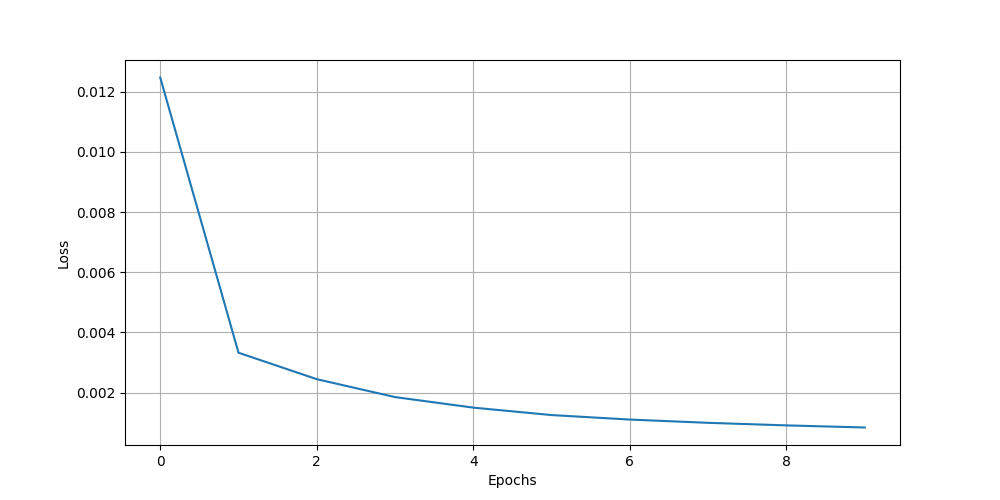
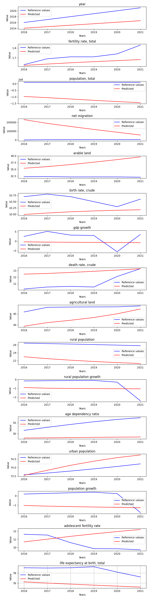

# AllStates

**Description:** Train and evaluate model on whole dataset.

## Hyperparameters
```
Input size:         16
Batch size:         1

Hidden size:        256
Sequence length:    10
Layers:             3

Learning rate:      0.0001
Epochs:             10

Bidirectional:      False
```
## Features
```
year
fertility rate, total
population, total
net migration
arable land
birth rate, crude
gdp growth
death rate, crude
agricultural land
rural population
rural population growth
age dependency ratio
urban population
population growth
adolescent fertility rate
life expectancy at birth, total
```
## Loss graph





## Evaluation of the model - state: Czechia




# Metric result
{'mae': 8194968.081969293,
 'mse': 1088894961549800.4,
 'r2': -262820.9797969713,
 'rmse': 8258915.432592933}
