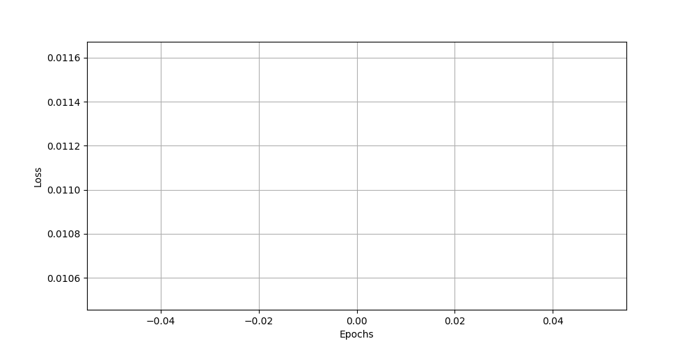
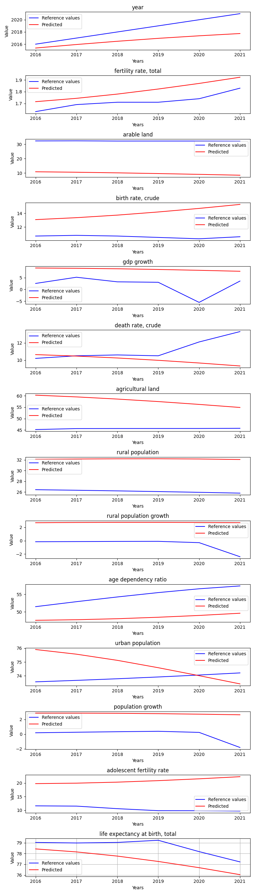

# AllStatesWithoutHighErrorFeatures

**Description:** Train and evaluate model on whole dataset excluding the high errorneous features.

## Hyperparameters
```
Input size:         14
Batch size:         1

Hidden size:        512
Sequence length:    10
Layers:             4

Learning rate:      0.0001
Epochs:             10

Bidirectional:      False
```
## Features
```
year
fertility rate, total
arable land
birth rate, crude
gdp growth
death rate, crude
agricultural land
rural population
rural population growth
age dependency ratio
urban population
population growth
adolescent fertility rate
life expectancy at birth, total
```
## Loss graph





## Evaluation of the model - state: Czechia




# Metric result
{'mae': 2.9351862297035534,
 'mse': 15.025515016724546,
 'r2': -177.45880746383997,
 'rmse': 3.02845131350808}
