# CompareLSTMARIMAExperiment

**Description:** Compares the performance of LSTM model with the statistical ARIMA model for all features prediction. Each model is trained just to predict 1 feauture from all features.

# LSTM model parameters
Hyperparameters:
```
Input size:         1
Batch size:         1

Hidden size:        256
Sequence length:    10
Layers:             3

Learning rate:      0.0001
Epochs:             20

Bidirectional:      False
```
# LSTM & ARIMA Comparision: Feature: fertility rate, total
Comparision of LSTM and ARIMA model of predicting feature fertility rate, total. State: Czechia

## Arima evaluation


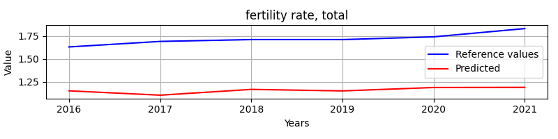


## RNN evaluation - fertility rate, total


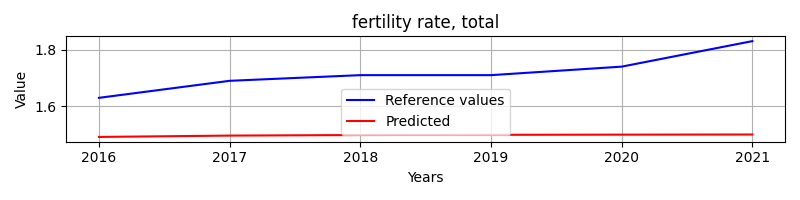

### Overall metrics (ARIMA)
```
{'mae': 0.5602717284986595,
 'mse': 0.3162614490249736,
 'r2': -86.51277605610322,
 'rmse': 0.5623712732928076}
```

### Overall metrics (RNN)
```
{'mae': 0.219357221921285,
 'mse': 0.051433188592317124,
 'r2': -13.232089080118438,
 'rmse': 0.22678886346625823}
```

# LSTM & ARIMA Comparision: Feature: population, total
Comparision of LSTM and ARIMA model of predicting feature population, total. State: Czechia

## Arima evaluation


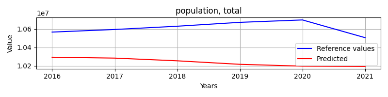


## RNN evaluation - population, total


### Overall metrics (ARIMA)
```
{'mae': 370941.1752923193,
 'mse': 144419086724.24503,
 'r2': -33.72977117822156,
 'rmse': 380025.1132810107}
```

### Overall metrics (RNN)
```
{'mae': 180048.0,
 'mse': 36469279142.333336,
 'r2': -7.7700992187156235,
 'rmse': 190969.3146616318}
```

# LSTM & ARIMA Comparision: Feature: net migration
Comparision of LSTM and ARIMA model of predicting feature net migration. State: Czechia

## Arima evaluation


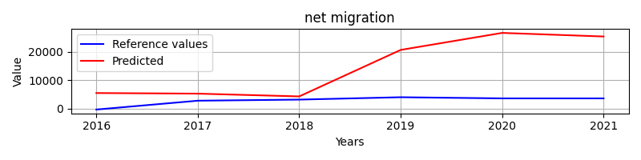


## RNN evaluation - net migration


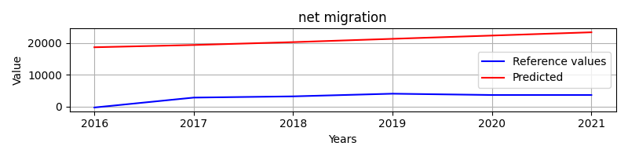

### Overall metrics (ARIMA)
```
{'mae': 11799.035064214704,
 'mse': 220010359.513285,
 'r2': -103.59694254393696,
 'rmse': 14832.746189201951}
```

### Overall metrics (RNN)
```
{'mae': 18003.220703125,
 'mse': 325427846.33712643,
 'r2': -153.71434081932938,
 'rmse': 18039.61879689054}
```

# LSTM & ARIMA Comparision: Feature: arable land
Comparision of LSTM and ARIMA model of predicting feature arable land. State: Czechia

## Arima evaluation


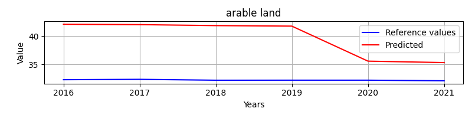


## RNN evaluation - arable land


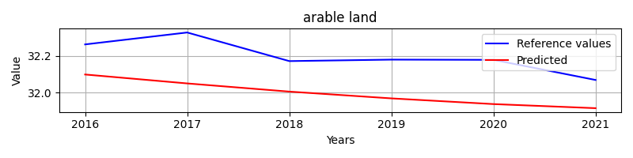

### Overall metrics (ARIMA)
```
{'mae': 7.599400081005445,
 'mse': 66.93202401029895,
 'r2': -10339.03160682162,
 'rmse': 8.181199423696928}
```

### Overall metrics (RNN)
```
{'mae': 0.2016929867918762,
 'mse': 0.042730470440068724,
 'r2': -5.6012409075912855,
 'rmse': 0.20671349844668763}
```

# LSTM & ARIMA Comparision: Feature: birth rate, crude
Comparision of LSTM and ARIMA model of predicting feature birth rate, crude. State: Czechia

## Arima evaluation


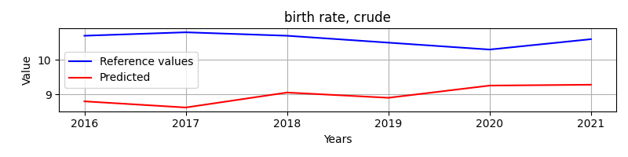


## RNN evaluation - birth rate, crude


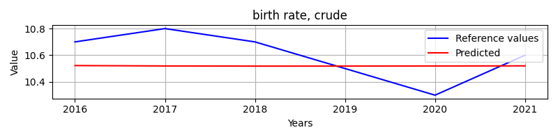

### Overall metrics (ARIMA)
```
{'mae': 1.6137452853810748,
 'mse': 2.7398928820067305,
 'r2': -101.74598307525268,
 'rmse': 1.6552621792352806}
```

### Overall metrics (RNN)
```
{'mae': 0.157392342885335,
 'mse': 0.03206419093132346,
 'r2': -0.2024071599246331,
 'rmse': 0.17906476742040423}
```

# LSTM & ARIMA Comparision: Feature: gdp growth
Comparision of LSTM and ARIMA model of predicting feature gdp growth. State: Czechia

## Arima evaluation


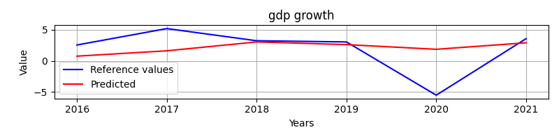


## RNN evaluation - gdp growth


### Overall metrics (ARIMA)
```
{'mae': 2.3302902376052876,
 'mse': 11.769394255040899,
 'r2': 0.013533325648003247,
 'rmse': 3.4306550766640616}
```

### Overall metrics (RNN)
```
{'mae': 2.158221845811202,
 'mse': 12.204728706199047,
 'r2': -0.022954782317357703,
 'rmse': 3.4935266860579506}
```

# LSTM & ARIMA Comparision: Feature: death rate, crude
Comparision of LSTM and ARIMA model of predicting feature death rate, crude. State: Czechia

## Arima evaluation


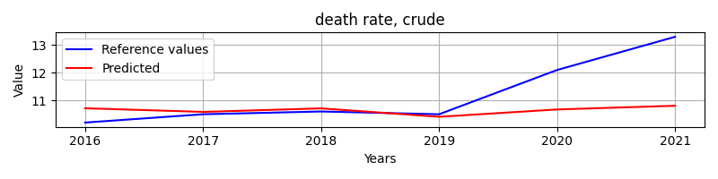


## RNN evaluation - death rate, crude


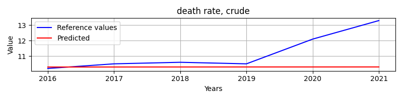

### Overall metrics (ARIMA)
```
{'mae': 0.787689799681974,
 'mse': 1.4241329879452902,
 'r2': -0.13026427614705516,
 'rmse': 1.193370431988865}
```

### Overall metrics (RNN)
```
{'mae': 0.9330728530883791,
 'mse': 2.068554397078394,
 'r2': -0.6417098389511053,
 'rmse': 1.4382469875088888}
```

# LSTM & ARIMA Comparision: Feature: agricultural land
Comparision of LSTM and ARIMA model of predicting feature agricultural land. State: Czechia

## Arima evaluation


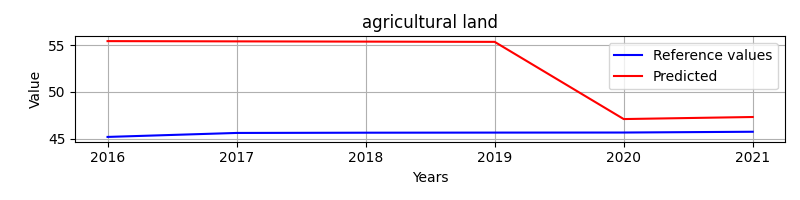


## RNN evaluation - agricultural land


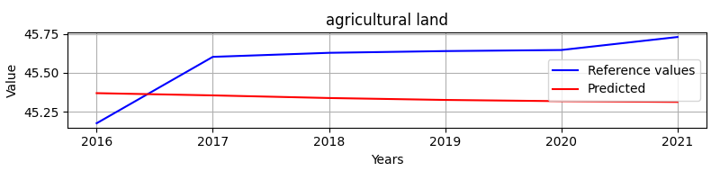

### Overall metrics (ARIMA)
```
{'mae': 7.098129974948008,
 'mse': 66.01803320568136,
 'r2': -2012.16548797538,
 'rmse': 8.12514819592119}
```

### Overall metrics (RNN)
```
{'mae': 0.29264166821725607,
 'mse': 0.08988996494794343,
 'r2': -1.7411203630486747,
 'rmse': 0.29981655215805453}
```

# LSTM & ARIMA Comparision: Feature: rural population
Comparision of LSTM and ARIMA model of predicting feature rural population. State: Czechia

## Arima evaluation


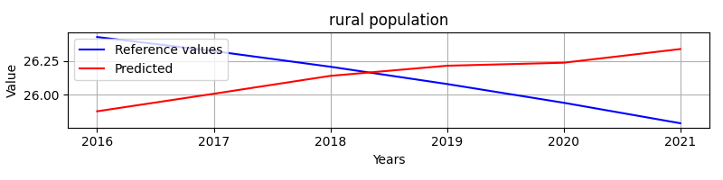


## RNN evaluation - rural population


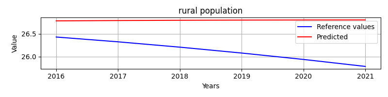

### Overall metrics (ARIMA)
```
{'mae': 0.321854977446329,
 'mse': 0.13815560462336443,
 'r2': -1.8436944953131027,
 'rmse': 0.37169289019749147}
```

### Overall metrics (RNN)
```
{'mae': 0.6692088775634767,
 'mse': 0.4994167152767635,
 'r2': -9.279630478774697,
 'rmse': 0.7066942162468598}
```

# LSTM & ARIMA Comparision: Feature: rural population growth
Comparision of LSTM and ARIMA model of predicting feature rural population growth. State: Czechia

## Arima evaluation


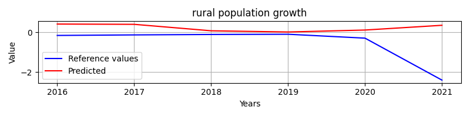


## RNN evaluation - rural population growth


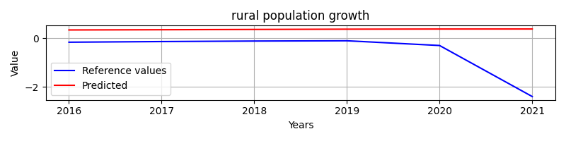

### Overall metrics (ARIMA)
```
{'mae': 0.7605267367985196,
 'mse': 1.4009997528344513,
 'r2': -0.9913269439332499,
 'rmse': 1.1836383539047943}
```

### Overall metrics (RNN)
```
{'mae': 0.9040501213391113,
 'mse': 1.5339736749848407,
 'r2': -1.180330941601936,
 'rmse': 1.238536909011936}
```

# LSTM & ARIMA Comparision: Feature: age dependency ratio
Comparision of LSTM and ARIMA model of predicting feature age dependency ratio. State: Czechia

## Arima evaluation


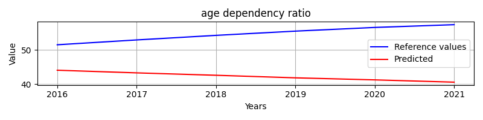


## RNN evaluation - age dependency ratio


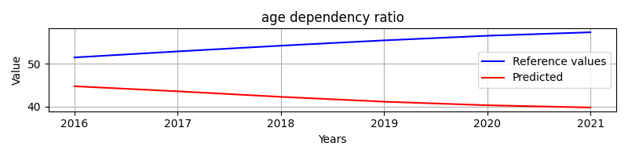

### Overall metrics (ARIMA)
```
{'mae': 12.422996581505052,
 'mse': 164.72343508529227,
 'r2': -38.7142527724771,
 'rmse': 12.834462789119467}
```

### Overall metrics (RNN)
```
{'mae': 12.672281946636375,
 'mse': 174.97319300809394,
 'r2': -41.185434100088884,
 'rmse': 13.227743307461555}
```

# LSTM & ARIMA Comparision: Feature: urban population
Comparision of LSTM and ARIMA model of predicting feature urban population. State: Czechia

## Arima evaluation


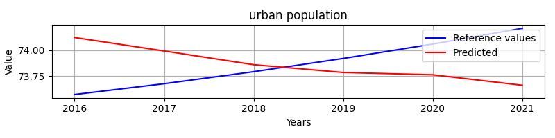


## RNN evaluation - urban population


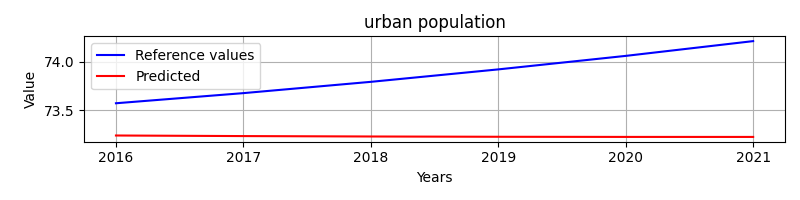

### Overall metrics (ARIMA)
```
{'mae': 0.32187385509057265,
 'mse': 0.1381706003531911,
 'r2': -1.8440031565104915,
 'rmse': 0.3717130618544243}
```

### Overall metrics (RNN)
```
{'mae': 0.6461865437825528,
 'mse': 0.4683269375511045,
 'r2': -8.639701103343086,
 'rmse': 0.6843441660094024}
```

# LSTM & ARIMA Comparision: Feature: population growth
Comparision of LSTM and ARIMA model of predicting feature population growth. State: Czechia

## Arima evaluation


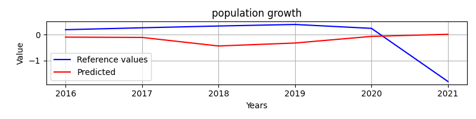


## RNN evaluation - population growth


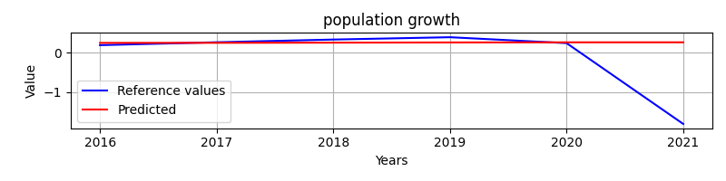

### Overall metrics (ARIMA)
```
{'mae': 0.7147233755893437,
 'mse': 0.7939668740776032,
 'r2': -0.2903106914232829,
 'rmse': 0.8910481884149719}
```

### Overall metrics (RNN)
```
{'mae': 0.39661970112508493,
 'mse': 0.7228302997215009,
 'r2': -0.17470349742096158,
 'rmse': 0.8501942717529335}
```

# LSTM & ARIMA Comparision: Feature: adolescent fertility rate
Comparision of LSTM and ARIMA model of predicting feature adolescent fertility rate. State: Czechia

## Arima evaluation


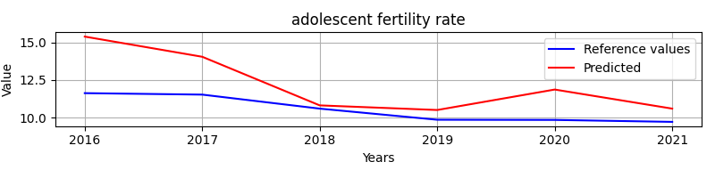


## RNN evaluation - adolescent fertility rate


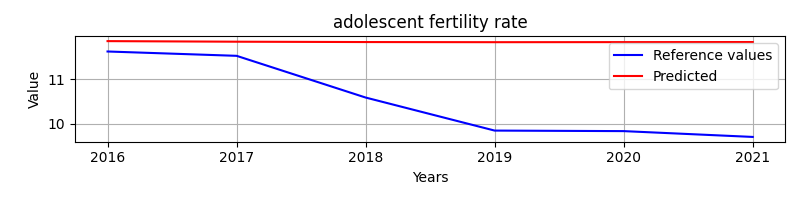

### Overall metrics (ARIMA)
```
{'mae': 1.6744787139958175,
 'mse': 4.304312821474244,
 'r2': -5.8143450030833,
 'rmse': 2.0746837883094966}
```

### Overall metrics (RNN)
```
{'mae': 1.3025024681091308,
 'mse': 2.318468603836081,
 'r2': -2.6704685743413856,
 'rmse': 1.5226518327694223}
```

# LSTM & ARIMA Comparision: Feature: life expectancy at birth, total
Comparision of LSTM and ARIMA model of predicting feature life expectancy at birth, total. State: Czechia

## Arima evaluation


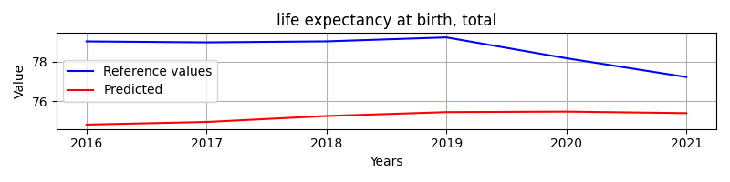


## RNN evaluation - life expectancy at birth, total


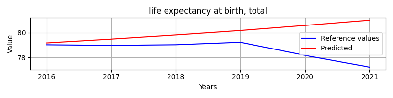

### Overall metrics (ARIMA)
```
{'mae': 3.3929559679476236,
 'mse': 12.230013890840752,
 'r2': -23.59233614313194,
 'rmse': 3.4971436760363095}
```

### Overall metrics (RNN)
```
{'mae': 1.4331100525894769,
 'mse': 3.668766904859144,
 'r2': -6.37722375136987,
 'rmse': 1.915402543816611}
```

