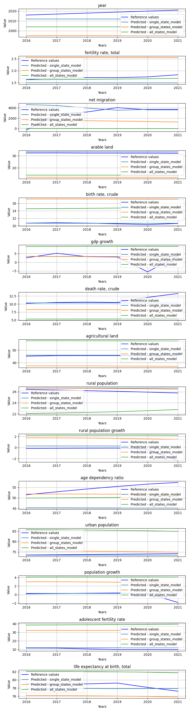

# DataUsedForTraining

**Description:** Trains base LSTM models using data in 3 categories: single state data, group of states (e.g. by wealth divided states) and with all available states data.


## ## Model comparision prediction plot
In the next feagure you can see each model predictions compared to each other and the reference data.



## Per target metrics - model comparision
```
                             target          mae           mse         rmse            r2    state               model   rank
4                 birth rate, crude     0.122480  2.725370e-02     0.165087     -0.022014  Czechia  single_state_model    7.0
31            fertility rate, total     0.072240  6.950969e-03     0.083372     -0.923404  Czechia    all_states_model    9.0
12                population growth     0.406053  7.414566e-01     0.861079     -0.204974  Czechia  single_state_model   27.0
7                 agricultural land     0.372203  1.722291e-01     0.415005     -4.251984  Czechia  single_state_model   28.0
11                 urban population     0.420660  2.261273e-01     0.475528     -3.654441  Czechia  single_state_model   29.0
23                 rural population     0.455106  2.299625e-01     0.479544     -3.733381  Czechia  group_states_model   33.0
1             fertility rate, total     0.228885  5.620030e-02     0.237066    -14.551198  Czechia  single_state_model   35.0
14  life expectancy at birth, total     0.924923  9.777479e-01     0.988811     -0.966073  Czechia  single_state_model   40.0
9           rural population growth     0.818025  1.371529e+00     1.171123     -0.949439  Czechia  single_state_model   40.0
8                  rural population     0.546173  3.435103e-01     0.586097     -6.070566  Czechia  single_state_model   41.0
6                 death rate, crude     0.903323  1.991139e+00     1.411077     -0.580269  Czechia  single_state_model   42.0
13        adolescent fertility rate     1.408659  2.602405e+00     1.613197     -3.119980  Czechia  single_state_model   57.0
16            fertility rate, total     0.840988  7.111658e-01     0.843306   -195.786841  Czechia  group_states_model   61.0
20                       gdp growth     2.033702  1.311349e+01     3.621256     -0.099124  Czechia  group_states_model   65.0
5                        gdp growth     1.997173  1.348604e+01     3.672334     -0.130349  Czechia  single_state_model   67.0
3                       arable land     1.035314  1.077781e+00     1.038162   -165.501657  Czechia  single_state_model   68.0
24          rural population growth     2.202804  5.428809e+00     2.329981     -6.716300  Czechia  group_states_model   70.0
26                 urban population     1.385459  2.083179e+00     1.443322    -41.878636  Czechia  group_states_model   73.0
29  life expectancy at birth, total     2.590814  7.078860e+00     2.660613    -13.234301  Czechia  group_states_model   76.0
39          rural population growth     2.774418  8.392811e+00     2.897035    -10.929218  Czechia    all_states_model   78.0
25             age dependency ratio     3.024974  1.292231e+01     3.594761     -2.115524  Czechia  group_states_model   78.0
21                death rate, crude     2.975188  1.016745e+01     3.188644     -7.069404  Czechia  group_states_model   83.0
27                population growth     2.965862  9.302711e+00     3.050035    -14.118247  Czechia  group_states_model   83.0
44  life expectancy at birth, total     3.395133  1.187862e+01     3.446538    -22.885752  Czechia    all_states_model   94.0
40             age dependency ratio     4.458795  2.316172e+01     4.812662     -4.584210  Czechia    all_states_model  102.0
38                 rural population     3.746900  1.425552e+01     3.775648   -292.425222  Czechia    all_states_model  111.0
42                population growth     4.185526  1.812014e+01     4.256775    -28.447833  Czechia    all_states_model  111.0
35                       gdp growth     7.133755  6.298463e+01     7.936286     -4.279137  Czechia    all_states_model  113.0
34                birth rate, crude     4.110797  1.696771e+01     4.119188   -635.289159  Czechia    all_states_model  115.0
36                death rate, crude     5.888131  3.590130e+01     5.991769    -27.493096  Czechia    all_states_model  116.0
0                              year     6.500000  4.516667e+01     6.720615    -14.485714  Czechia  single_state_model  117.0
10             age dependency ratio     9.427045  9.316283e+01     9.652089    -21.461237  Czechia  single_state_model  129.0
19                birth rate, crude     6.528614  4.264819e+01     6.530558  -1598.307197  Czechia  group_states_model  131.0
17                    net migration  2000.633928  4.206622e+06  2051.005145     -0.999905  Czechia  group_states_model  139.0
22                agricultural land     8.186128  6.709273e+01     8.191015  -2044.937521  Czechia  group_states_model  140.0
2                     net migration  1334.133833  4.624110e+06  2150.374494     -1.198387  Czechia  single_state_model  141.0
30                             year    14.500000  2.131667e+02    14.600228    -72.085714  Czechia    all_states_model  143.0
41                 urban population    11.539908  1.334251e+02    11.550979  -2745.325569  Czechia    all_states_model  147.0
32                    net migration  2926.798677  1.008751e+07  3176.083399     -3.795784  Czechia    all_states_model  150.0
37                agricultural land    11.804917  1.394072e+02    11.807082  -4250.107483  Czechia    all_states_model  151.0
15                             year    23.500000  5.551667e+02    23.561975   -189.342857  Czechia  group_states_model  157.0
28        adolescent fertility rate    21.774213  4.747404e+02    21.788539   -750.582266  Czechia  group_states_model  158.0
33                      arable land    18.210758  3.316353e+02    18.210857 -51231.870555  Czechia    all_states_model  158.0
18                      arable land    19.975186  3.990108e+02    19.975254 -61640.402923  Czechia  group_states_model  162.0
43        adolescent fertility rate    28.503143  8.137541e+02    28.526375  -1287.289490  Czechia    all_states_model  165.0
```


## Overall metrics - model comparision
```
          mae            mse        rmse           r2    state               model  rank
0   90.616317  308284.791036  145.292118   -15.809885  Czechia  single_state_model   6.0
1  139.938198  280548.120181  143.484263 -4433.954962  Czechia  group_states_model   7.0
2  203.141540  672621.920855  219.873213 -4041.182108  Czechia    all_states_model  11.0
```


