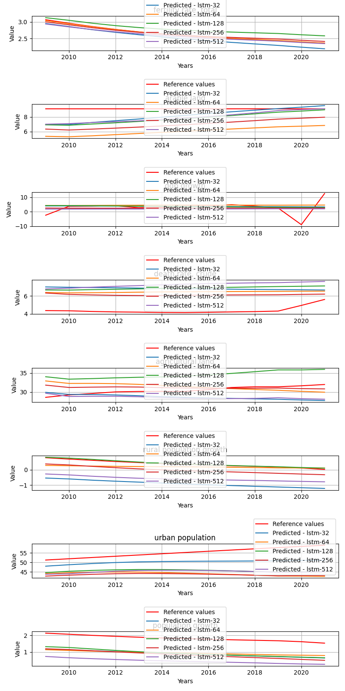

# DifferentHiddenLayers

**Description:** Try to train BaseLSTM models with different layers.

## Per target metrics - model comparision
```
                      target        mae         mse       rmse           r2          state     model   rank
27         death rate, crude   2.099985    5.762595   2.400541    -3.573488        Czechia   lstm-64  235.0
99         death rate, crude   0.909931    2.083436   1.443411    -0.653521        Czechia  lstm-512  136.0
103        population growth   1.172402    1.393390   1.180419    -1.264459        Czechia  lstm-512  142.0
28         agricultural land  11.160979  124.729106  11.168219 -3802.511233        Czechia   lstm-64  462.0
3          death rate, crude   4.094334   18.045359   4.247983   -13.321713        Czechia   lstm-32  312.0
..                       ...        ...         ...        ...          ...            ...       ...    ...
107        death rate, crude   1.061683    1.389270   1.178673    -1.334651  United States  lstm-512  135.0
81               arable land   3.866905   15.100019   3.885874 -1107.017771  United States  lstm-256  340.0
59         death rate, crude   0.657622    0.995973   0.997984    -0.673720  United States  lstm-128  106.0
85   rural population growth   2.535516    6.513302   2.552117   -82.298857  United States  lstm-256  289.0
60         agricultural land  13.000537  173.608782  13.176069 -7108.851218  United States  lstm-128  474.0

[120 rows x 8 columns]
```


## Overall metrics - model comparision
```
         mae        mse      rmse            r2          state     model  rank
12  3.267948  19.122293  3.386009 -6.954342e+02        Czechia  lstm-512  31.0
9   3.515588  17.247669  3.620238 -7.159204e+02        Czechia  lstm-256  34.0
6   3.303743  18.496878  3.408492 -9.281768e+02        Czechia  lstm-128  35.0
0   4.029460  26.322102  4.162421 -1.099155e+03        Czechia   lstm-32  50.0
3   4.661613  36.158276  4.760361 -2.417129e+03        Czechia   lstm-64  55.0
2   1.913914   8.143350  2.293933 -6.090423e+28       Honduras   lstm-32  14.0
8   2.642207  18.351348  2.972153 -8.348714e+28       Honduras  lstm-128  27.0
14  2.726316  18.198944  2.987871 -7.105324e+28       Honduras  lstm-512  27.0
11  2.614382  21.651097  2.903909 -1.867900e+29       Honduras  lstm-256  30.0
5   2.746973  22.089022  3.102821 -3.807168e+29       Honduras   lstm-64  38.0
1   2.341733  12.325924  2.496309 -4.482444e+02  United States   lstm-32   9.0
10  3.214643  16.585694  3.318338 -2.860638e+02  United States  lstm-256  20.0
13  3.028544  20.442420  3.132690 -3.010717e+02  United States  lstm-512  25.0
4   3.295669  22.987864  3.461382 -6.260805e+02  United States   lstm-64  37.0
7   3.824801  31.286360  3.943969 -1.038760e+03  United States  lstm-128  48.0
```


## Honduras predictions
Honduras feature predictions.



