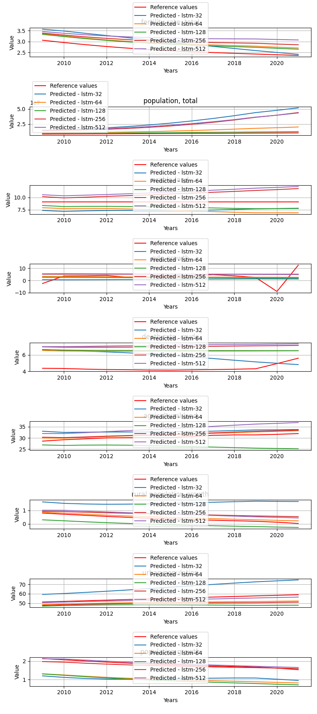

# DifferentHiddenLayers

**Description:** Try to train BaseLSTM models with different layers.

## Per target metrics - model comparision
```
                      target           mae           mse          rmse  \
59         agricultural land  7.776599e-01  6.750178e-01  8.215946e-01   
86         agricultural land  3.726905e+00  1.397437e+01  3.738231e+00   
32         agricultural land  4.295246e+00  1.854013e+01  4.305826e+00   
113        agricultural land  4.689211e+00  2.212341e+01  4.703553e+00   
5          agricultural land  1.135081e+01  1.289334e+02  1.135489e+01   
56               arable land  3.013862e-01  1.196467e-01  3.458998e-01   
110              arable land  5.564584e-01  3.177432e-01  5.636871e-01   
29               arable land  1.395607e+00  2.040583e+00  1.428490e+00   
83               arable land  2.578927e+00  6.681966e+00  2.584950e+00   
2                arable land  7.487458e+00  5.609066e+01  7.489370e+00   
112        death rate, crude  8.733157e-01  1.660666e+00  1.288668e+00   
85         death rate, crude  8.851591e-01  1.932873e+00  1.390278e+00   
58         death rate, crude  1.387066e+00  3.209379e+00  1.791474e+00   
31         death rate, crude  1.819439e+00  4.626106e+00  2.150838e+00   
4          death rate, crude  6.159691e+00  3.916408e+01  6.258121e+00   
108    fertility rate, total  2.557033e-02  9.926930e-04  3.150703e-02   
81     fertility rate, total  6.190363e-02  4.737676e-03  6.883078e-02   
54     fertility rate, total  1.255201e-01  1.880692e-02  1.371383e-01   
27     fertility rate, total  2.098260e-01  4.683631e-02  2.164170e-01   
0      fertility rate, total  3.724116e-01  1.423697e-01  3.773191e-01   
57                gdp growth  2.658039e+00  1.190393e+01  3.450207e+00   
84                gdp growth  2.039757e+00  1.255986e+01  3.543989e+00   
30                gdp growth  2.017844e+00  1.268817e+01  3.562046e+00   
111               gdp growth  2.991073e+00  1.238974e+01  3.519906e+00   
3                 gdp growth  3.306669e+00  1.361619e+01  3.690012e+00   
89         population growth  7.631113e-01  6.894664e-01  8.303411e-01   
8          population growth  8.057022e-01  7.502837e-01  8.661892e-01   
62         population growth  8.973453e-01  8.360034e-01  9.143322e-01   
35         population growth  9.493520e-01  9.163619e-01  9.572680e-01   
116        population growth  1.205523e+00  1.484298e+00  1.218318e+00   
28         population, total  1.378651e+05  3.404953e+10  1.845251e+05   
55         population, total  3.929804e+06  1.563959e+13  3.954692e+06   
109        population, total  5.120791e+06  2.728409e+13  5.223417e+06   
1          population, total  7.500231e+06  5.791879e+13  7.610440e+06   
82         population, total  1.561009e+07  2.530212e+14  1.590664e+07   
33   rural population growth  8.617446e-01  8.236819e-01  9.075693e-01   
6    rural population growth  6.571172e-01  1.260838e+00  1.122870e+00   
87   rural population growth  1.265105e+00  1.632948e+00  1.277868e+00   
60   rural population growth  1.292675e+00  1.715675e+00  1.309838e+00   
114  rural population growth  1.832310e+00  4.027908e+00  2.006965e+00   
34          urban population  2.510564e-01  9.951311e-02  3.154570e-01   
61          urban population  6.702795e-01  4.537311e-01  6.735957e-01   
115         urban population  1.898793e+00  3.626511e+00  1.904340e+00   
88          urban population  2.308312e+00  5.382184e+00  2.319953e+00   
7           urban population  3.204524e+00  1.029900e+01  3.209205e+00   
50         agricultural land  1.014685e+00  1.105199e+00  1.051284e+00   
104        agricultural land  1.260319e+00  1.681580e+00  1.296757e+00   
23         agricultural land  2.543210e+00  6.933759e+00  2.633203e+00   
131        agricultural land  3.812197e+00  1.513334e+01  3.890159e+00   
77         agricultural land  4.258910e+00  2.051535e+01  4.529388e+00   
74               arable land  1.089358e+00  1.228307e+00  1.108290e+00   
20               arable land  1.641964e+00  2.729890e+00  1.652238e+00   
47               arable land  1.712111e+00  3.066747e+00  1.751213e+00   
101              arable land  1.663406e+00  3.122271e+00  1.766995e+00   
128              arable land  2.075911e+00  4.684380e+00  2.164343e+00   
22         death rate, crude  1.569853e+00  2.918036e+00  1.708226e+00   
49         death rate, crude  2.078672e+00  4.468313e+00  2.113839e+00   
76         death rate, crude  2.151985e+00  4.799067e+00  2.190677e+00   
103        death rate, crude  2.629365e+00  7.037940e+00  2.652912e+00   
130        death rate, crude  2.787006e+00  7.894019e+00  2.809630e+00   
72     fertility rate, total  2.916516e-01  8.522293e-02  2.919297e-01   
45     fertility rate, total  3.290539e-01  1.087281e-01  3.297394e-01   
18     fertility rate, total  3.501255e-01  1.490713e-01  3.860975e-01   
99     fertility rate, total  4.226205e-01  1.818946e-01  4.264911e-01   
126    fertility rate, total  5.715867e-01  3.375643e-01  5.810028e-01   
48                gdp growth  2.708021e+00  2.127487e+01  4.612468e+00   
75                gdp growth  3.077852e+00  2.159518e+01  4.647061e+00   
21                gdp growth  3.982848e+00  2.469831e+01  4.969739e+00   
102               gdp growth  3.416631e+00  2.616064e+01  5.114748e+00   
129               gdp growth  3.542509e+00  2.669581e+01  5.166798e+00   
134        population growth  5.461858e-02  3.513858e-03  5.927780e-02   
107        population growth  7.902419e-02  8.051710e-03  8.973132e-02   
26         population growth  7.737439e-01  6.189921e-01  7.867605e-01   
53         population growth  8.081937e-01  6.539985e-01  8.087017e-01   
80         population growth  8.682151e-01  7.542851e-01  8.684959e-01   
73         population, total  1.389724e+06  2.114998e+12  1.454303e+06   
46         population, total  4.751810e+06  2.980594e+13  5.459481e+06   
100        population, total  1.553785e+07  3.269864e+14  1.808277e+07   
127        population, total  1.634304e+07  3.433955e+14  1.853093e+07   
19         population, total  2.021648e+07  5.445473e+14  2.333554e+07   
51   rural population growth  1.107097e-01  1.322586e-02  1.150038e-01   
132  rural population growth  3.354729e-01  1.145630e-01  3.384716e-01   
105  rural population growth  3.312092e-01  1.195880e-01  3.458150e-01   
78   rural population growth  4.258143e-01  1.841614e-01  4.291403e-01   
24   rural population growth  1.171041e+00  1.449474e+00  1.203941e+00   
133         urban population  1.585893e+00  2.903876e+00  1.704076e+00   
52          urban population  4.442834e+00  2.154445e+01  4.641600e+00   
106         urban population  5.407020e+00  3.161176e+01  5.622433e+00   
79          urban population  7.291561e+00  5.866329e+01  7.659196e+00   
25          urban population  1.185469e+01  1.475282e+02  1.214612e+01   
95         agricultural land  3.890539e-01  2.553656e-01  5.053371e-01   
122        agricultural land  9.253003e-01  1.266707e+00  1.125481e+00   
68         agricultural land  1.621495e+00  3.303042e+00  1.817427e+00   
41         agricultural land  3.277317e+00  1.118567e+01  3.344498e+00   
14         agricultural land  1.086764e+01  1.234453e+02  1.111060e+01   
65               arable land  1.267722e+00  2.280996e+00  1.510297e+00   
38               arable land  1.405090e+00  2.394181e+00  1.547314e+00   
119              arable land  1.724564e+00  2.982227e+00  1.726912e+00   
92               arable land  3.463760e+00  1.213187e+01  3.483083e+00   
11               arable land  3.751327e+00  1.714619e+01  4.140796e+00   
121        death rate, crude  6.743940e-01  7.198997e-01  8.484690e-01   
40         death rate, crude  8.550468e-01  8.547127e-01  9.245067e-01   
94         death rate, crude  8.996229e-01  8.560900e-01  9.252513e-01   
67         death rate, crude  1.240381e+00  1.657178e+00  1.287314e+00   
13         death rate, crude  2.729759e+00  7.824193e+00  2.797176e+00   
36     fertility rate, total  2.009573e-01  5.352531e-02  2.313554e-01   
63     fertility rate, total  2.240105e-01  6.376980e-02  2.525268e-01   
9      fertility rate, total  3.311461e-01  1.147173e-01  3.386995e-01   
117    fertility rate, total  5.827566e-01  3.694873e-01  6.078546e-01   
90     fertility rate, total  5.910662e-01  3.783212e-01  6.150782e-01   
66                gdp growth  1.410630e+00  4.276761e+00  2.068033e+00   
120               gdp growth  1.368712e+00  5.042775e+00  2.245612e+00   
39                gdp growth  1.951807e+00  5.205825e+00  2.281628e+00   
12                gdp growth  1.644007e+00  5.960667e+00  2.441448e+00   
93                gdp growth  1.913816e+00  6.803496e+00  2.608351e+00   
125        population growth  1.941722e-01  7.188195e-02  2.681081e-01   
17         population growth  2.218982e-01  8.311073e-02  2.882893e-01   
98         population growth  2.500768e-01  1.130098e-01  3.361693e-01   
71         population growth  4.913583e-01  2.745729e-01  5.239970e-01   
44         population growth  8.347251e-01  7.383199e-01  8.592555e-01   
10         population, total  8.576736e+07  8.030228e+15  8.961154e+07   
64         population, total  1.565810e+08  2.735593e+16  1.653963e+08   
37         population, total  2.058087e+08  4.856189e+16  2.203676e+08   
118        population, total  2.050816e+08  5.150310e+16  2.269430e+08   
91         population, total  5.938870e+08  4.421251e+17  6.649249e+08   
42   rural population growth  1.937098e-01  8.365357e-02  2.892293e-01   
96   rural population growth  2.525513e-01  1.195325e-01  3.457347e-01   
123  rural population growth  4.822842e-01  2.913411e-01  5.397602e-01   
69   rural population growth  6.184285e-01  4.556627e-01  6.750279e-01   
15   rural population growth  1.985574e+00  3.973656e+00  1.993403e+00   
97          urban population  4.117351e-01  1.736405e-01  4.167020e-01   
124         urban population  7.586413e-01  5.845644e-01  7.645681e-01   
70          urban population  5.207065e+00  3.035025e+01  5.509106e+00   
43          urban population  5.323284e+00  3.182076e+01  5.640989e+00   
16          urban population  8.376932e+00  7.526944e+01  8.675796e+00   

               r2          state     model   rank  
59  -1.958411e+01        Czechia  lstm-128  198.0  
86  -4.251369e+02        Czechia  lstm-256  412.0  
32  -5.643661e+02        Czechia   lstm-64  425.0  
113 -6.736351e+02        Czechia  lstm-512  438.0  
5   -3.930719e+03        Czechia   lstm-32  481.0  
56  -1.748368e+01        Czechia  lstm-128  136.0  
110 -4.808673e+01        Czechia  lstm-512  183.0  
29  -3.142407e+02        Czechia   lstm-64  298.0  
83  -1.031267e+03        Czechia  lstm-256  379.0  
2   -8.664198e+03        Czechia   lstm-32  474.0  
112 -3.179887e-01        Czechia  lstm-512  192.0  
85  -5.340266e-01        Czechia  lstm-256  206.0  
58  -1.547127e+00        Czechia  lstm-128  255.0  
31  -2.671512e+00        Czechia   lstm-64  287.0  
4   -3.008260e+01        Czechia   lstm-32  430.0  
108  7.253117e-01        Czechia  lstm-512    7.0  
81  -3.109635e-01        Czechia  lstm-256   36.0  
54  -4.204067e+00        Czechia  lstm-128   77.0  
27  -1.196009e+01        Czechia   lstm-64   97.0  
0   -3.839516e+01        Czechia   lstm-32  158.0  
57   2.257184e-03        Czechia  lstm-128  285.0  
84  -5.272035e-02        Czechia  lstm-256  287.0  
30  -6.347491e-02        Czechia   lstm-64  289.0  
111 -3.846143e-02        Czechia  lstm-512  296.0  
3   -1.412581e-01        Czechia   lstm-32  311.0  
89  -1.204823e-01        Czechia  lstm-256  134.0  
8   -2.193193e-01        Czechia   lstm-32  152.0  
62  -3.586261e-01        Czechia  lstm-128  171.0  
35  -4.892203e-01        Czechia   lstm-64  184.0  
116 -1.412198e+00        Czechia  lstm-512  214.0  
28  -7.188200e+00        Czechia   lstm-64  431.0  
55  -3.759994e+03        Czechia  lstm-128  492.0  
109 -6.560253e+03        Czechia  lstm-512  499.0  
1   -1.392726e+04        Czechia   lstm-32  507.0  
82  -6.084531e+04        Czechia  lstm-256  512.0  
33  -1.707497e-01        Czechia   lstm-64  155.0  
6   -7.921063e-01        Czechia   lstm-32  176.0  
87  -1.321009e+00        Czechia  lstm-256  216.0  
60  -1.438594e+00        Czechia  lstm-128  230.0  
114 -4.725114e+00        Czechia  lstm-512  289.0  
34  -1.048306e+00        Czechia   lstm-64   83.0  
61  -8.339272e+00        Czechia  lstm-128  173.0  
115 -7.364547e+01        Czechia  lstm-512  323.0  
88  -1.097830e+02        Czechia  lstm-256  354.0  
7   -2.109871e+02        Czechia   lstm-32  386.0  
50  -1.879789e-01       Honduras   lstm-64  175.0  
104 -8.075307e-01       Honduras  lstm-256  215.0  
23  -6.453101e+00       Honduras   lstm-32  329.0  
131 -1.526683e+01       Honduras  lstm-512  380.0  
77  -2.105196e+01       Honduras  lstm-128  395.0  
74  -3.892661e+29       Honduras  lstm-128  288.0  
20  -8.651367e+29       Honduras   lstm-32  333.0  
47  -9.718908e+29       Honduras   lstm-64  345.0  
101 -9.894873e+29       Honduras  lstm-256  347.0  
128 -1.484539e+30       Honduras  lstm-512  377.0  
22  -1.725899e+01       Honduras   lstm-32  278.0  
49  -2.695953e+01       Honduras   lstm-64  324.0  
76  -2.902915e+01       Honduras  lstm-128  333.0  
103 -4.303842e+01       Honduras  lstm-256  358.0  
130 -4.839516e+01       Honduras  lstm-512  368.0  
72  -8.499060e-01       Honduras  lstm-128   82.0  
45  -1.360124e+00       Honduras   lstm-64   93.0  
18  -2.235842e+00       Honduras   lstm-32  120.0  
99  -2.948327e+00       Honduras  lstm-256  133.0  
126 -6.327395e+00       Honduras  lstm-512  159.0  
48  -1.535605e-02       Honduras   lstm-64  309.0  
75  -3.064315e-02       Honduras  lstm-128  318.0  
21  -1.787421e-01       Honduras   lstm-32  342.0  
102 -2.485329e-01       Honduras  lstm-256  343.0  
129 -2.740738e-01       Honduras  lstm-512  348.0  
134  8.824896e-01       Honduras  lstm-512    7.0  
107  7.307347e-01       Honduras  lstm-256   15.0  
26  -1.970033e+01       Honduras   lstm-32  194.0  
53  -2.087102e+01       Honduras   lstm-64  200.0  
80  -2.422480e+01       Honduras  lstm-128  219.0  
73  -4.424098e+00       Honduras  lstm-128  427.0  
46  -7.543995e+01       Honduras   lstm-64  474.0  
100 -8.375855e+02       Honduras  lstm-256  500.0  
127 -8.796679e+02       Honduras  lstm-512  505.0  
19  -1.395540e+03       Honduras   lstm-32  512.0  
51   7.374750e-01       Honduras   lstm-64   17.0  
132 -1.274003e+00       Honduras  lstm-512   98.0  
105 -1.373747e+00       Honduras  lstm-256  106.0  
78  -2.655487e+00       Honduras  lstm-128  132.0  
24  -2.777113e+01       Honduras   lstm-32  250.0  
133  5.052562e-01       Honduras  lstm-512  207.0  
52  -2.670606e+00       Honduras   lstm-64  373.0  
106 -4.385809e+00       Honduras  lstm-256  397.0  
79  -8.994675e+00       Honduras  lstm-128  417.0  
25  -2.413490e+01       Honduras   lstm-32  443.0  
95  -9.458060e+00  United States  lstm-256  149.0  
122 -5.087582e+01  United States  lstm-512  254.0  
68  -1.342704e+02  United States  lstm-128  317.0  
41  -4.570899e+02  United States   lstm-64  394.0  
14  -5.054493e+03  United States   lstm-32  479.0  
65  -1.663762e+02  United States  lstm-128  292.0  
38  -1.746816e+02  United States   lstm-64  300.0  
119 -2.178315e+02  United States  lstm-512  319.0  
92  -8.892190e+02  United States  lstm-256  408.0  
11  -1.257163e+03  United States   lstm-32  427.0  
121 -2.097825e-01  United States  lstm-512  142.0  
40  -4.363341e-01  United States   lstm-64  170.0  
94  -4.386486e-01  United States  lstm-256  179.0  
67  -1.784867e+00  United States  lstm-128  222.0  
13  -1.214846e+01  United States   lstm-32  345.0  
36  -4.024606e+00  United States   lstm-64   83.0  
63  -4.986291e+00  United States  lstm-128   94.0  
9   -9.768913e+00  United States   lstm-32  127.0  
117 -3.368504e+01  United States  lstm-512  185.0  
90  -3.451432e+01  United States  lstm-256  189.0  
66   1.373102e-02  United States  lstm-128  226.0  
120 -1.629204e-01  United States  lstm-512  242.0  
39  -2.005216e-01  United States   lstm-64  266.0  
12  -3.745965e-01  United States   lstm-32  270.0  
93  -5.689625e-01  United States  lstm-256  287.0  
125 -8.427675e-01  United States  lstm-512   67.0  
17  -1.130629e+00  United States   lstm-32   75.0  
98  -1.897123e+00  United States  lstm-256   96.0  
71  -6.038957e+00  United States  lstm-128  150.0  
44  -1.792759e+01  United States   lstm-64  206.0  
10  -1.225825e+02  United States   lstm-32  495.0  
64  -4.199986e+02  United States  lstm-128  506.0  
37  -7.463512e+02  United States   lstm-64  515.0  
118 -7.916155e+02  United States  lstm-512  517.0  
91  -6.803158e+03  United States  lstm-256  532.0  
42  -6.984858e-02  United States   lstm-64   45.0  
96  -5.287049e-01  United States  lstm-256   87.0  
123 -2.725972e+00  United States  lstm-512  142.0  
69  -4.827487e+00  United States  lstm-128  167.0  
15  -4.981923e+01  United States   lstm-32  324.0  
97   6.538166e-01  United States  lstm-256   78.0  
124 -1.654337e-01  United States  lstm-512  128.0  
70  -5.950865e+01  United States  lstm-128  430.0  
43  -6.244037e+01  United States   lstm-64  436.0  
16  -1.490631e+02  United States   lstm-32  455.0  
```


## Overall metrics - model comparision
```
             mae           mse          rmse            r2          state     model  rank
3   1.531966e+04  3.783281e+09  2.050433e+04 -1.002443e+02        Czechia   lstm-64   5.0
6   4.366458e+05  1.737732e+12  4.394112e+05 -4.236607e+02        Czechia  lstm-128  14.0
12  5.689783e+05  3.031566e+12  5.803814e+05 -8.179321e+02        Czechia  lstm-512  20.0
0   8.333627e+05  6.435421e+12  8.456082e+05 -2.978088e+03        Czechia   lstm-32  27.0
9   1.734456e+06  2.811347e+13  1.767406e+06 -6.934870e+03        Czechia  lstm-256  32.0
8   1.544160e+05  2.349997e+11  1.615917e+05 -4.325178e+28       Honduras  lstm-128  17.0
5   5.279803e+05  3.311771e+12  6.066107e+05 -1.079879e+29       Honduras   lstm-64  27.0
11  1.726430e+06  3.633182e+13  2.009198e+06 -1.099430e+29       Honduras  lstm-256  37.0
2   2.246278e+06  6.050526e+13  2.592840e+06 -9.612630e+28       Honduras   lstm-32  42.0
14  1.815895e+06  3.815505e+13  2.058994e+06 -1.649488e+29       Honduras  lstm-512  42.0
7   1.739789e+07  3.039547e+15  1.837737e+07 -8.864197e+01  United States  lstm-128  37.0
1   9.529710e+06  8.922476e+14  9.956841e+06 -7.396160e+02  United States   lstm-32  39.0
4   2.286764e+07  5.395765e+15  2.448529e+07 -1.625802e+02  United States   lstm-64  44.0
13  2.278685e+07  5.722567e+15  2.521588e+07 -1.220128e+02  United States  lstm-512  44.0
10  6.598744e+07  4.912502e+16  7.388055e+07 -8.599032e+02  United States  lstm-256  53.0
```


## Honduras predictions
Honduras feature predictions.



