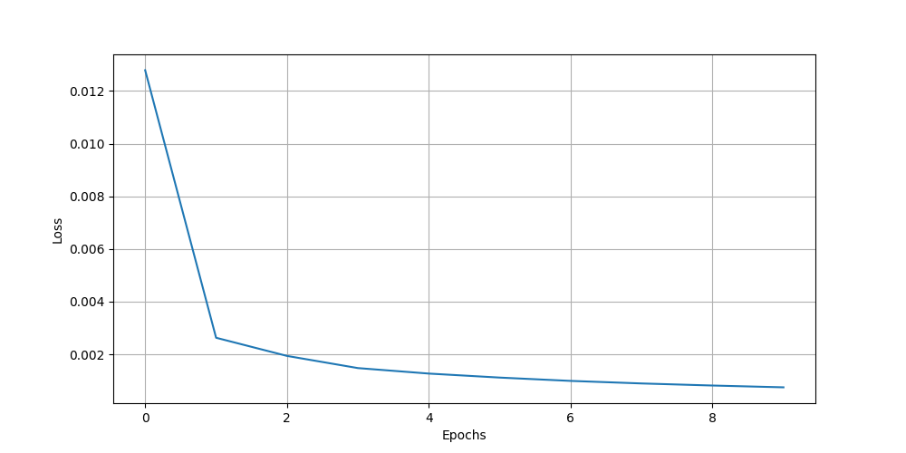
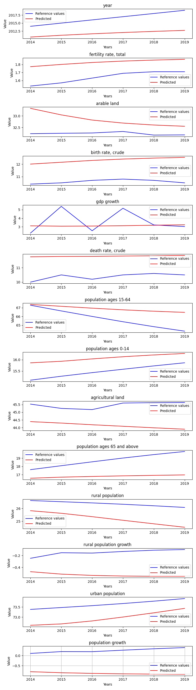

# ExcludeCovidYears

**Description:** Trains a model on all states data excluding the covid years.

## Hyperparameters
```
Input size:         14
Batch size:         1

Hidden size:        256
Sequence length:    10
Layers:             3

Learning rate:      0.0001
Epochs:             10

Bidirectional:      False
```
## Features
```
year
fertility rate, total
arable land
birth rate, crude
gdp growth
death rate, crude
population ages 15-64
population ages 0-14
agricultural land
population ages 65 and above
rural population
rural population growth
urban population
population growth
```
## Loss graph





## Evaluation of the model - state: Czechia




# Metric result
{'mae': 1.9581076255042547,
 'mse': 6.648423348096595,
 'r2': -209.74094910208382,
 'rmse': 2.046816651541895}
