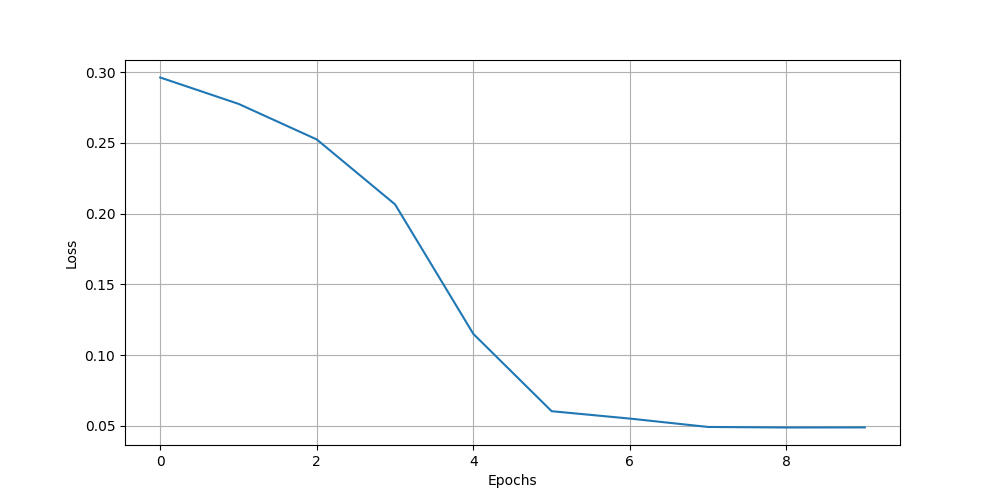
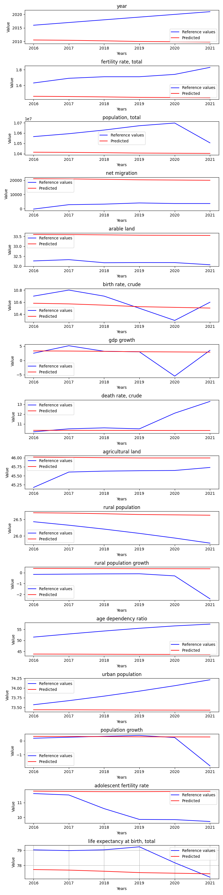

# OneStateDataExperiment

**Description:** Train and evaluate model on single state data.

## Hyperparameters
```
Input size:         19
Batch size:         1

Hidden size:        128
Sequence length:    10
Layers:             3

Learning rate:      0.0001
Epochs:             10

Bidirectional:      False
```
## Features
```
year
fertility rate, total
population, total
net migration
arable land
birth rate, crude
gdp growth
death rate, crude
population ages 15-64
population ages 0-14
agricultural land
population ages 65 and above
rural population
rural population growth
age dependency ratio
urban population
population growth
adolescent fertility rate
life expectancy at birth, total
```

## Loss graph





## Prediction of Czechia by the training data




# Metric result
{'mae': 11864.340056484063,
 'mse': 2516268177.1801558,
 'r2': -31.718209138609364,
 'rmse': 12396.447000786402}
