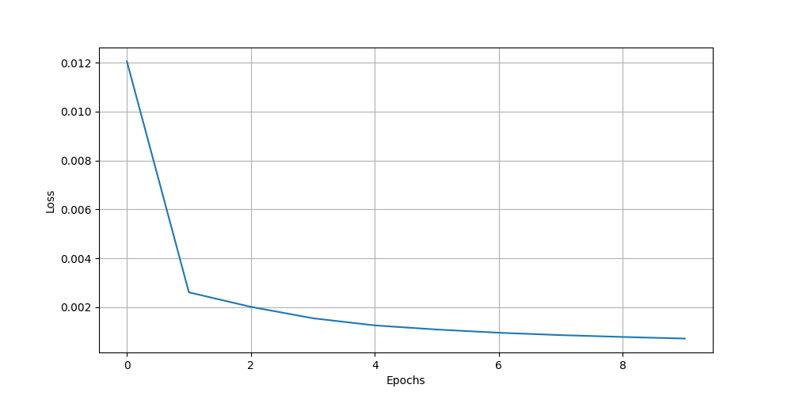

# OnlyStationaryFeaturesAllData

**Description:** Train and evaluate model on single state data.

## Hyperparameters
```
Input size:         14
Batch size:         1

Hidden size:        128
Sequence length:    10
Layers:             3

Learning rate:      0.0001
Epochs:             10

Bidirectional:      False
```
## Features
```
year
fertility rate, total
arable land
birth rate, crude
gdp growth
death rate, crude
population ages 15-64
population ages 0-14
agricultural land
population ages 65 and above
rural population
rural population growth
urban population
population growth
```
## Loss graph





## Evaluation of the model - state: Czechia


# Metric result
{'mae': 1.8403200592902011,
 'mse': 5.78853284226279,
 'r2': -80.45621174883172,
 'rmse': 1.892191848037692}
