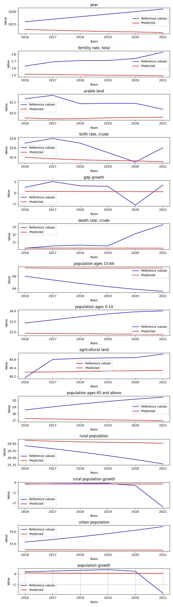

# OnlyStationaryFeaturesDataExperiment

**Description:** Train and evaluate model on single state data with all features with boundaries (for example % values, features with some mean.) 

## Hyperparameters
```
Input size:         14
Batch size:         1

Hidden size:        128
Sequence length:    10
Layers:             3

Learning rate:      0.0001
Epochs:             40

Bidirectional:      False
```
## Features
```
year
fertility rate, total
arable land
birth rate, crude
gdp growth
death rate, crude
population ages 15-64
population ages 0-14
agricultural land
population ages 65 and above
rural population
rural population growth
urban population
population growth
```

## Evaluation of the model




# Compare metric results
{'mae': 1.3972495304132817,
 'mse': 5.452824425222187,
 'r2': -7.039421996235525,
 'rmse': 1.5681872088704556}
