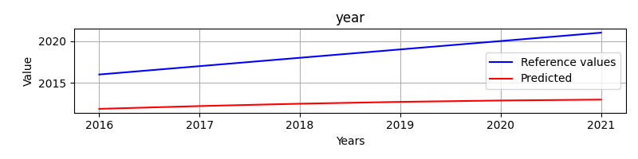
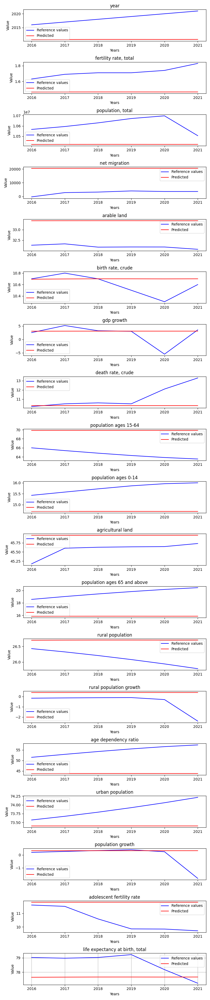

# OptimalParamsExperiment

**Description:** The goal is to find the optimal parameters for the given LocalModel model.

# Base model evaluation
Hyperparameters:
```
Input size:         1
Batch size:         1

Hidden size:        128
Sequence length:    10
Layers:             3

Learning rate:      0.0001
Epochs:             20

Bidirectional:      False
```
## Base model predicted vs reference values
Displays the performance for every feature predicted of the `Base Model`.



# Optimal model evaluation
Hyperparameters:
```
Input size:         1
Batch size:         1

Hidden size:        1436
Sequence length:    10
Layers:             5

Learning rate:      0.005857034912964482
Epochs:             20

Bidirectional:      False
```
## Optimal model predicted vs reference values
Displays the performance for every feature predicted of the `Optimal Model`.



# Compare metric results

Base model:
{'mae': 5.960367838541704,
 'mse': 37.299719810486245,
 'r2': -11.78847536359545,
 'rmse': 6.107349655168455}

Optimal model:
{'mae': 5.915405273437538,
 'mse': 37.90868621567927,
 'r2': -11.997263845375917,
 'rmse': 6.157003022224308}
