# RNNvsStatisticalMethods

**Description:** Compares the performance of LSTM model with the statistical ARIMA model for all features prediction. ARIMA model is trained just to predict 1 feauture from all features and LSTM predict all features at once.

## Features
```
year
fertility rate, total
population, total
net migration
arable land
birth rate, crude
gdp growth
death rate, crude
agricultural land
rural population
rural population growth
age dependency ratio
urban population
population growth
adolescent fertility rate
life expectancy at birth, total
```

## Hyperparameters

```
Input size:         16
Batch size:         1

Hidden size:        256
Sequence length:    10
Layers:             2

Learning rate:      0.0001
Epochs:             30

Bidirectional:      False
```


## Arima evaluation: fertility rate, total


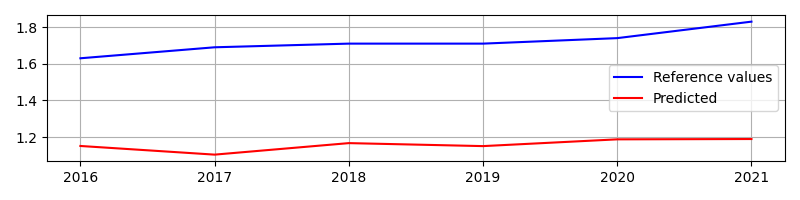


## Arima evaluation: population, total


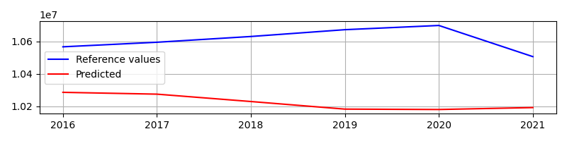


## Arima evaluation: net migration


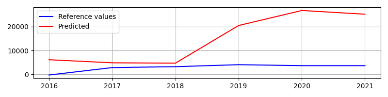


## Arima evaluation: arable land


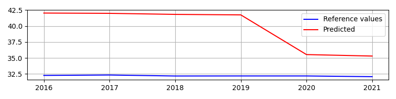


## Arima evaluation: birth rate, crude


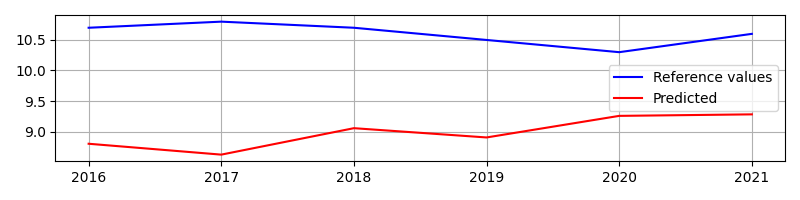


## Arima evaluation: gdp growth


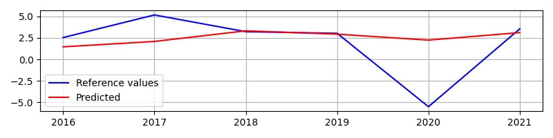


## Arima evaluation: death rate, crude


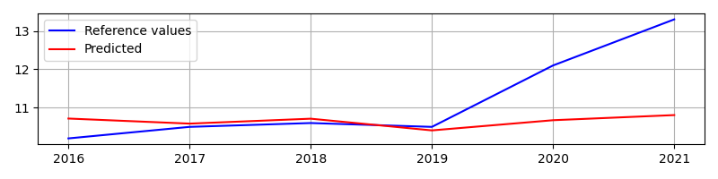


## Arima evaluation: agricultural land


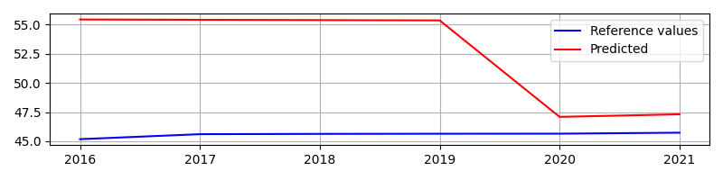


## Arima evaluation: rural population


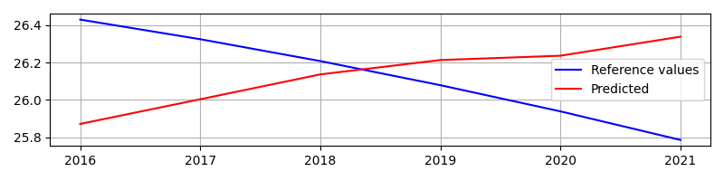


## Arima evaluation: rural population growth


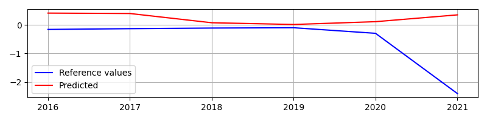


## Arima evaluation: age dependency ratio


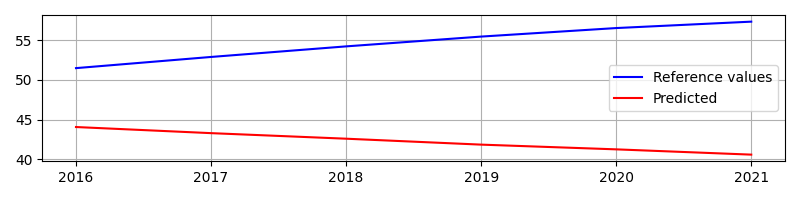


## Arima evaluation: urban population


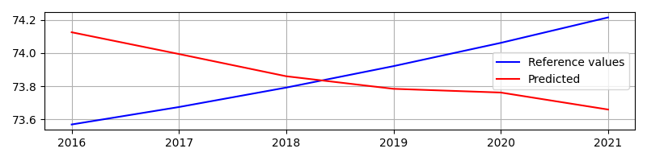


## Arima evaluation: population growth


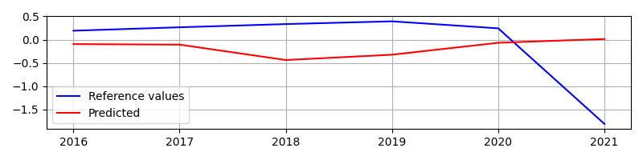


## Arima evaluation: adolescent fertility rate


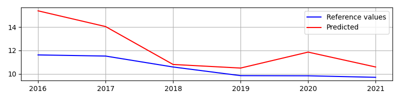


## Arima evaluation: life expectancy at birth, total


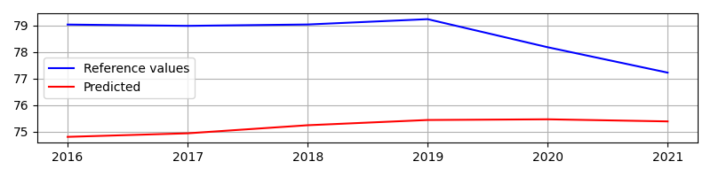

## LSTM per feature dict metrics

```
[{'feature': 'year',
  'mae': 8.011534730593363,
  'mse': 67.4754916225334,
  'rmse': 8.214346694809842},
 {'feature': 'fertility rate, total',
  'mae': 0.2721751286586126,
  'mse': 0.07788073153943034,
  'rmse': 0.27907119439209477},
 {'feature': 'population, total',
  'mae': 199464.89359011254,
  'mse': 43972264840.36851,
  'rmse': 209695.64811976548},
 {'feature': 'net migration',
  'mae': 18081.86635327339,
  'mse': 329339818.6708778,
  'rmse': 18147.72213449605},
 {'feature': 'arable land',
  'mae': 1.3671420790838174,
  'mse': 1.8746714286730832,
  'rmse': 1.3691864112213075},
 {'feature': 'birth rate, crude',
  'mae': 0.12435846130053196,
  'mse': 0.024307039650216435,
  'rmse': 0.15590715073471273},
 {'feature': 'gdp growth',
  'mae': 1.9819849305958932,
  'mse': 13.073703739115585,
  'rmse': 3.615757699171169},
 {'feature': 'death rate, crude',
  'mae': 0.9060585811734203,
  'mse': 1.9984354735951744,
  'rmse': 1.4136603105396905},
 {'feature': 'agricultural land',
  'mae': 0.5412645406388042,
  'mse': 0.3280269735703572,
  'rmse': 0.5727363909953315},
 {'feature': 'rural population',
  'mae': 0.5616682877937951,
  'mse': 0.3602924278736092,
  'rmse': 0.6002436404274595},
 {'feature': 'rural population growth',
  'mae': 0.9252969038380066,
  'mse': 1.5560125334308428,
  'rmse': 1.247402314183697},
 {'feature': 'age dependency ratio',
  'mae': 10.885426371790233,
  'mse': 122.7602856102052,
  'rmse': 11.079724076447265},
 {'feature': 'urban population',
  'mae': 0.4488230725030083,
  'mse': 0.2506003237405389,
  'rmse': 0.5005999637839968},
 {'feature': 'population growth',
  'mae': 0.4070495940301933,
  'mse': 0.7450192100188971,
  'rmse': 0.8631449530750308},
 {'feature': 'adolescent fertility rate',
  'mae': 1.3286173085235065,
  'mse': 2.3776751472620945,
  'rmse': 1.5419711888560352},
 {'feature': 'life expectancy at birth, total',
  'mae': 1.1401956778425724,
  'mse': 1.5411717991936553,
  'rmse': 1.2414394061707785}]
```


## ARIMA per feature dict metrics

```
[{'feature': 'fertility rate, total',
  'mae': 0.5602684465104834,
  'mse': 0.316258756158468,
  'rmse': 0.5623688790806867},
 {'feature': 'population, total',
  'mae': 370941.1752914631,
  'mse': 144419086723.67618,
  'rmse': 380025.1132802623},
 {'feature': 'net migration',
  'mae': 11799.035255443758,
  'mse': 220010366.23300537,
  'rmse': 14832.746415718344},
 {'feature': 'arable land',
  'mae': 7.599092942554923,
  'mse': 66.92873344143486,
  'rmse': 8.18099831569686},
 {'feature': 'birth rate, crude',
  'mae': 1.6137441872246951,
  'mse': 2.739890180501081,
  'rmse': 1.6552613631995043},
 {'feature': 'gdp growth',
  'mae': 2.3302906016233607,
  'mse': 11.76939406080592,
  'rmse': 3.430655048355331},
 {'feature': 'death rate, crude',
  'mae': 0.7876972392376341,
  'mse': 1.424140195664994,
  'rmse': 1.1933734518854497},
 {'feature': 'agricultural land',
  'mae': 7.097390973488636,
  'mse': 66.0157673204349,
  'rmse': 8.12500875817589},
 {'feature': 'rural population',
  'mae': 0.3218632438825306,
  'mse': 0.13816579017481842,
  'rmse': 0.3717065915138154},
 {'feature': 'rural population growth',
  'mae': 0.7605269024315477,
  'mse': 1.4010090929110846,
  'rmse': 1.1836422993924662},
 {'feature': 'age dependency ratio',
  'mae': 12.42299426967498,
  'mse': 164.7233864839216,
  'rmse': 12.834460895726068},
 {'feature': 'urban population',
  'mae': 0.32186101216711904,
  'mse': 0.13816223589998436,
  'rmse': 0.3717018104609989},
 {'feature': 'population growth',
  'mae': 0.7147228357015981,
  'mse': 0.7939705124383835,
  'rmse': 0.891050230031048},
 {'feature': 'adolescent fertility rate',
  'mae': 1.674478821521778,
  'mse': 4.3043129574584675,
  'rmse': 2.0746838210817735},
 {'feature': 'life expectancy at birth, total',
  'mae': 3.392656952446354,
  'mse': 12.2279364014081,
  'rmse': 3.4968466368155324}]
```


# LSTM ARIMA comparision results

```
[{'best_model': 'FineTunableLSTM', 'feature': 'adolescent fertility rate'},
 {'best_model': 'FineTunableLSTM', 'feature': 'birth rate, crude'},
 {'best_model': 'FineTunableLSTM', 'feature': 'population, total'},
 {'best_model': 'ARIMA', 'feature': 'death rate, crude'},
 {'best_model': 'ARIMA', 'feature': 'rural population'},
 {'best_model': 'ARIMA', 'feature': 'urban population'},
 {'best_model': 'FineTunableLSTM', 'feature': 'population growth'},
 {'best_model': 'FineTunableLSTM',
  'feature': 'life expectancy at birth, total'},
 {'best_model': 'ARIMA', 'feature': 'net migration'},
 {'best_model': 'ARIMA', 'feature': 'rural population growth'},
 {'best_model': 'FineTunableLSTM', 'feature': 'agricultural land'},
 {'best_model': 'ARIMA', 'feature': 'gdp growth'},
 {'best_model': 'FineTunableLSTM', 'feature': 'fertility rate, total'},
 {'best_model': 'FineTunableLSTM', 'feature': 'arable land'},
 {'best_model': 'FineTunableLSTM', 'feature': 'age dependency ratio'}]
```


