# RNNvsStatisticalMethodsSingleFeature

**Description:** Compares the performance of LSTM model with the statistical ARIMA model for all features prediction. Each model is trained just to predict 1 feauture from all features.

# LSTM model parameters
Hyperparameters:
```
Input size:         1
Batch size:         1

Hidden size:        256
Sequence length:    10
Layers:             3

Learning rate:      0.0001
Epochs:             10

Bidirectional:      False
```
# LSTM & ARIMA Comparision: Feature: fertility rate, total
Comparision of LSTM and ARIMA model of predicting feature fertility rate, total. State: Czechia

## Arima evaluation


## RNN evaluation - fertility rate, total


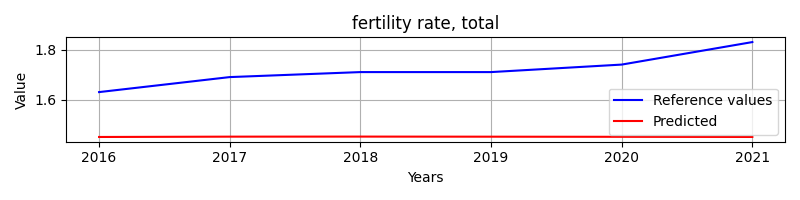

### Overall metrics (ARIMA)
```
{'mae': 0.5602684465104834,
 'mse': 0.316258756158468,
 'r2': -86.51203091241221,
 'rmse': 0.5623688790806867}
```

### Overall metrics (RNN)
```
{'mae': 0.2670298846562704,
 'mse': 0.0749318478995949,
 'r2': -19.73440833501469,
 'rmse': 0.2737368223304912}
```

# LSTM & ARIMA Comparision: Feature: population, total
Comparision of LSTM and ARIMA model of predicting feature population, total. State: Czechia

## Arima evaluation


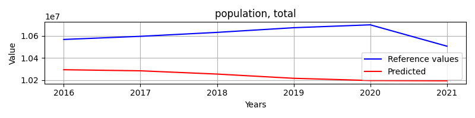


## RNN evaluation - population, total


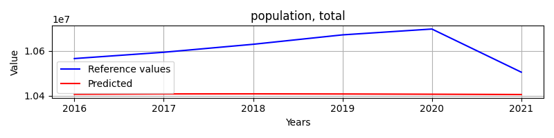

### Overall metrics (ARIMA)
```
{'mae': 370941.1752914631,
 'mse': 144419086723.67618,
 'r2': -33.72977117808477,
 'rmse': 380025.1132802623}
```

### Overall metrics (RNN)
```
{'mae': 203139.855005304,
 'mse': 45350664605.03743,
 'r2': -9.905886751109113,
 'rmse': 212956.95481725276}
```

# LSTM & ARIMA Comparision: Feature: net migration
Comparision of LSTM and ARIMA model of predicting feature net migration. State: Czechia

## Arima evaluation


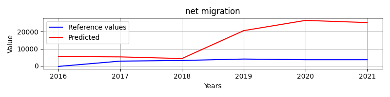


## RNN evaluation - net migration


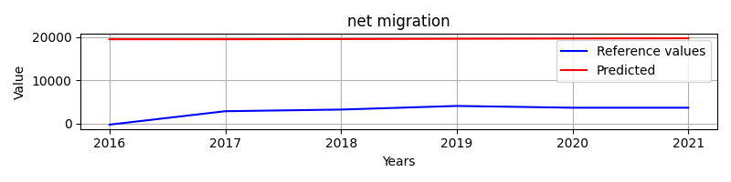

### Overall metrics (ARIMA)
```
{'mae': 11799.035255443758,
 'mse': 220010366.23300537,
 'r2': -103.59694573861474,
 'rmse': 14832.746415718344}
```

### Overall metrics (RNN)
```
{'mae': 16734.759153346222,
 'mse': 282007400.2178423,
 'r2': -133.0714678290844,
 'rmse': 16793.075960580965}
```

# LSTM & ARIMA Comparision: Feature: arable land
Comparision of LSTM and ARIMA model of predicting feature arable land. State: Czechia

## Arima evaluation


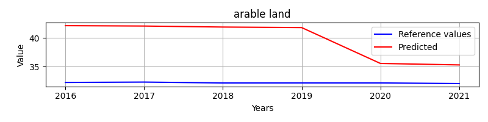


## RNN evaluation - arable land


### Overall metrics (ARIMA)
```
{'mae': 7.599092942554923,
 'mse': 66.92873344143486,
 'r2': -10338.52326142848,
 'rmse': 8.18099831569686}
```

### Overall metrics (RNN)
```
{'mae': 0.42492013243334625,
 'mse': 0.18370668155161618,
 'r2': -27.380030661193526,
 'rmse': 0.4286101743444924}
```

# LSTM & ARIMA Comparision: Feature: birth rate, crude
Comparision of LSTM and ARIMA model of predicting feature birth rate, crude. State: Czechia

## Arima evaluation


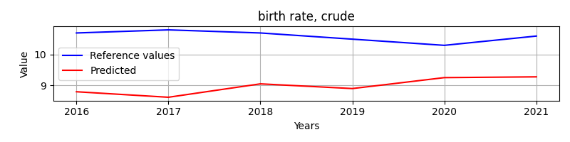


## RNN evaluation - birth rate, crude


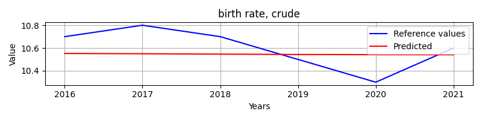

### Overall metrics (ARIMA)
```
{'mae': 1.6137441872246951,
 'mse': 2.739890180501081,
 'r2': -101.74588176879082,
 'rmse': 1.6552613631995043}
```

### Overall metrics (RNN)
```
{'mae': 0.14931355516115818,
 'mse': 0.028644441505574342,
 'r2': -0.0741665564590408,
 'rmse': 0.1692466883149397}
```

# LSTM & ARIMA Comparision: Feature: gdp growth
Comparision of LSTM and ARIMA model of predicting feature gdp growth. State: Czechia

## Arima evaluation


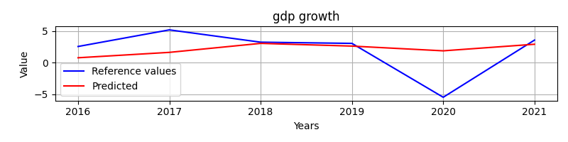


## RNN evaluation - gdp growth


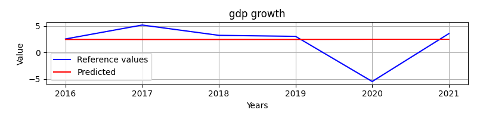

### Overall metrics (ARIMA)
```
{'mae': 2.3302906016233607,
 'mse': 11.76939406080592,
 'r2': 0.013533341928053777,
 'rmse': 3.430655048355331}
```

### Overall metrics (RNN)
```
{'mae': 2.2040509811898255,
 'mse': 12.183547930243938,
 'r2': -0.0211794887751533,
 'rmse': 3.490493937860935}
```

# LSTM & ARIMA Comparision: Feature: death rate, crude
Comparision of LSTM and ARIMA model of predicting feature death rate, crude. State: Czechia

## Arima evaluation


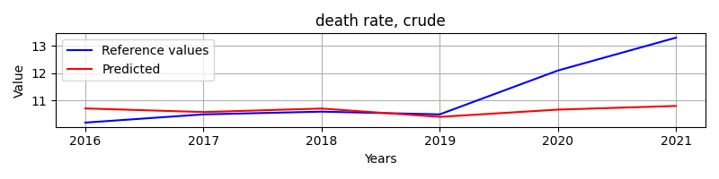


## RNN evaluation - death rate, crude


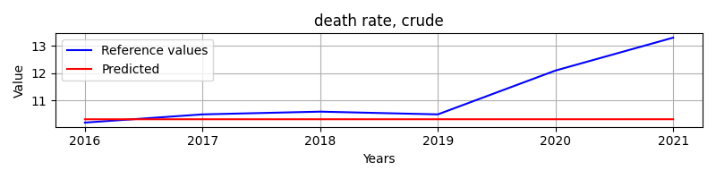

### Overall metrics (ARIMA)
```
{'mae': 0.7876972392376341,
 'mse': 1.424140195664994,
 'r2': -0.13026999655951843,
 'rmse': 1.1933734518854497}
```

### Overall metrics (RNN)
```
{'mae': 0.9180798704425497,
 'mse': 2.0290785851444286,
 'r2': -0.6103798294797045,
 'rmse': 1.4244572949528633}
```

# LSTM & ARIMA Comparision: Feature: agricultural land
Comparision of LSTM and ARIMA model of predicting feature agricultural land. State: Czechia

## Arima evaluation


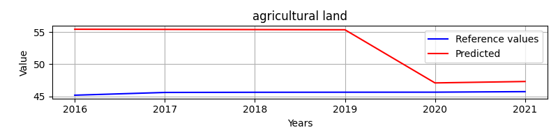


## RNN evaluation - agricultural land


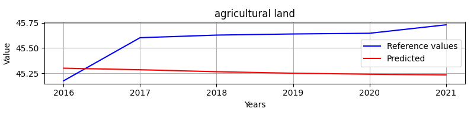

### Overall metrics (ARIMA)
```
{'mae': 7.097390973488636,
 'mse': 66.0157673204349,
 'r2': -2012.0963916731064,
 'rmse': 8.12500875817589}
```

### Overall metrics (RNN)
```
{'mae': 0.3495816568772625,
 'mse': 0.1351855969366551,
 'r2': -3.1223733123997945,
 'rmse': 0.3676759401112005}
```

# LSTM & ARIMA Comparision: Feature: rural population
Comparision of LSTM and ARIMA model of predicting feature rural population. State: Czechia

## Arima evaluation


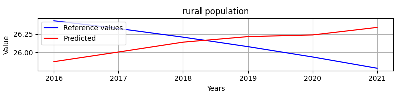


## RNN evaluation - rural population


### Overall metrics (ARIMA)
```
{'mae': 0.3218632438825306,
 'mse': 0.13816579017481842,
 'r2': -1.8439041472970406,
 'rmse': 0.3717065915138154}
```

### Overall metrics (RNN)
```
{'mae': 0.6035397034088769,
 'mse': 0.41372395184891725,
 'r2': -7.5157929543234925,
 'rmse': 0.6432137683919066}
```

# LSTM & ARIMA Comparision: Feature: rural population growth
Comparision of LSTM and ARIMA model of predicting feature rural population growth. State: Czechia

## Arima evaluation


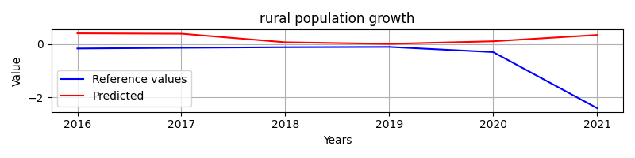


## RNN evaluation - rural population growth


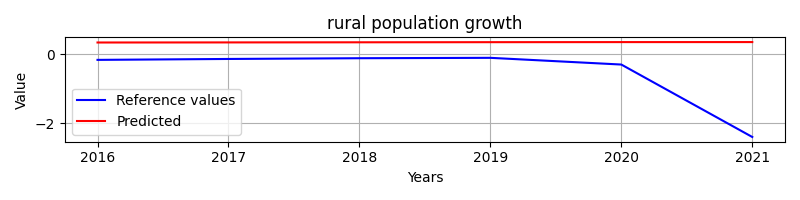

### Overall metrics (ARIMA)
```
{'mae': 0.7605269024315477,
 'mse': 1.4010090929110846,
 'r2': -0.9913402195574752,
 'rmse': 1.1836422993924662}
```

### Overall metrics (RNN)
```
{'mae': 0.8870057100709751,
 'mse': 1.4945973185615005,
 'r2': -1.1243629092442733,
 'rmse': 1.2225372462880222}
```

# LSTM & ARIMA Comparision: Feature: age dependency ratio
Comparision of LSTM and ARIMA model of predicting feature age dependency ratio. State: Czechia

## Arima evaluation


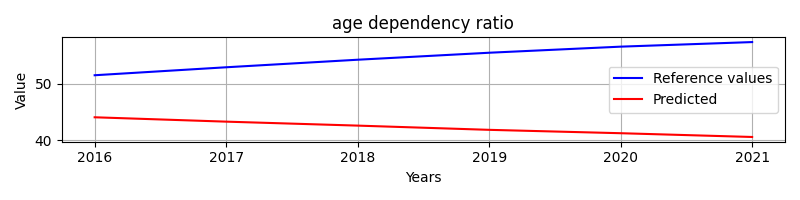


## RNN evaluation - age dependency ratio


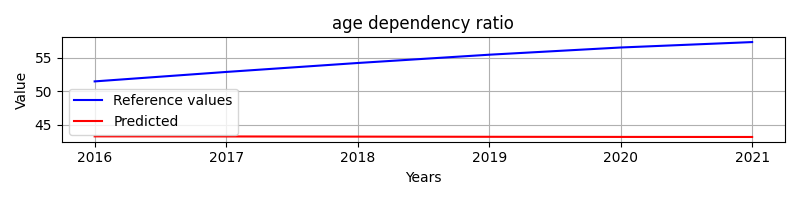

### Overall metrics (ARIMA)
```
{'mae': 12.42299426967498,
 'mse': 164.7233864839216,
 'r2': -38.71424105485405,
 'rmse': 12.834460895726068}
```

### Overall metrics (RNN)
```
{'mae': 11.441482450367218,
 'mse': 135.19445631552838,
 'r2': -31.594917710236032,
 'rmse': 11.627315094875875}
```

# LSTM & ARIMA Comparision: Feature: urban population
Comparision of LSTM and ARIMA model of predicting feature urban population. State: Czechia

## Arima evaluation


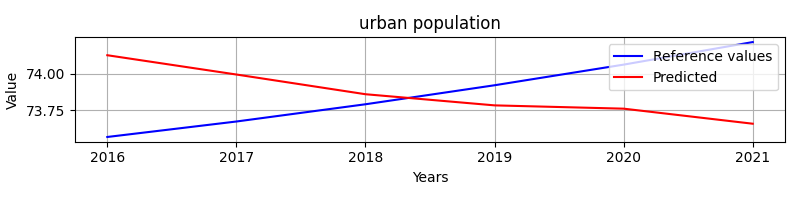


## RNN evaluation - urban population


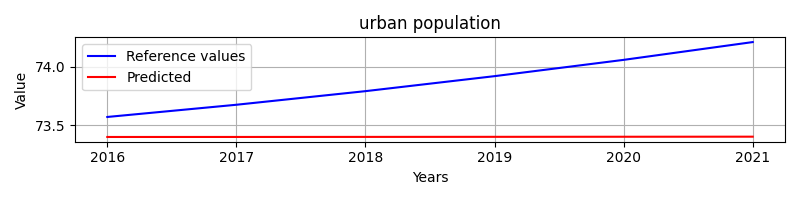

### Overall metrics (ARIMA)
```
{'mae': 0.32186101216711904,
 'mse': 0.13816223589998436,
 'r2': -1.8438309886885262,
 'rmse': 0.3717018104609989}
```

### Overall metrics (RNN)
```
{'mae': 0.4731607761482361,
 'mse': 0.2720613720853795,
 'r2': -4.5999134330860185,
 'rmse': 0.521595026898627}
```

# LSTM & ARIMA Comparision: Feature: population growth
Comparision of LSTM and ARIMA model of predicting feature population growth. State: Czechia

## Arima evaluation


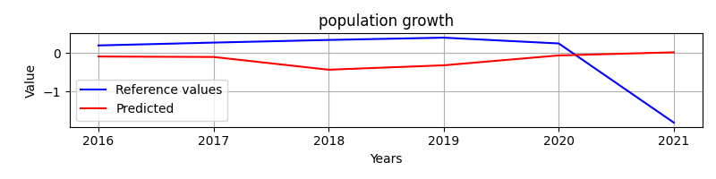


## RNN evaluation - population growth


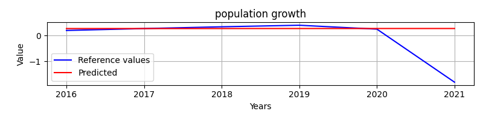

### Overall metrics (ARIMA)
```
{'mae': 0.7147228357015981,
 'mse': 0.7939705124383835,
 'r2': -0.2903166042843446,
 'rmse': 0.891050230031048}
```

### Overall metrics (RNN)
```
{'mae': 0.3954154557598753,
 'mse': 0.7252271646282146,
 'r2': -0.17859874861594727,
 'rmse': 0.8516027035115697}
```

# LSTM & ARIMA Comparision: Feature: adolescent fertility rate
Comparision of LSTM and ARIMA model of predicting feature adolescent fertility rate. State: Czechia

## Arima evaluation


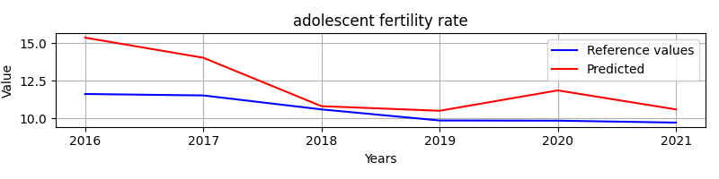


## RNN evaluation - adolescent fertility rate


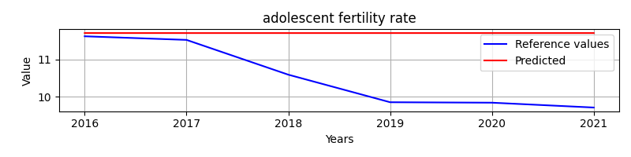

### Overall metrics (ARIMA)
```
{'mae': 1.674478821521778,
 'mse': 4.3043129574584675,
 'r2': -5.814345218365845,
 'rmse': 2.0746838210817735}
```

### Overall metrics (RNN)
```
{'mae': 1.1848346153746057,
 'mse': 2.035618012860247,
 'r2': -2.2226754907115636,
 'rmse': 1.4267508587206972}
```

# LSTM & ARIMA Comparision: Feature: life expectancy at birth, total
Comparision of LSTM and ARIMA model of predicting feature life expectancy at birth, total. State: Czechia

## Arima evaluation


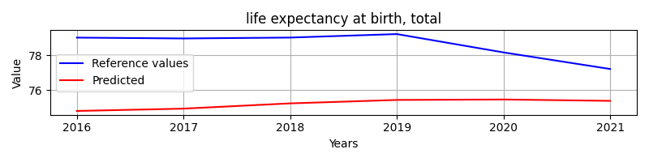


## RNN evaluation - life expectancy at birth, total


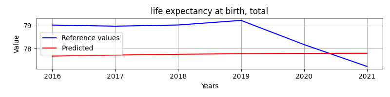

### Overall metrics (ARIMA)
```
{'mae': 3.392656952446354,
 'mse': 12.2279364014081,
 'r2': -23.58815868929439,
 'rmse': 3.4968466368155324}
```

### Overall metrics (RNN)
```
{'mae': 1.0502287881742827,
 'mse': 1.272968920311506,
 'r2': -1.5597092421542795,
 'rmse': 1.1282592433973258}
```

# Feature comparation dict
```
[{'best_model': 'LSTM', 'feature': 'fertility rate, total'},
 {'best_model': 'LSTM', 'feature': 'population, total'},
 {'best_model': 'ARIMA', 'feature': 'net migration'},
 {'best_model': 'LSTM', 'feature': 'arable land'},
 {'best_model': 'LSTM', 'feature': 'birth rate, crude'},
 {'best_model': 'ARIMA', 'feature': 'gdp growth'},
 {'best_model': 'ARIMA', 'feature': 'death rate, crude'},
 {'best_model': 'LSTM', 'feature': 'agricultural land'},
 {'best_model': 'ARIMA', 'feature': 'rural population'},
 {'best_model': 'ARIMA', 'feature': 'rural population growth'},
 {'best_model': 'LSTM', 'feature': 'age dependency ratio'},
 {'best_model': 'ARIMA', 'feature': 'urban population'},
 {'best_model': 'LSTM', 'feature': 'population growth'},
 {'best_model': 'LSTM', 'feature': 'adolescent fertility rate'},
 {'best_model': 'LSTM', 'feature': 'life expectancy at birth, total'}]
```

