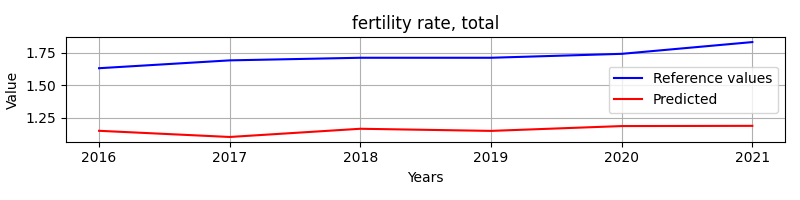

# RNNvsStatisticalMethodsSingleFeature

**Description:** The goal is to find the optimal parameters for the given BaseLSTM model.

# LSTM model parameters
Hyperparameters:
```
Input size:         16
Batch size:         1

Hidden size:        256
Sequence length:    10
Layers:             3

Learning rate:      0.0001
Epochs:             1

Bidirectional:      False
```
# LSTM & ARIMA Comparision: Feature: fertility rate, total
Comparision of LSTM and ARIMA model of predicting feature fertility rate, total. State: Czechia

## Arima evaluation




