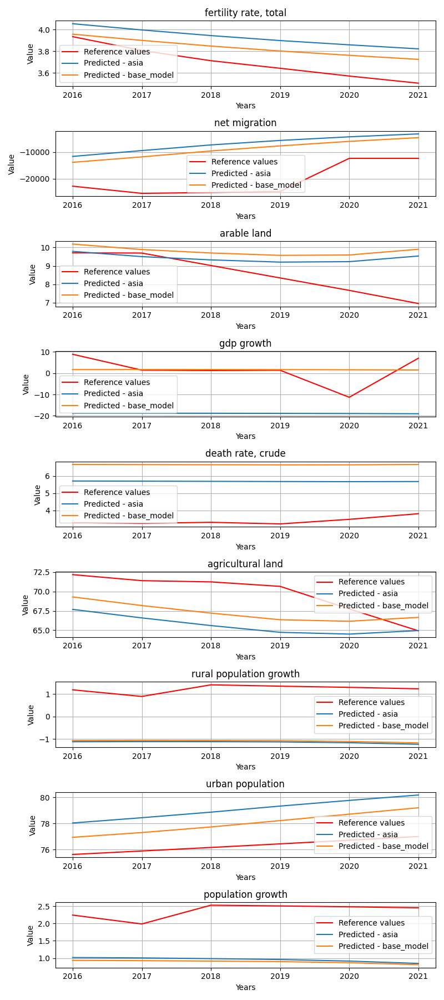
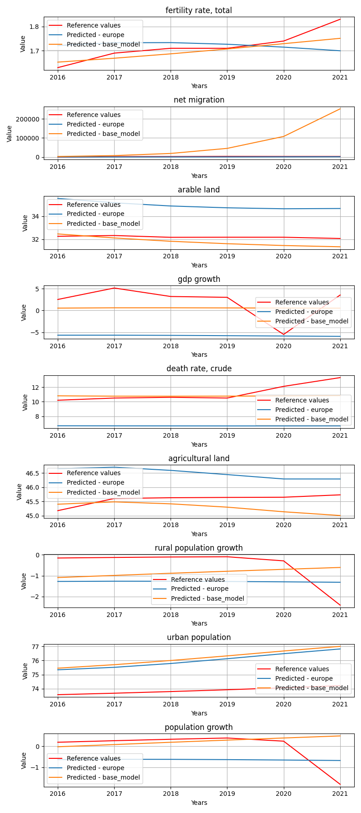

# StatesByGroup_geolocation

**Description:** States by the given state groups.

## asia model


## Model comparision prediction plot
In the next feagure you can see each model predictions compared to each other and the reference data.



## Per target metrics - model comparision
```
                      target            mae           mse           rmse          r2               state       model   rank
61          urban population      11.947716  1.471917e+02      12.132260  -16.673446          Bangladesh        asia  495.0
62         population growth       0.505772  3.310543e-01       0.575373  -34.072550          Bangladesh        asia  173.0
60   rural population growth       1.315040  1.781721e+00       1.334811 -184.190100          Bangladesh        asia  257.0
55             net migration  269087.684885  9.798867e+10  313031.418618   -2.280862          Bangladesh        asia  527.0
138               gdp growth       2.766053  1.046353e+01       3.234738   -7.947678          Bangladesh  base_model  364.0
..                       ...            ...           ...            ...         ...                 ...         ...    ...
30                gdp growth      20.312840  4.539575e+02      21.306279   -9.938680  West Bank and Gaza        asia  491.0
113        agricultural land       2.952499  9.776681e+00       3.126768   -0.515485  West Bank and Gaza  base_model  306.0
31         death rate, crude       2.283021  5.256032e+00       2.292604 -126.752750  West Bank and Gaza        asia  326.0
111               gdp growth       4.444663  4.154274e+01       6.445366   -0.001025  West Bank and Gaza  base_model  391.0
34          urban population       2.799166  7.908511e+00       2.812207  -34.841826  West Bank and Gaza        asia  357.0

[162 rows x 8 columns]
```


## Overall metrics - model comparision
```
             mae           mse          rmse            r2                 state       model  rank
6   29903.903618  1.088763e+10  34786.687623    -94.418996            Bangladesh        asia  56.0
15  29805.234750  1.079784e+10  34640.311711    -44.452204            Bangladesh  base_model  48.0
8   19597.295329  4.085411e+09  21310.213860   -120.018884                 China        asia  48.0
17  19734.526276  4.138234e+09  21445.194437    -46.374289                 China  base_model  46.0
7    4531.335745  2.125723e+08   4864.252461    -18.290159             Indonesia        asia  29.0
16   4552.663326  2.152291e+08   4892.103857     -4.007221             Indonesia  base_model  31.0
1     832.894422  7.961198e+06    945.078013   -121.338634              Maldives        asia  25.0
10    843.102660  8.146924e+06    954.903282   -202.181347              Maldives  base_model  29.0
11    695.471103  6.770664e+06    869.554679 -44843.259453              Mongolia  base_model  30.0
2     685.510022  6.609557e+06    861.338726 -31663.650587              Mongolia        asia  26.0
4   65417.590575  7.647602e+10  92185.910123  -6120.812648  Syrian Arab Republic        asia  70.0
13  65416.137563  7.647602e+10  92184.810956  -2485.063856  Syrian Arab Republic  base_model  64.0
0     464.369981  2.239514e+06    503.229863  -2074.041441          Turkmenistan        asia  18.0
9     352.348725  1.427630e+06    400.126472    -70.390473          Turkmenistan  base_model  10.0
5    4861.981722  2.306771e+08   5067.257575  -3136.086386            Uzbekistan        asia  48.0
14   4867.916839  2.313022e+08   5071.704691  -3073.735259            Uzbekistan  base_model  50.0
3    1506.984553  2.236946e+07   1580.568723    -48.550792    West Bank and Gaza        asia  29.0
12   1283.338073  1.660803e+07   1360.664497    -58.487014    West Bank and Gaza  base_model  27.0
```


## europe model


## Model comparision prediction plot
In the next feagure you can see each model predictions compared to each other and the reference data.



## Per target metrics - model comparision
```
                      target       mae        mse      rmse          r2                   state       model   rank
42   rural population growth  0.700704   0.510894  0.714769  -28.006532  Bosnia and Herzegovina      europe  208.0
41         agricultural land  2.129911   4.614660  2.148176  -31.771007  Bosnia and Herzegovina      europe  351.0
120               gdp growth  2.179749   9.544846  3.089473   -0.018318  Bosnia and Herzegovina  base_model  290.0
124         urban population  2.847054   8.126592  2.850718  -18.146852  Bosnia and Herzegovina  base_model  362.0
117    fertility rate, total  0.315158   0.100500  0.317018 -301.206292  Bosnia and Herzegovina  base_model  185.0
..                       ...       ...        ...       ...         ...                     ...         ...    ...
132  rural population growth  0.555669   0.418168  0.646659   -5.690442             Switzerland  base_model  146.0
48                gdp growth  6.967715  52.373687  7.236967  -12.851060             Switzerland      europe  468.0
131        agricultural land  4.576542  22.674266  4.761750 -248.065544             Switzerland  base_model  483.0
53         population growth  1.331325   1.805287  1.343610  -49.783766             Switzerland      europe  320.0
49         death rate, crude  1.548249   2.463922  1.569689  -35.915148             Switzerland      europe  325.0

[162 rows x 8 columns]
```


## Overall metrics - model comparision
```
             mae           mse          rmse            r2                   state       model  rank
13  3.036035e+03  8.297719e+07  3.038207e+03 -7.271421e+01  Bosnia and Herzegovina  base_model  26.0
4   2.874330e+03  7.426928e+07  2.875286e+03 -8.020911e+01  Bosnia and Herzegovina      europe  23.0
2   1.959412e+02  3.625019e+05  2.030454e+02 -1.475970e+02                 Czechia      europe  15.0
11  7.765950e+03  1.380655e+09  1.238685e+04 -6.736523e+02                 Czechia  base_model  48.0
1   4.880263e+03  2.804781e+08  5.584211e+03 -2.224289e+01                  France      europe  32.0
10  5.460646e+07  1.187268e+17  1.148559e+08 -1.335082e+08                  France  base_model  71.0
6   5.426909e+03  3.580233e+08  6.309851e+03 -1.309978e+01                   Italy      europe  34.0
15  1.648439e+07  8.402368e+15  3.055481e+07 -9.128351e+05                   Italy  base_model  63.0
0   2.996930e+03  9.578314e+07  3.267015e+03 -4.473291e+02                 Moldova      europe  30.0
9   3.339864e+03  1.185462e+08  3.632623e+03 -5.294181e+02                 Moldova  base_model  35.0
12  1.333676e+02  2.020945e+05  1.535293e+02 -5.248707e+04              Montenegro  base_model  20.0
3   1.082946e+02  1.262596e+05  1.219865e+02 -4.683127e+04              Montenegro      europe  16.0
16  4.291344e+07  6.107047e+16  8.237480e+07 -3.916272e+08                  Norway  base_model  69.0
7   5.382790e+05  5.089545e+12  7.520028e+05 -3.430990e+04                  Norway      europe  54.0
17  7.001292e+02  1.154404e+07  1.134701e+03 -8.031571e+02                  Poland  base_model  26.0
8   6.310293e+02  1.038191e+07  1.077458e+03 -5.820559e+02                  Poland      europe  21.0
5   9.505559e+03  1.159036e+09  1.135017e+04 -6.803728e+01             Switzerland      europe  40.0
14  6.702845e+06  1.431906e+15  1.261351e+07 -4.955609e+06             Switzerland  base_model  61.0
```


## north_america model

