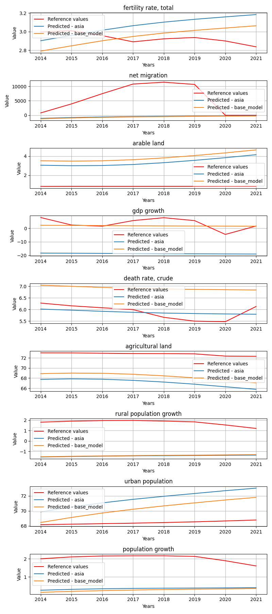
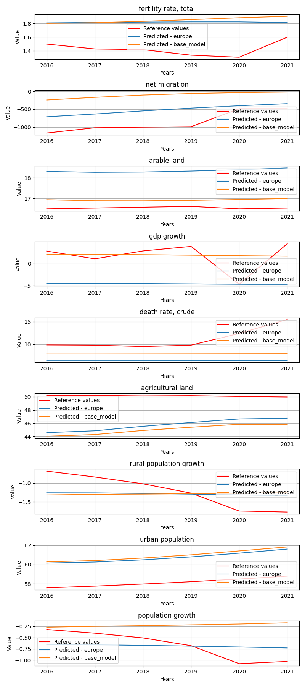
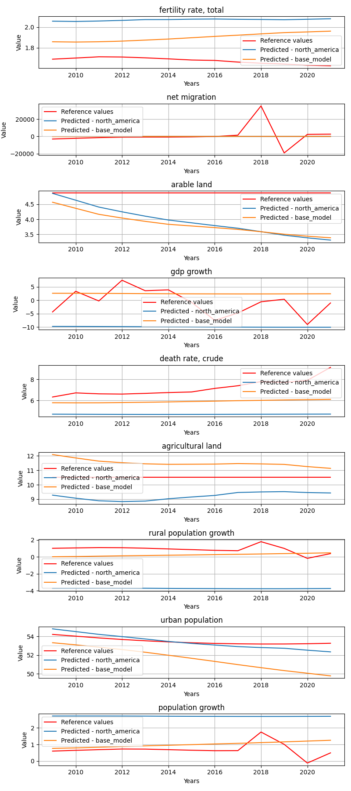
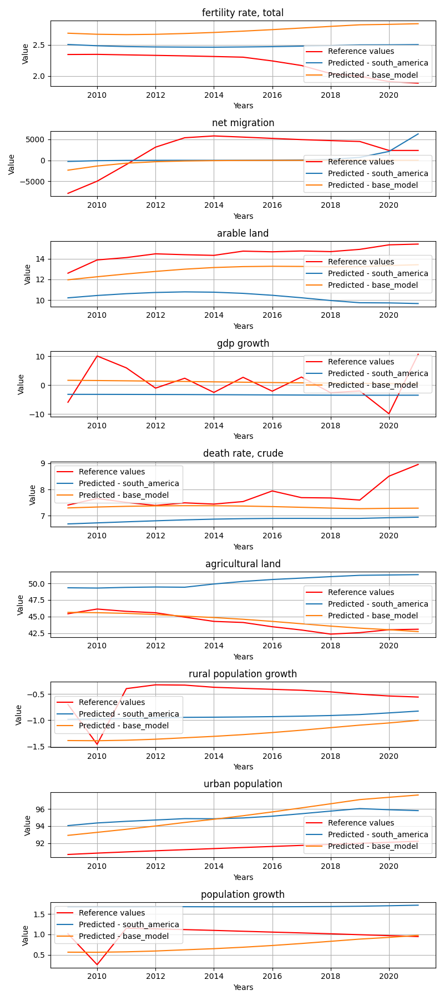
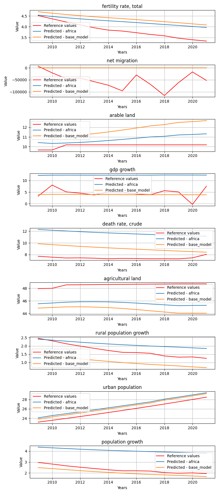
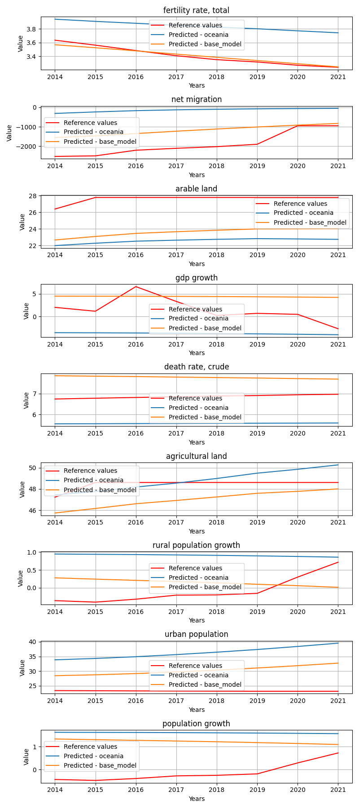

# StatesByGroup_geolocation

**Description:** States by the given state groups.

## asia model


## Model comparision prediction plot
In the next feagure you can see each model predictions compared to each other and the reference data.



## Per target metrics - model comparision
```
                      target            mae           mse           rmse          r2               state       model   rank
61          urban population      11.947716  1.471917e+02      12.132260  -16.673446          Bangladesh        asia  495.0
62         population growth       0.505772  3.310543e-01       0.575373  -34.072550          Bangladesh        asia  173.0
60   rural population growth       1.315040  1.781721e+00       1.334811 -184.190100          Bangladesh        asia  257.0
55             net migration  269087.684885  9.798867e+10  313031.418618   -2.280862          Bangladesh        asia  527.0
138               gdp growth       2.766053  1.046353e+01       3.234738   -7.947678          Bangladesh  base_model  364.0
..                       ...            ...           ...            ...         ...                 ...         ...    ...
30                gdp growth      20.312840  4.539575e+02      21.306279   -9.938680  West Bank and Gaza        asia  491.0
113        agricultural land       2.952499  9.776681e+00       3.126768   -0.515485  West Bank and Gaza  base_model  306.0
31         death rate, crude       2.283021  5.256032e+00       2.292604 -126.752750  West Bank and Gaza        asia  326.0
111               gdp growth       4.444663  4.154274e+01       6.445366   -0.001025  West Bank and Gaza  base_model  391.0
34          urban population       2.799166  7.908511e+00       2.812207  -34.841826  West Bank and Gaza        asia  357.0

[162 rows x 8 columns]
```


## Overall metrics - model comparision
```
             mae           mse          rmse            r2                 state       model  rank
6   29903.903618  1.088763e+10  34786.687623    -94.418996            Bangladesh        asia  56.0
15  29805.234750  1.079784e+10  34640.311711    -44.452204            Bangladesh  base_model  48.0
8   19597.295329  4.085411e+09  21310.213860   -120.018884                 China        asia  48.0
17  19734.526276  4.138234e+09  21445.194437    -46.374289                 China  base_model  46.0
7    4531.335745  2.125723e+08   4864.252461    -18.290159             Indonesia        asia  29.0
16   4552.663326  2.152291e+08   4892.103857     -4.007221             Indonesia  base_model  31.0
1     832.894422  7.961198e+06    945.078013   -121.338634              Maldives        asia  25.0
10    843.102660  8.146924e+06    954.903282   -202.181347              Maldives  base_model  29.0
11    695.471103  6.770664e+06    869.554679 -44843.259453              Mongolia  base_model  30.0
2     685.510022  6.609557e+06    861.338726 -31663.650587              Mongolia        asia  26.0
4   65417.590575  7.647602e+10  92185.910123  -6120.812648  Syrian Arab Republic        asia  70.0
13  65416.137563  7.647602e+10  92184.810956  -2485.063856  Syrian Arab Republic  base_model  64.0
0     464.369981  2.239514e+06    503.229863  -2074.041441          Turkmenistan        asia  18.0
9     352.348725  1.427630e+06    400.126472    -70.390473          Turkmenistan  base_model  10.0
5    4861.981722  2.306771e+08   5067.257575  -3136.086386            Uzbekistan        asia  48.0
14   4867.916839  2.313022e+08   5071.704691  -3073.735259            Uzbekistan  base_model  50.0
3    1506.984553  2.236946e+07   1580.568723    -48.550792    West Bank and Gaza        asia  29.0
12   1283.338073  1.660803e+07   1360.664497    -58.487014    West Bank and Gaza  base_model  27.0
```


## europe model


## Model comparision prediction plot
In the next feagure you can see each model predictions compared to each other and the reference data.



## Per target metrics - model comparision
```
                      target       mae       mse      rmse          r2                   state       model   rank
42   rural population growth  0.700704  0.510894  0.714769  -28.006532  Bosnia and Herzegovina      europe  205.0
110              arable land  0.876439  0.865278  0.930203   -6.869125  Bosnia and Herzegovina  base_model  190.0
115         urban population  2.847054  8.126592  2.850718  -18.146852  Bosnia and Herzegovina  base_model  329.0
41         agricultural land  2.129911  4.614660  2.148176  -31.771007  Bosnia and Herzegovina      europe  311.0
108    fertility rate, total  0.315158  0.100500  0.317018 -301.206292  Bosnia and Herzegovina  base_model  166.0
..                       ...       ...       ...       ...         ...                     ...         ...    ...
56               arable land  0.967573  0.981267  0.990589 -200.904233             Switzerland      europe  269.0
60   rural population growth  1.783289  3.239354  1.799821  -50.827800             Switzerland      europe  313.0
130        death rate, crude  0.686209  0.521336  0.722036   -6.810790             Switzerland  base_model  169.0
62         population growth  1.331325  1.805287  1.343610  -49.783766             Switzerland      europe  294.0
58         death rate, crude  1.548249  2.463922  1.569689  -35.915148             Switzerland      europe  293.0

[144 rows x 8 columns]
```


## Overall metrics - model comparision
```
             mae           mse          rmse            r2                   state       model  rank
4   2.874330e+03  7.426928e+07  2.875286e+03 -8.020911e+01  Bosnia and Herzegovina      europe  24.0
12  3.036035e+03  8.297719e+07  3.038207e+03 -7.271421e+01  Bosnia and Herzegovina  base_model  26.0
5   4.880263e+03  2.804781e+08  5.584211e+03 -2.224289e+01                  France      europe  26.0
13  5.460646e+07  1.187268e+17  1.148559e+08 -1.335082e+08                  France  base_model  59.0
2   1.553943e+03  3.216040e+07  1.894250e+03 -1.694783e+01                 Hungary      europe  16.0
10  1.329657e+05  4.128723e+11  2.141858e+05 -4.158920e+03                 Hungary  base_model  40.0
1   8.220789e+05  2.645937e+13  1.714625e+06 -2.176726e+06                 Iceland      europe  48.0
9   8.912304e+07  4.077571e+17  2.128529e+08 -3.352867e+10                 Iceland  base_model  64.0
0   8.464191e+02  6.467312e+06  8.505636e+02 -1.051747e+02                  Latvia      europe  16.0
8   9.147685e+02  7.607216e+06  9.215891e+02 -6.894960e+01                  Latvia  base_model  16.0
3   4.006697e+01  1.588910e+04  4.446659e+01 -5.376577e+02         North Macedonia      europe  12.0
11  8.524366e+01  6.776286e+04  8.862128e+01 -4.518610e+02         North Macedonia  base_model  14.0
7   5.382790e+05  5.089545e+12  7.520028e+05 -3.430990e+04                  Norway      europe  44.0
15  4.291344e+07  6.107047e+16  8.237480e+07 -3.916272e+08                  Norway  base_model  57.0
6   9.505559e+03  1.159036e+09  1.135017e+04 -6.803728e+01             Switzerland      europe  30.0
14  6.702845e+06  1.431906e+15  1.261351e+07 -4.955609e+06             Switzerland  base_model  52.0
```


## north_america model


## Model comparision prediction plot
In the next feagure you can see each model predictions compared to each other and the reference data.



## Per target metrics - model comparision
```
                   target          mae           mse          rmse           r2                state          model   rank
67      death rate, crude     0.214308  5.034754e-02      0.224383     0.608614               Canada     base_model    6.0
70       urban population     7.409957  5.786692e+01      7.607031 -1023.656513               Canada     base_model  308.0
25       urban population     5.041786  2.704240e+01      5.200231  -477.842967               Canada  north_america  296.0
21             gdp growth    10.557866  1.183568e+02     10.879190   -16.207730               Canada  north_america  278.0
71      population growth     3.235465  1.095349e+01      3.309605  -205.886081               Canada     base_model  246.0
..                    ...          ...           ...           ...          ...                  ...            ...    ...
28          net migration  5447.921357  1.279382e+08  11310.978382    -0.007072  Trinidad and Tobago  north_america  263.0
72  fertility rate, total     0.226131  5.546393e-02      0.235508   -65.108582  Trinidad and Tobago     base_model   71.0
30             gdp growth     9.208046  1.050791e+02     10.250812    -4.063044  Trinidad and Tobago  north_america  256.0
35      population growth     2.001559  4.156853e+00      2.038836   -26.892115  Trinidad and Tobago  north_america  181.0
73          net migration  5413.091103  1.277916e+08  11304.493907    -0.005917  Trinidad and Tobago     base_model  259.0

[90 rows x 8 columns]
```


## Overall metrics - model comparision
```
            mae           mse          rmse            r2                state          model  rank
7  7.873944e+08  2.254487e+19  1.582715e+09 -4.102852e+09               Canada     base_model  36.0
2  2.641414e+09  2.301824e+20  5.057254e+09 -4.188998e+10               Canada  north_america  40.0
5  1.615028e+03  2.638127e+07  1.714611e+03 -2.421269e+02                 Cuba     base_model  23.0
0  1.635471e+03  2.717591e+07  1.742012e+03 -2.093412e+02                 Cuba  north_america  25.0
9  5.056884e+03  2.391455e+08  5.156282e+03 -1.119668e+01          El Salvador     base_model  22.0
4  5.238723e+03  2.568927e+08  5.345884e+03 -1.155667e+02          El Salvador  north_america  30.0
6  1.002125e+03  1.017408e+07  1.064460e+03 -4.254617e+01              Jamaica     base_model   9.0
1  1.071582e+03  1.157702e+07  1.137213e+03 -8.854346e+01              Jamaica  north_america  13.0
8  6.026782e+02  1.419907e+07  1.257467e+03 -1.213604e+01  Trinidad and Tobago     base_model   9.0
3  6.076989e+02  1.421537e+07  1.259306e+03 -3.834815e+01  Trinidad and Tobago  north_america  13.0
```


## south_america model


## Model comparision prediction plot
In the next feagure you can see each model predictions compared to each other and the reference data.



## Per target metrics - model comparision
```
                     target          mae           mse         rmse            r2      state          model   rank
46            net migration  4145.953430  1.972098e+07  4440.831007     -0.135309  Argentina     base_model  158.0
21               gdp growth     5.417429  4.845143e+01     6.960706     -0.484316  Argentina  south_america  143.0
20              arable land     4.185577  1.837601e+01     4.286725    -38.167417  Argentina  south_america  153.0
22        death rate, crude     0.903066  9.824524e-01     0.991187     -3.902685  Argentina  south_america   71.0
51  rural population growth     0.721130  5.885978e-01     0.767201     -6.243452  Argentina     base_model   70.0
25         urban population     3.626043  1.318117e+01     3.630588    -57.694104  Argentina  south_america  143.0
26        population growth     0.696226  5.336206e-01     0.730493     -9.939386  Argentina  south_america   69.0
45    fertility rate, total     0.540887  3.456812e-01     0.587947    -11.176266  Argentina     base_model   64.0
47              arable land     1.516297  2.411789e+00     1.552993     -4.140590  Argentina     base_model   95.0
49        death rate, crude     0.423414  3.996413e-01     0.632172     -0.994311  Argentina     base_model   46.0
24  rural population growth     0.470606  2.353102e-01     0.485088     -1.895795  Argentina  south_america   43.0
23        agricultural land     6.109868  4.142062e+01     6.435885    -25.007862  Argentina  south_america  167.0
50        agricultural land     0.500669  3.580024e-01     0.598333      0.775212  Argentina     base_model   37.0
18    fertility rate, total     0.285668  1.137212e-01     0.337226     -3.005714  Argentina  south_america   29.0
53        population growth     0.321705  1.356593e-01     0.368320     -1.781058  Argentina     base_model   29.0
48               gdp growth     4.704393  3.221499e+01     5.675825      0.013089  Argentina     base_model  123.0
19            net migration  4289.239779  2.197456e+07  4687.703581     -0.265045  Argentina  south_america  163.0
52         urban population     3.798733  1.556056e+01     3.944687    -68.289213  Argentina     base_model  147.0
39               gdp growth     4.167590  4.201967e+01     6.482258     -0.328836   Suriname     base_model  134.0
12               gdp growth     5.322591  3.971877e+01     6.302283     -0.256072   Suriname  south_america  130.0
36    fertility rate, total     0.092892  8.711393e-03     0.093335     -0.079791   Suriname     base_model    7.0
44        population growth     1.228106  1.518350e+00     1.232214   -651.116048   Suriname     base_model  119.0
16         urban population     3.974675  1.819112e+01     4.265105  -1345.874261   Suriname  south_america  160.0
10            net migration   846.647647  8.045599e+05   896.972620     -4.598359   Suriname  south_america  169.0
37            net migration   852.920762  8.135498e+05   901.969941     -4.660913   Suriname     base_model  173.0
14        agricultural land     3.262383  1.104167e+01     3.322901 -15917.841229   Suriname  south_america  150.0
40        death rate, crude     2.071670  4.532913e+00     2.129064    -18.124313   Suriname     base_model  118.0
43         urban population     6.849034  5.188147e+01     7.202879  -3840.314048   Suriname     base_model  194.0
13        death rate, crude     1.826786  3.571548e+00     1.889854    -14.068327   Suriname  south_america  110.0
15  rural population growth     1.136711  1.310381e+00     1.144719    -47.313913   Suriname  south_america  108.0
42  rural population growth     0.220062  7.663589e-02     0.276832     -1.825575   Suriname     base_model   22.0
17        population growth     0.930031  8.667461e-01     0.930992   -371.258688   Suriname  south_america  101.0
38              arable land     0.850376  7.565057e-01     0.869773  -1274.141268   Suriname     base_model   99.0
41        agricultural land     0.128921  2.220233e-02     0.149004    -31.009236   Suriname     base_model   45.0
9     fertility rate, total     0.418150  1.749484e-01     0.418268    -20.685122   Suriname  south_america   58.0
11              arable land     0.372202  1.424653e-01     0.377446   -239.134789   Suriname  south_america   69.0
5         agricultural land    11.985360  1.457427e+02    12.072395   -105.101508    Uruguay  south_america  189.0
1             net migration  4620.177619  2.568915e+07  5068.446071     -4.272480    Uruguay  south_america  183.0
28            net migration  4462.052571  2.401801e+07  4900.817448     -3.929494    Uruguay     base_model  178.0
7          urban population     6.349365  4.078212e+01     6.386088   -238.107502    Uruguay  south_america  176.0
33  rural population growth     0.449539  2.883699e-01     0.537001      0.311470    Uruguay     base_model   32.0
35        population growth     0.328897  1.298034e-01     0.360282     -6.970047    Uruguay     base_model   42.0
6   rural population growth     0.962459  1.287322e+00     1.134602     -2.073692    Uruguay  south_america   76.0
3                gdp growth     6.704618  5.026238e+01     7.089596     -2.958174    Uruguay  south_america  154.0
8         population growth     1.402955  1.991653e+00     1.411259   -121.289270    Uruguay  south_america  118.0
32        agricultural land     5.314321  2.935391e+01     5.417925    -20.369809    Uruguay     base_model  152.0
0     fertility rate, total     0.971147  1.013274e+00     1.006615    -21.387440    Uruguay  south_america   94.0
27    fertility rate, total     1.052635  1.222710e+00     1.105762    -26.014740    Uruguay     base_model   99.0
29              arable land     1.768025  4.419089e+00     2.102163     -6.110816    Uruguay     base_model  106.0
4         death rate, crude     3.144790  1.041973e+01     3.227961    -19.055330    Uruguay  south_america  125.0
30               gdp growth     3.521327  1.674808e+01     4.092442     -0.318915    Uruguay     base_model  111.0
31        death rate, crude     2.303895  6.021524e+00     2.453879    -10.589898    Uruguay     base_model  118.0
2               arable land     4.559684  2.128949e+01     4.614053    -33.257202    Uruguay  south_america  155.0
34         urban population     1.816909  3.723932e+00     1.929749    -20.833589    Uruguay     base_model  116.0
```


## Overall metrics - model comparision
```
          mae           mse        rmse           r2      state          model  rank
5  462.053407  2.191226e+06  494.995387   -10.219100  Argentina     base_model  10.0
2  478.992696  2.441632e+06  523.506831   -15.595814  Argentina  south_america  15.0
1   95.987908  8.940388e+04  101.736021 -1995.670085   Suriname  south_america   9.0
4   96.503268  9.040562e+04  102.267256  -646.844448   Suriname     base_model  11.0
3  497.623124  2.668675e+06  546.535183   -10.536204    Uruguay     base_model  17.0
0  517.362000  2.854380e+06  567.265404   -60.833622    Uruguay  south_america  22.0
```


## africa model


## Model comparision prediction plot
In the next feagure you can see each model predictions compared to each other and the reference data.



## Per target metrics - model comparision
```
                      target       mae        mse      rmse           r2     state       model   rank
76         death rate, crude  2.362120   6.695065  2.587482    -4.849629  Botswana      africa  434.0
80         population growth  2.183570   4.786471  2.187801  -367.117727  Botswana      africa  495.0
173              arable land  2.608140   7.279367  2.698030 -1426.288578  Botswana  base_model  536.0
74               arable land  2.058971   4.471062  2.114489  -875.655287  Botswana      africa  490.0
72     fertility rate, total  0.292348   0.088471  0.297440   -17.515580  Botswana      africa  186.0
..                       ...       ...        ...       ...          ...       ...         ...    ...
124         urban population  3.834273  16.351293  4.043673    -3.221156      Togo  base_model  481.0
123  rural population growth  1.991548   4.047847  2.011926  -112.722383      Togo  base_model  466.0
18     fertility rate, total  0.294243   0.090375  0.300625    -0.508155      Togo      africa  103.0
25          urban population  3.123939  10.203426  3.194280    -1.634058      Togo      africa  440.0
22         death rate, crude  3.932336  16.010477  4.001309   -30.240702      Togo      africa  540.0

[198 rows x 8 columns]
```


## Overall metrics - model comparision
```
             mae           mse          rmse            r2          state       model  rank
8     137.765359  2.384947e+05    166.904611 -9.594599e+02       Botswana      africa  20.0
19    209.370361  5.364016e+05    247.460758 -1.093017e+03       Botswana  base_model  30.0
3    3170.271820  1.221655e+08   3687.600179 -3.808634e+02    Congo, Rep.      africa  57.0
14   2124.452930  8.401026e+07   3057.604013 -5.226250e+02    Congo, Rep.  base_model  54.0
10   4453.071895  3.746625e+08   6454.347496 -6.058665e+00  Cote d'Ivoire      africa  53.0
21   4959.414375  2.744812e+08   5524.542558 -7.588449e+00  Cote d'Ivoire  base_model  51.0
17    259.732454  6.009233e+05    261.479862 -6.468810e+29       Eswatini  base_model  35.0
6     656.212346  4.125674e+06    680.794898 -2.647066e+29       Eswatini      africa  45.0
4    5876.589143  4.096896e+08   6749.083919 -6.799243e+01          Kenya      africa  68.0
15   5874.624969  4.095711e+08   6747.263816 -4.605242e+01          Kenya  base_model  63.0
9    4700.920137  3.004983e+08   5780.941422 -4.676540e+01           Mali      africa  55.0
20   4727.135638  3.024796e+08   5798.795867 -3.122028e+00           Mali  base_model  52.0
5     437.277301  5.960275e+06    816.502320 -5.171795e+31     Mauritania      africa  47.0
16    552.833057  7.181742e+06    894.929324 -8.706138e+31     Mauritania  base_model  51.0
7     269.332607  7.419591e+05    291.978877 -2.905723e+02      Mauritius      africa  34.0
18    261.256988  7.034072e+05    283.125193 -2.141771e+02      Mauritius  base_model  28.0
12   1569.731560  2.824532e+07   1772.757127 -2.921619e+02        Senegal  base_model  47.0
1    2354.806745  5.713531e+07   2521.861940 -2.275131e+02        Senegal      africa  48.0
0   17583.293671  1.075144e+10  34565.641802 -2.323779e+02   South Africa      africa  75.0
11  18700.202227  1.085008e+10  34723.308227 -2.001908e+02   South Africa  base_model  75.0
2     205.958220  3.886094e+05    209.952114 -1.837901e+01           Togo      africa  13.0
13    205.072831  3.879201e+05    209.184040 -2.970482e+01           Togo  base_model  11.0
```


## oceania model


## Model comparision prediction plot
In the next feagure you can see each model predictions compared to each other and the reference data.



## Per target metrics - model comparision
```
                     target           mae           mse          rmse             r2        state       model   rank
37            net migration  2.352456e+07  1.476909e+15  3.843058e+07 -841032.264160    Australia  base_model  216.0
43         urban population  2.979924e+00  9.536267e+00  3.088085e+00     -60.049458    Australia  base_model  151.0
38              arable land  2.160827e+00  5.018256e+00  2.240146e+00     -91.224811    Australia  base_model  143.0
39               gdp growth  1.942723e+00  4.133252e+00  2.033040e+00      -4.074497    Australia  base_model  118.0
40        death rate, crude  1.234549e+00  1.541999e+00  1.241772e+00     -95.517694    Australia  base_model  112.0
10            net migration  1.439881e+07  3.777656e+14  1.943619e+07 -215119.505769    Australia     oceania  212.0
9     fertility rate, total  1.087958e+00  1.238065e+00  1.112684e+00     -95.040611    Australia     oceania  104.0
14        agricultural land  1.485035e+00  3.922982e+00  1.980652e+00      -0.028189    Australia     oceania   97.0
12               gdp growth  7.839535e+00  6.230439e+01  7.893313e+00     -75.492664    Australia     oceania  175.0
16         urban population  3.209873e+00  1.253538e+01  3.540533e+00     -79.249216    Australia     oceania  158.0
41        agricultural land  1.395310e+00  3.169558e+00  1.780325e+00       0.169279    Australia  base_model   91.0
36    fertility rate, total  7.087890e-01  5.563067e-01  7.458597e-01     -42.154482    Australia  base_model   71.0
44        population growth  6.890475e-01  8.714537e-01  9.335168e-01      -3.790861    Australia  base_model   65.0
13        death rate, crude  1.064503e+00  1.149523e+00  1.072158e+00     -70.951630    Australia     oceania   95.0
15  rural population growth  3.769735e-01  3.397763e-01  5.829034e-01      -0.561754    Australia     oceania   29.0
11              arable land  1.870331e-01  5.422918e-02  2.328716e-01       0.003384    Australia     oceania   10.0
17        population growth  2.873855e-01  2.358823e-01  4.856772e-01      -0.296775    Australia     oceania   19.0
42  rural population growth  5.341295e-01  5.153826e-01  7.179015e-01      -1.368914    Australia  base_model   47.0
34         urban population  2.604019e+00  7.639903e+00  2.764037e+00    -166.262128  New Zealand  base_model  160.0
7          urban population  1.792760e+00  5.038743e+00  2.244714e+00    -109.314345  New Zealand     oceania  145.0
3                gdp growth  7.824864e+00  6.322503e+01  7.951417e+00     -29.469057  New Zealand     oceania  171.0
32        agricultural land  2.233645e+00  5.082537e+00  2.254448e+00      -0.702527  New Zealand  base_model  118.0
4         death rate, crude  1.390342e+00  1.955930e+00  1.398546e+00     -87.915455  New Zealand     oceania  118.0
28            net migration  4.859728e+06  8.438929e+13  9.186364e+06  -94338.077041  New Zealand  base_model  208.0
30               gdp growth  1.885780e+00  4.158832e+00  2.039321e+00      -1.004201  New Zealand  base_model  113.0
6   rural population growth  5.482340e-01  4.117802e-01  6.417010e-01      -0.063062  New Zealand     oceania   34.0
27    fertility rate, total  6.984263e-01  5.694902e-01  7.546457e-01     -15.403709  New Zealand  base_model   68.0
1             net migration  3.681122e+06  3.764489e+13  6.135543e+06  -42082.354617  New Zealand     oceania  204.0
0     fertility rate, total  1.134291e+00  1.369450e+00  1.170235e+00     -38.445920  New Zealand     oceania   99.0
8         population growth  5.558070e-01  4.527025e-01  6.728317e-01      -0.121587  New Zealand     oceania   38.0
31        death rate, crude  4.784522e-01  2.548164e-01  5.047934e-01     -10.583810  New Zealand  base_model   45.0
2               arable land  5.297093e-01  3.077384e-01  5.547418e-01     -10.639576  New Zealand     oceania   49.0
5         agricultural land  1.130851e+00  1.736236e+00  1.317663e+00       0.418403  New Zealand     oceania   74.0
33  rural population growth  7.340508e-01  7.520946e-01  8.672339e-01      -0.941626  New Zealand  base_model   57.0
35        population growth  8.590706e-01  1.102324e+00  1.049916e+00      -1.731048  New Zealand  base_model   70.0
29              arable land  2.320957e+00  5.627379e+00  2.372210e+00    -211.844101  New Zealand  base_model  158.0
25         urban population  1.312113e+01  1.759993e+02  1.326647e+01  -26626.283646        Tonga     oceania  194.0
20              arable land  5.027997e+00  2.536786e+01  5.036651e+00    -119.234945        Tonga     oceania  173.0
47              arable land  4.005048e+00  1.614451e+01  4.018024e+00     -75.519466        Tonga  base_model  163.0
52         urban population  7.053898e+00  5.202533e+01  7.212859e+00   -7870.016916        Tonga  base_model  184.0
19            net migration  1.749605e+03  3.325539e+06  1.823606e+03      -8.828419        Tonga     oceania  173.0
45    fertility rate, total  2.702015e-02  1.077096e-03  3.281914e-02       0.939367        Tonga  base_model    4.0
21               gdp growth  5.193354e+00  3.272389e+01  5.720479e+00      -4.234206        Tonga     oceania  153.0
48               gdp growth  3.428750e+00  1.433344e+01  3.785953e+00      -1.292643        Tonga  base_model  138.0
22        death rate, crude  1.287869e+00  1.662312e+00  1.289307e+00    -301.411207        Tonga     oceania  121.0
26        population growth  1.725289e+00  3.143846e+00  1.773089e+00     -19.618571        Tonga     oceania  119.0
53        population growth  1.345652e+00  2.024456e+00  1.422834e+00     -12.277175        Tonga  base_model  108.0
49        death rate, crude  9.154196e-01  8.540637e-01  9.241557e-01    -154.373028        Tonga  base_model   95.0
24  rural population growth  9.898019e-01  1.132498e+00  1.064189e+00      -7.557810        Tonga     oceania   79.0
23        agricultural land  7.148708e-01  7.732490e-01  8.793458e-01      -2.664935        Tonga     oceania   63.0
18    fertility rate, total  4.353428e-01  1.944570e-01  4.409728e-01      -9.946622        Tonga     oceania   35.0
51  rural population growth  4.670360e-01  2.483751e-01  4.983724e-01      -0.876866        Tonga  base_model   27.0
46            net migration  7.094606e+02  6.401185e+05  8.000740e+02      -0.891829        Tonga  base_model  159.0
50        agricultural land  1.436394e+00  2.395300e+00  1.547676e+00     -10.352900        Tonga  base_model  110.0
```


## Overall metrics - model comparision
```
            mae           mse          rmse            r2        state       model  rank
1  1.599870e+06  4.197396e+13  2.159579e+06 -23937.902580    Australia     oceania  20.0
4  2.613841e+06  1.641010e+14  4.270066e+06 -93481.141733    Australia  base_model  24.0
0  4.090152e+05  4.182766e+12  6.817288e+05  -4706.433913  New Zealand     oceania  12.0
3  5.399711e+05  9.376588e+12  1.020709e+06 -10527.394466  New Zealand  base_model  16.0
5  8.090442e+01  7.113406e+04  9.105742e+01   -902.740162        Tonga  base_model   4.0
2  1.975668e+02  3.695311e+05  2.058974e+02  -3011.086707        Tonga     oceania   8.0
```


