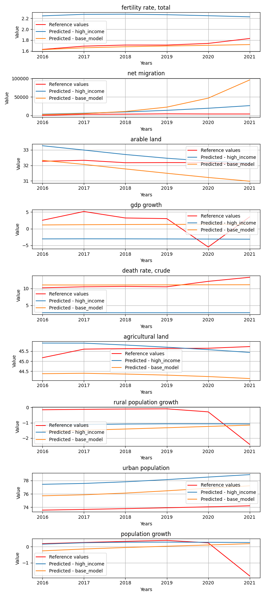

# StatesByGroup_wealth

**Description:** States by the given state groups.

## high_income model


## Model comparision prediction plot
In the next feagure you can see each model predictions compared to each other and the reference data.



## Per target metrics - model comparision
```
                      target        mae          mse       rmse          r2                state        model   rank
5          agricultural land   0.566688     0.325365   0.570408    0.000000  Antigua and Barbuda  high_income  128.5
109            net migration  29.764590  1066.173466  32.652312    0.644761  Antigua and Barbuda   base_model  582.0
115         urban population   6.480697    42.827342   6.544260 -415.077721  Antigua and Barbuda   base_model  717.0
112        death rate, crude   1.216224     1.557155   1.247860  -26.227561  Antigua and Barbuda   base_model  384.0
8          population growth   1.052357     1.115121   1.055993  -63.585039  Antigua and Barbuda  high_income  371.0
..                       ...        ...          ...        ...         ...                  ...          ...    ...
159  rural population growth   0.493945     0.331273   0.575563   -3.739168       United Kingdom   base_model  187.0
52          urban population   2.837634     8.079669   2.842476   -7.526968       United Kingdom  high_income  496.0
48                gdp growth   5.834500    39.397021   6.276705   -1.203941       United Kingdom  high_income  574.0
53         population growth   0.240493     0.071966   0.268265   -0.325135       United Kingdom  high_income   61.0
157        death rate, crude   1.074715     1.343392   1.159048   -9.090363       United Kingdom   base_model  345.0

[216 rows x 8 columns]
```


## Overall metrics - model comparision
```
             mae           mse          rmse            r2                state        model  rank
12  5.034345e+00  1.311991e+02  5.743354e+00 -5.526168e+01  Antigua and Barbuda   base_model   5.0
0   4.808128e+00  1.486402e+02  6.430670e+00 -1.523503e+02  Antigua and Barbuda  high_income  12.0
11  5.072442e+03  3.118500e+08  5.888738e+03 -9.287986e+01              Austria  high_income  26.0
23  9.059739e+04  1.574352e+11  1.322617e+05 -2.389336e+02              Austria   base_model  41.0
1   8.448482e+03  1.660931e+09  1.358690e+04 -5.891685e+02              Bahrain  high_income  36.0
13  1.532182e+04  6.775542e+09  2.744033e+04 -3.251110e+02              Bahrain   base_model  37.0
9   4.069630e+04  2.090872e+10  4.820160e+04 -2.301607e+04               Cyprus  high_income  44.0
21  1.400394e+05  4.020736e+11  2.113660e+05 -4.402367e+05               Cyprus   base_model  57.0
3   1.117801e+03  1.681660e+07  1.369387e+03 -6.884427e+01              Czechia  high_income  17.0
15  3.071003e+03  2.006504e+08  4.722964e+03 -1.232749e+02              Czechia   base_model  24.0
16  2.201487e+07  1.456118e+16  4.022323e+07 -4.468702e+06              Germany   base_model  85.0
4   1.090769e+06  1.812994e+13  1.419311e+06 -5.672193e+03              Germany  high_income  58.0
19  4.759692e+06  5.305797e+14  7.678107e+06 -5.764771e+04                Italy   base_model  73.0
7   2.370094e+05  5.208470e+11  2.405685e+05 -8.556389e+01                Italy  high_income  46.0
2   2.708092e+07  2.824375e+16  5.601960e+07 -6.395199e+09                Malta  high_income  89.0
14  5.038298e+07  1.106161e+17  1.108633e+08 -2.504666e+10                Malta   base_model  95.0
22  6.139878e+07  9.359958e+16  1.019802e+08 -1.075556e+06        North America   base_model  91.0
10  1.496319e+07  3.378098e+15  1.937380e+07 -3.900646e+04        North America  high_income  75.0
6   1.172639e+06  1.992377e+13  1.487872e+06 -1.290706e+05               Norway  high_income  65.0
18  2.393731e+06  1.298431e+14  3.798294e+06 -8.335057e+05               Norway   base_model  74.0
8   7.737271e+02  5.494351e+06  7.836631e+02 -2.759707e+02             Slovenia  high_income  21.0
20  7.649604e+02  5.406810e+06  7.763206e+02 -8.022117e+01             Slovenia   base_model  12.0
17  2.357947e+06  1.191163e+14  3.638016e+06 -1.700937e+05       United Kingdom   base_model  69.0
5   1.493793e+05  2.077300e+11  1.519275e+05 -3.666476e+02       United Kingdom  high_income  48.0
```


## upper_middle_income model


## Model comparision prediction plot
In the next feagure you can see each model predictions compared to each other and the reference data.

_prediction_comparions.png)

## Per target metrics - model comparision
```
                      target           mae           mse          rmse          r2     state                model   rank
136            net migration  10258.517509  1.070226e+08  10345.172004  -15.379687   Albania           base_model  755.0
140        agricultural land      0.750495  7.270152e-01      0.852652   -1.955823   Albania           base_model  253.0
141  rural population growth      1.176740  1.449938e+00      1.204134  -26.638116   Albania           base_model  377.0
18     fertility rate, total      0.431377  1.978241e-01      0.444774  -14.560243   Albania  upper_middle_income  232.0
142         urban population      2.273932  5.420896e+00      2.328282    0.096156   Albania           base_model  387.0
..                       ...           ...           ...           ...         ...       ...                  ...    ...
96   rural population growth      1.750929  3.075875e+00      1.753817 -250.376704  Viet Nam  upper_middle_income  501.0
208            net migration   2865.027058  9.127445e+06   3021.166096   -4.442250  Viet Nam           base_model  712.0
93                gdp growth      2.473615  7.006579e+00      2.646994   -0.991578  Viet Nam  upper_middle_income  463.0
214         urban population      0.910904  8.392219e-01      0.916091    0.678974  Viet Nam           base_model  208.0
215        population growth      0.564572  3.207719e-01      0.566367  -62.049170  Viet Nam           base_model  310.0

[234 rows x 8 columns]
```


## Overall metrics - model comparision
```
             mae           mse          rmse            r2                                              state                model   rank
15  1.140735e+03  1.189140e+07  1.150569e+03 -6.282222e+00                                            Albania           base_model   10.0
2   1.206601e+03  1.349774e+07  1.226813e+03 -5.725491e+01                                            Albania  upper_middle_income   23.0
4   1.045456e+05  1.570344e+11  1.320952e+05 -1.293873e+05                                            Belarus  upper_middle_income   96.0
17  7.693957e+04  1.079826e+11  1.095370e+05 -8.892533e+04                                            Belarus           base_model   92.0
11  1.443140e+03  1.926341e+07  1.467364e+03 -6.818301e+02                                           Bulgaria  upper_middle_income   43.0
24  1.431439e+03  1.898389e+07  1.454369e+03 -1.578578e+02                                           Bulgaria           base_model   33.0
14  1.145368e+03  1.875745e+07  1.445352e+03 -1.630607e+03                             Caribbean small states           base_model   34.0
1   1.157621e+03  1.902720e+07  1.456076e+03 -2.037646e+03                             Caribbean small states  upper_middle_income   40.0
7   1.030361e+04  1.964697e+09  1.477770e+04 -3.178433e+03                                         Costa Rica  upper_middle_income   70.0
20  5.521828e+03  4.862124e+08  7.353029e+03 -9.028419e+02                                         Costa Rica           base_model   52.0
19  5.715484e+03  6.038086e+08  8.192275e+03 -2.210783e+02                                   Egypt, Arab Rep.           base_model   53.0
6   5.715999e+03  6.036565e+08  8.191276e+03 -1.937658e+02                                   Egypt, Arab Rep.  upper_middle_income   51.0
8   2.784985e+04  1.845594e+10  4.528611e+04 -1.232469e+01                                             Jordan  upper_middle_income   57.0
21  2.785164e+04  1.845602e+10  4.528666e+04 -2.780313e+01                                             Jordan           base_model   63.0
9   4.417437e+04  2.135358e+10  4.871119e+04 -1.095889e+02  Latin America & Caribbean (excluding high income)  upper_middle_income   77.0
22  4.292235e+04  1.995912e+10  4.709321e+04 -3.020161e+01  Latin America & Caribbean (excluding high income)           base_model   70.0
0   4.032114e+04  1.805446e+10  4.479059e+04 -7.323263e+01  Latin America & the Caribbean (IDA & IBRD coun...  upper_middle_income   66.0
13  3.906120e+04  1.663999e+10  4.299965e+04 -1.889305e+01  Latin America & the Caribbean (IDA & IBRD coun...           base_model   57.0
5   2.532874e+03  1.121171e+08  3.531561e+03 -6.432540e+01                                             Panama  upper_middle_income   39.0
18  1.177832e+03  2.472087e+07  1.659508e+03 -2.864736e+01                                             Panama           base_model   30.0
12  5.010202e+06  3.481627e+14  6.219709e+06 -1.311566e+30                                 Russian Federation  upper_middle_income  104.0
25  1.285911e+06  2.508361e+13  1.669453e+06 -4.722096e+29                                 Russian Federation           base_model  100.0
16  9.301718e+03  8.702549e+08  9.836191e+03 -2.659285e+02                                          Sri Lanka           base_model   58.0
3   9.303960e+03  8.704498e+08  9.837663e+03 -3.497496e+02                                          Sri Lanka  upper_middle_income   62.0
10  3.478789e+02  1.206175e+06  3.678353e+02 -1.158166e+02                                           Viet Nam  upper_middle_income   18.0
23  3.195969e+02  1.014164e+06  3.369955e+02 -1.302324e+01                                           Viet Nam           base_model    6.0
```


## lower_middle_income model


## Model comparision prediction plot
In the next feagure you can see each model predictions compared to each other and the reference data.

_prediction_comparions.png)

## Per target metrics - model comparision
```
                      target        mae         mse       rmse          r2                                       state                model   rank
48                gdp growth  20.523823  424.197387  20.596053 -113.889606  East Asia & Pacific (IDA & IBRD countries)  lower_middle_income  629.0
142         urban population   2.399251    6.770185   2.601958    0.515165  East Asia & Pacific (IDA & IBRD countries)           base_model  305.0
52          urban population   2.923934   11.350016   3.368978    0.187189  East Asia & Pacific (IDA & IBRD countries)  lower_middle_income  368.0
51   rural population growth   1.702965    2.933464   1.712736 -100.023251  East Asia & Pacific (IDA & IBRD countries)  lower_middle_income  372.0
53         population growth   0.365304    0.154761   0.393397   -6.298351  East Asia & Pacific (IDA & IBRD countries)  lower_middle_income  172.0
..                       ...        ...         ...        ...         ...                                         ...                  ...    ...
16          urban population   3.197210   10.370359   3.220304 -241.523502                                     Ukraine  lower_middle_income  512.0
11               arable land   1.968961    4.076546   2.019046 -325.399388                                     Ukraine  lower_middle_income  415.0
103        death rate, crude   3.137448   11.623535   3.409331   -4.846685                                     Ukraine           base_model  435.0
9      fertility rate, total   0.721485    0.553295   0.743838  -50.693755                                     Ukraine  lower_middle_income  290.0
105  rural population growth   2.546981    6.550570   2.559408 -108.241243                                     Ukraine           base_model  443.0

[180 rows x 8 columns]
```


## Overall metrics - model comparision
```
              mae           mse           rmse            r2                                       state                model  rank
5    35086.079142  1.334136e+10   38505.329447 -9.781603e+01  East Asia & Pacific (IDA & IBRD countries)  lower_middle_income  56.0
15   33718.778926  1.231736e+10   36996.052560 -8.380275e+01  East Asia & Pacific (IDA & IBRD countries)           base_model  52.0
0    36796.409642  1.681399e+10   43227.359128 -5.835555e+01                                       India  lower_middle_income  60.0
10   36650.621165  1.669148e+10   43068.578956 -1.030609e+02                                       India           base_model  60.0
14    1178.802396  1.400476e+07    1248.968034 -8.007703e+00                                     Lao PDR           base_model  16.0
4     1258.753668  1.596487e+07    1335.139469 -1.824838e+01                                     Lao PDR  lower_middle_income  20.0
9      545.158851  6.649296e+06     862.724455 -3.348768e+31                                  Mauritania  lower_middle_income  28.0
19     648.296183  7.956719e+06     941.781354 -1.076278e+32                                  Mauritania           base_model  32.0
7    25611.615701  7.201409e+09   28290.101526 -1.048295e+03                                       Nepal  lower_middle_income  57.0
17   25411.919838  7.089273e+09   28067.605805 -1.204556e+03                                       Nepal           base_model  55.0
6     2388.118655  5.405146e+07    2453.877116 -5.320161e+01                                   Nicaragua  lower_middle_income  29.0
16    2247.481321  4.765425e+07    2302.892992 -1.745860e+02                                   Nicaragua           base_model  33.0
2    10390.636881  1.482536e+09   12838.163200 -2.857673e+01                                 Philippines  lower_middle_income  39.0
12   10223.535322  1.433210e+09   12621.196634 -2.942545e+01                                 Philippines           base_model  37.0
8      147.082827  2.094230e+05     156.500552 -3.191161e+29                       Sao Tome and Principe  lower_middle_income  24.0
18     101.009544  9.743446e+04     106.349386 -3.181770e+29                       Sao Tome and Principe           base_model  20.0
13  230294.461136  5.509658e+11  247426.495990 -1.699924e+02                     South Asia (IDA & IBRD)           base_model  68.0
3   230578.002946  5.520791e+11  247677.563787 -1.685770e+02                     South Asia (IDA & IBRD)  lower_middle_income  70.0
11    2759.326162  1.235394e+08    3707.480124 -2.512482e+02                                     Ukraine           base_model  42.0
1     2758.831948  1.236108e+08    3709.655128 -2.406966e+02                                     Ukraine  lower_middle_income  42.0
```


## low_income model


## Model comparision prediction plot
In the next feagure you can see each model predictions compared to each other and the reference data.

_prediction_comparions.png)

## Per target metrics - model comparision
```
                      target           mae           mse          rmse          r2                     state       model   rank
54     fertility rate, total      0.865659  8.314513e-01      0.911840 -550.641657  Central African Republic  low_income  297.0
143        population growth      1.569961  3.242019e+00      1.800561   -4.316737  Central African Republic  base_model  290.0
135    fertility rate, total      0.787606  7.082018e-01      0.841547 -468.869502  Central African Republic  base_model  286.0
136            net migration  71255.339282  6.723835e+09  81998.995644   -3.104587  Central African Republic  base_model  511.0
142         urban population      6.149482  4.287377e+01      6.547807  -26.882113  Central African Republic  base_model  504.0
..                       ...           ...           ...           ...         ...                       ...         ...    ...
24   rural population growth      1.356379  1.857941e+00      1.363063  -51.197997                      Togo  low_income  318.0
20               arable land      6.755293  4.840217e+01      6.957167  -20.563509                      Togo  low_income  501.0
107        population growth      1.351530  1.908163e+00      1.381363 -133.435218                      Togo  base_model  333.0
23         agricultural land      3.544564  1.405115e+01      3.748487   -7.866956                      Togo  low_income  409.0
25          urban population      0.877959  8.109377e-01      0.900521    0.790653                      Togo  low_income  154.0

[162 rows x 8 columns]
```


## Overall metrics - model comparision
```
              mae           mse           rmse            r2                                              state       model  rank
15    7919.757663  7.470928e+08    9114.361575 -1.800082e+03                           Central African Republic  base_model  35.0
6     7953.098516  7.515620e+08    9141.751334 -1.342261e+03                           Central African Republic  low_income  37.0
13   34030.079401  1.251031e+10   37284.660192 -8.334329e+01        East Asia & Pacific (excluding high income)  base_model  36.0
4    36440.888520  1.437241e+10   39964.839360 -1.823888e+02        East Asia & Pacific (excluding high income)  low_income  42.0
17    1887.864828  3.824563e+07    2063.342682 -4.108574e+02                                            Eritrea  base_model  26.0
8     2055.088131  4.363028e+07    2203.890960 -5.024990e+02                                            Eritrea  low_income  30.0
16      69.672980  4.934992e+04      75.478045 -2.609174e+29                                      Guinea-Bissau  base_model  20.0
7      122.542536  1.362375e+05     125.044220 -3.821196e+29                                      Guinea-Bissau  low_income  24.0
14  369830.033631  1.327620e+12  384075.272493 -1.875585e+01                                   IDA & IBRD total  base_model  52.0
5   382125.242409  1.416653e+12  396746.011700 -8.835507e+01                                   IDA & IBRD total  low_income  62.0
0   166877.911199  3.493673e+11  197025.829402 -6.846086e+01                                           IDA only  low_income  51.0
9   168394.948295  3.553729e+11  198711.214639 -4.473778e+01                                           IDA only  base_model  52.0
12   29564.136991  1.691059e+10   43348.427683 -5.058330e+01  Middle East & North Africa (excluding high inc...  base_model  36.0
3    29681.709393  1.694329e+10   43391.195505 -1.055892e+02  Middle East & North Africa (excluding high inc...  low_income  43.0
1    65318.824228  7.642415e+10   92154.047933 -1.495432e+04                               Syrian Arab Republic  low_income  55.0
10   65416.872825  7.647608e+10   92185.514134 -7.772763e+03                               Syrian Arab Republic  base_model  57.0
2      207.350345  3.910374e+05     211.307921 -2.302631e+01                                               Togo  low_income  14.0
11     205.560292  3.886993e+05     209.624483 -3.261170e+01                                               Togo  base_model  12.0
```


