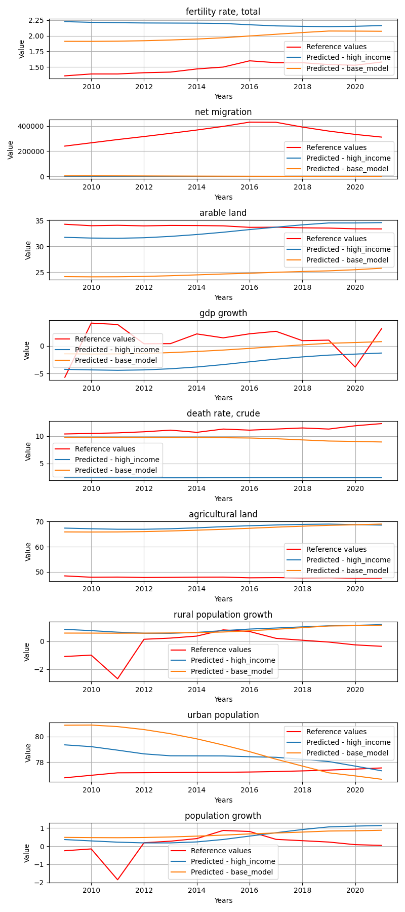
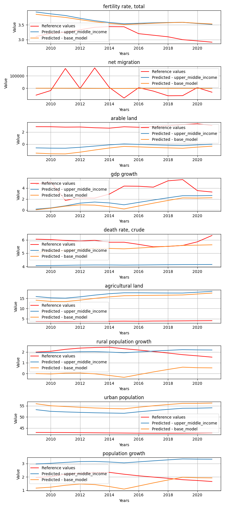
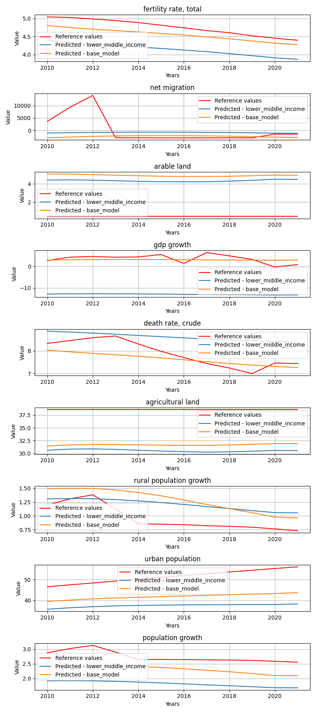
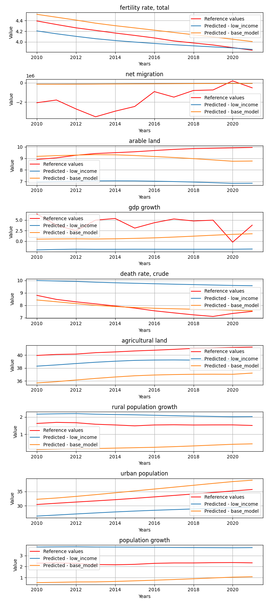

# StatesByGroup_wealth

**Description:** States by the given state groups.

## high_income model


## Model comparision prediction plot
In the next feagure you can see each model predictions compared to each other and the reference data.



## Per target metrics - model comparision
```
                      target            mae           mse           rmse          r2                state        model   rank
3                 gdp growth       8.518064  8.349566e+01       9.137596   -0.494608  Antigua and Barbuda  high_income  498.0
6    rural population growth       1.410329  2.692938e+00       1.641017  -79.335658  Antigua and Barbuda  high_income  359.0
108    fertility rate, total       1.530050  2.354144e+00       1.534322 -572.628673  Antigua and Barbuda   base_model  386.0
116        population growth       0.536662  4.347690e-01       0.659370  -24.180737  Antigua and Barbuda   base_model  147.0
4          death rate, crude       3.669876  1.351086e+01       3.675712 -235.243502  Antigua and Barbuda  high_income  500.0
..                       ...            ...           ...            ...         ...                  ...          ...    ...
153    fertility rate, total       0.308115  1.123947e-01       0.335253   -6.225066       United Kingdom   base_model   87.0
53         population growth       0.322280  2.414404e-01       0.491366   -3.445705       United Kingdom  high_income   85.0
50         agricultural land       0.393166  2.486920e-01       0.498690   -0.190882       United Kingdom  high_income   46.0
47               arable land      11.271445  1.299563e+02      11.399837 -870.596068       United Kingdom  high_income  674.0
46             net migration  250018.841371  6.320524e+10  251406.519982  -89.230208       United Kingdom  high_income  783.0

[216 rows x 8 columns]
```


## Overall metrics - model comparision
```
              mae           mse           rmse            r2                state        model  rank
12      53.571865  3.089535e+04      65.596459  -1236.915349  Antigua and Barbuda   base_model  15.0
0      147.081402  2.944660e+05     188.173647  -1227.759438  Antigua and Barbuda  high_income  17.0
23    5054.044566  3.075708e+08    5851.312330   -287.413430              Austria   base_model  52.0
11    5061.947281  3.080857e+08    5856.135580   -324.544474              Austria  high_income  56.0
1     2668.495235  8.114378e+07    3004.988536 -12418.930349              Bahrain  high_income  57.0
13    2665.605261  8.080894e+07    2998.800507 -13755.083060              Bahrain   base_model  55.0
21     468.642229  2.029320e+06     480.385223  -1943.880686               Cyprus   base_model  34.0
9      477.352540  2.098088e+06     488.903258  -1461.021046               Cyprus  high_income  35.0
3      330.149448  1.123999e+06     358.022832  -1400.175884              Czechia  high_income  28.0
15     329.275895  1.112545e+06     356.167591  -2817.472248              Czechia   base_model  30.0
4    38377.879044  1.361575e+10   38899.972935   -856.582320              Germany  high_income  75.0
16   38205.303570  1.351018e+10   38748.737312   -893.640460              Germany   base_model  73.0
19   12817.305519  2.487872e+09   16630.416509    -29.056955                Italy   base_model  52.0
7    12881.570028  2.514142e+09   16719.131909    -63.286029                Italy  high_income  57.0
2      191.085691  3.901064e+05     214.493087   -195.775986                Malta  high_income  15.0
14     574.247163  4.811912e+06     736.501850    -86.465812                Malta   base_model  28.0
22  147718.688114  2.058247e+11  151229.975987  -2841.975049        North America   base_model  88.0
10  153656.160524  2.222236e+11  157139.574659  -4141.038149        North America  high_income  92.0
6     3031.461795  9.816600e+07    3307.022613 -38137.804050               Norway  high_income  63.0
18    3231.851365  1.116627e+08    3526.223016 -26347.621576               Norway   base_model  65.0
8      792.240153  5.712598e+06     801.758760  -2652.609506             Slovenia  high_income  47.0
20     789.805575  5.689116e+06     799.601859  -1506.608708             Slovenia   base_model  42.0
17   27610.744558  6.928612e+09   27748.215260    -33.926466       United Kingdom   base_model  59.0
5    27783.563445  7.022804e+09   27937.882590   -161.589765       United Kingdom  high_income  65.0
```


## upper_middle_income model


## Model comparision prediction plot
In the next feagure you can see each model predictions compared to each other and the reference data.



## Per target metrics - model comparision
```
                      target            mae           mse           rmse           r2     state                model   rank
25          urban population       3.385335  1.606426e+01       4.008024    -1.678446   Albania  upper_middle_income  451.0
139        death rate, crude       2.138063  5.984426e+00       2.446309    -2.792756   Albania           base_model  333.0
21                gdp growth       1.878834  8.640366e+00       2.939450     0.054283   Albania  upper_middle_income  298.0
137              arable land       7.977051  6.366764e+01       7.979200 -1031.777513   Albania           base_model  702.0
20               arable land       8.985982  8.080551e+01       8.989189 -1309.777561   Albania  upper_middle_income  716.0
..                       ...            ...           ...            ...          ...       ...                  ...    ...
93                gdp growth       5.314607  3.516199e+01       5.929754    -8.994583  Viet Nam  upper_middle_income  528.0
96   rural population growth       1.917270  3.747126e+00       1.935749  -305.234852  Viet Nam  upper_middle_income  412.0
208            net migration  111731.751110  1.297301e+10  113899.142060 -7734.176018  Viet Nam           base_model  894.0
213  rural population growth       0.634314  5.920119e-01       0.769423   -47.382332  Viet Nam           base_model  188.0
91             net migration  115166.000469  1.355203e+10  116413.173199 -8079.412839  Viet Nam  upper_middle_income  898.0

[234 rows x 8 columns]
```


## Overall metrics - model comparision
```
             mae           mse          rmse            r2                                              state                model  rank
15   2632.191594  6.522392e+07   2695.025520 -1.695139e+02                                            Albania           base_model  44.0
2    2581.178662  6.071165e+07   2602.047841 -3.167458e+02                                            Albania  upper_middle_income  44.0
4    1642.028185  2.418246e+07   1646.531825 -5.787537e+02                                            Belarus  upper_middle_income  43.0
17   1620.472615  2.363601e+07   1625.215337 -4.692843e+02                                            Belarus           base_model  38.0
24   1031.399785  1.018547e+07   1069.250274 -2.524699e+03                                           Bulgaria           base_model  38.0
11   1121.733242  1.224270e+07   1174.365891 -3.538215e+03                                           Bulgaria  upper_middle_income  42.0
14    710.352450  1.514528e+07   1300.784247 -5.652945e+04                             Caribbean small states           base_model  43.0
1     706.771930  1.505811e+07   1297.141801 -6.817999e+04                             Caribbean small states  upper_middle_income  41.0
7     431.747964  1.735676e+06    441.857078 -7.247897e+02                                         Costa Rica  upper_middle_income  17.0
20    433.865213  1.755169e+06    444.005006 -5.124919e+02                                         Costa Rica           base_model  18.0
6    5706.880786  6.018647e+08   8181.290948 -2.157088e+03                                   Egypt, Arab Rep.  upper_middle_income  64.0
19   5707.069559  6.026889e+08   8187.092804 -2.316930e+03                                   Egypt, Arab Rep.           base_model  68.0
8   27856.828698  1.845609e+10  45287.334180 -8.179778e+01                                             Jordan  upper_middle_income  65.0
21  27856.863563  1.845606e+10  45287.367209 -1.103718e+02                                             Jordan           base_model  67.0
9   45659.012876  2.313371e+10  50702.819887 -2.196899e+02  Latin America & Caribbean (excluding high income)  upper_middle_income  86.0
22  45632.265938  2.311839e+10  50685.179942 -7.113234e+01  Latin America & Caribbean (excluding high income)           base_model  77.0
0   41457.017654  1.972911e+10  46823.683147 -1.619316e+02  Latin America & the Caribbean (IDA & IBRD coun...  upper_middle_income  75.0
13  41509.126653  1.975703e+10  46855.967305 -6.084556e+01  Latin America & the Caribbean (IDA & IBRD coun...           base_model  73.0
18    819.493539  6.671314e+06    864.529881 -1.403228e+02                                             Panama           base_model  19.0
5     818.487565  6.655474e+06    863.845238 -2.673912e+02                                             Panama  upper_middle_income  20.0
12  33499.274002  1.010586e+10  33515.303268 -6.383972e+29                                 Russian Federation  upper_middle_income  84.0
25  36762.277430  1.218432e+10  36799.428722 -2.522968e+30                                 Russian Federation           base_model  88.0
16   2878.159030  2.815002e+08   5597.663321 -1.543327e+03                                          Sri Lanka           base_model  58.0
3    2496.525623  2.072866e+08   4805.183023 -1.359652e+03                                          Sri Lanka  upper_middle_income  52.0
23  12418.676036  1.441446e+09  12659.605839 -2.126723e+03                                           Viet Nam           base_model  69.0
10  12801.303671  1.505781e+09  12939.962064 -2.104518e+03                                           Viet Nam  upper_middle_income  71.0
```


## lower_middle_income model


## Model comparision prediction plot
In the next feagure you can see each model predictions compared to each other and the reference data.



## Per target metrics - model comparision
```
                      target            mae           mse           rmse            r2                                       state                model   rank
47               arable land       0.730728  6.689595e-01       0.817899    -21.104238  East Asia & Pacific (IDA & IBRD countries)  lower_middle_income  242.0
136            net migration  232098.860376  7.323044e+10  270611.235604     -1.987734  East Asia & Pacific (IDA & IBRD countries)           base_model  565.0
137              arable land       0.528917  4.016197e-01       0.633735    -12.270604  East Asia & Pacific (IDA & IBRD countries)           base_model  195.0
53         population growth       0.579765  3.750637e-01       0.612424    -16.687573  East Asia & Pacific (IDA & IBRD countries)  lower_middle_income  202.0
143        population growth       0.540307  3.799909e-01       0.616434    -16.919938  East Asia & Pacific (IDA & IBRD countries)           base_model  204.0
..                       ...            ...           ...            ...           ...                                         ...                  ...    ...
15   rural population growth       1.783727  3.270142e+00       1.808354    -53.534859                                     Ukraine  lower_middle_income  363.0
105  rural population growth       1.570347  2.800527e+00       1.673478    -45.703270                                     Ukraine           base_model  352.0
12                gdp growth      15.717798  2.542480e+02      15.945156    -38.063946                                     Ukraine  lower_middle_income  550.0
13         death rate, crude       4.907416  2.673485e+01       5.170576    -12.447738                                     Ukraine  lower_middle_income  419.0
101              arable land      12.415405  1.544375e+02      12.427288 -12364.444725                                     Ukraine           base_model  590.0

[180 rows x 8 columns]
```


## Overall metrics - model comparision
```
              mae           mse           rmse            r2                                       state                model  rank
15   25790.547268  8.136716e+09   30069.849861 -9.718792e+01  East Asia & Pacific (IDA & IBRD countries)           base_model  49.0
5    32180.916542  1.172019e+10   36091.037093 -1.640230e+02  East Asia & Pacific (IDA & IBRD countries)  lower_middle_income  56.0
0    32899.085069  1.414219e+10   39646.396412 -5.798320e+02                                       India  lower_middle_income  63.0
10   30203.273055  1.222826e+10   36866.207638 -7.755120e+02                                       India           base_model  60.0
4     1108.030537  1.287574e+07    1200.519455 -7.129177e+01                                     Lao PDR  lower_middle_income  20.0
14    3141.788149  9.260878e+07    3212.040851 -4.676304e+02                                     Lao PDR           base_model  34.0
9      430.816444  3.553806e+06     633.397589 -5.545808e+32                                  Mauritania  lower_middle_income  32.0
19     400.361071  4.328273e+06     696.194410 -7.270036e+32                                  Mauritania           base_model  34.0
7    12227.332723  3.112941e+09   18603.189707 -5.473418e+03                                       Nepal  lower_middle_income  54.0
17   14457.218643  3.811234e+09   20583.204686 -6.775571e+03                                       Nepal           base_model  58.0
16     263.794478  1.471866e+06     405.740775 -1.470763e+02                                   Nicaragua           base_model  15.0
6     1924.463955  3.652798e+07    2017.967410 -4.756179e+01                                   Nicaragua  lower_middle_income  22.0
12    8890.242964  9.899943e+08   10490.104778 -8.659806e+01                                 Philippines           base_model  36.0
2    10310.372364  1.481661e+09   12834.525942 -9.777419e+01                                 Philippines  lower_middle_income  41.0
18     134.245099  1.719403e+05     141.879738 -3.956160e+28                       Sao Tome and Principe           base_model  20.0
8      167.272433  2.650939e+05     177.429349 -1.035547e+29                       Sao Tome and Principe  lower_middle_income  24.0
3   222354.286533  5.164884e+11  239562.246316 -2.445479e+03                     South Asia (IDA & IBRD)  lower_middle_income  73.0
13  215899.024956  4.902747e+11  233403.367023 -2.923399e+03                     South Asia (IDA & IBRD)           base_model  71.0
1     2763.688334  1.236228e+08    3712.183668 -1.827940e+03                                     Ukraine  lower_middle_income  40.0
11    2761.333026  1.235053e+08    3709.471919 -2.303532e+03                                     Ukraine           base_model  38.0
```


## low_income model


## Model comparision prediction plot
In the next feagure you can see each model predictions compared to each other and the reference data.



## Per target metrics - model comparision
```
                      target           mae           mse          rmse            r2                     state       model   rank
58         death rate, crude      4.120411  1.863812e+01      4.317189     -8.828335  Central African Republic  low_income  374.0
135    fertility rate, total      0.692113  5.253309e-01      0.724797   -347.540473  Central African Republic  base_model  226.0
54     fertility rate, total      0.971330  9.688144e-01      0.984284   -641.777753  Central African Republic  low_income  265.0
139        death rate, crude      5.705410  3.357210e+01      5.794144    -16.703387  Central African Republic  base_model  428.0
56               arable land      3.286481  1.087862e+01      3.298276 -11571.669457  Central African Republic  low_income  426.0
..                       ...           ...           ...           ...           ...                       ...         ...    ...
21                gdp growth      7.244167  5.379533e+01      7.334530    -42.274795                      Togo  low_income  490.0
23         agricultural land      6.112259  4.591287e+01      6.775903    -27.973235                      Togo  low_income  461.0
26         population growth      1.503105  2.265310e+00      1.505095   -158.597192                      Togo  low_income  284.0
105  rural population growth      0.377497  2.472329e-01      0.497225     -5.945894                      Togo  base_model  108.0
100            net migration  11524.996940  2.623914e+08  16198.500201  -2039.710064                      Togo  base_model  590.0

[162 rows x 8 columns]
```


## Overall metrics - model comparision
```
              mae           mse           rmse            r2                                              state       model  rank
15    7924.904097  7.459826e+08    9107.726882 -1.297913e+04                           Central African Republic  base_model  36.0
6     7961.975636  7.517191e+08    9143.725206 -1.452127e+04                           Central African Republic  low_income  40.0
4    34747.495313  1.338466e+10   38568.049703 -1.809257e+02        East Asia & Pacific (excluding high income)  low_income  38.0
13   26172.804835  8.341330e+09   30445.533911 -9.418788e+01        East Asia & Pacific (excluding high income)  base_model  31.0
17    2093.613495  4.412789e+07    2217.635436 -4.116587e+03                                            Eritrea  base_model  28.0
8     2212.941492  4.879276e+07    2332.196486 -2.083269e+03                                            Eritrea  low_income  30.0
7       45.071881  2.208617e+04      52.758597 -1.697541e+30                                      Guinea-Bissau  low_income  21.0
16     128.373803  1.545165e+05     132.981064 -1.125999e+30                                      Guinea-Bissau  base_model  23.0
14  376445.408096  1.380029e+12  391583.410030 -8.010919e+01                                   IDA & IBRD total  base_model  54.0
5   387149.050161  1.458129e+12  402513.248837 -4.146798e+02                                   IDA & IBRD total  low_income  63.0
9   176808.841756  3.906764e+11  208348.628262 -1.261658e+02                                           IDA only  base_model  50.0
0   177988.716879  3.957040e+11  209685.528682 -7.746826e+01                                           IDA only  low_income  50.0
12   29563.053499  1.690911e+10   43347.533216 -7.653372e+02  Middle East & North Africa (excluding high inc...  base_model  43.0
3    29567.963077  1.691164e+10   43350.952818 -4.487760e+02  Middle East & North Africa (excluding high inc...  low_income  45.0
1    65419.525977  7.647798e+10   92186.058330 -3.908988e+02                               Syrian Arab Republic  low_income  47.0
10   65601.399242  7.658132e+10   92248.307386 -5.117169e+03                               Syrian Arab Republic  base_model  56.0
11    1283.144766  2.915462e+07    1802.649562 -2.442368e+02                                               Togo  base_model  19.0
2      180.775225  3.940799e+05     214.073024 -5.384593e+01                                               Togo  low_income  10.0
```


