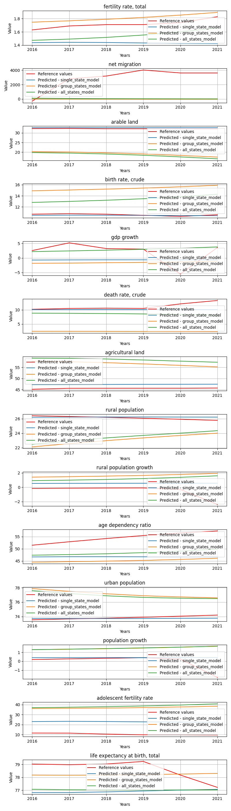

# DataUsedForTraining

**Description:** Trains base LSTM models using data in 3 categories: single state data, group of states (e.g. by wealth divided states) and with all available states data.


## Model comparision prediction plot
In the next feagure you can see each model predictions compared to each other and the reference data.



## Per target metrics - model comparision
```
                             target          mae           mse         rmse            r2    state               model   rank
3                 birth rate, crude     0.168010  3.412664e-02     0.184734     -0.279749  Czechia  single_state_model   11.0
14            fertility rate, total     0.094393  9.318731e-03     0.096534     -1.578588  Czechia  group_states_model   13.0
10                 urban population     0.200624  5.788626e-02     0.240596     -0.191489  Czechia  single_state_model   13.0
7                  rural population     0.213477  6.425444e-02     0.253485     -0.322567  Czechia  single_state_model   19.0
28            fertility rate, total     0.169605  2.920507e-02     0.170895     -7.081343  Czechia    all_states_model   29.0
11                population growth     0.470061  8.390767e-01     0.916011     -0.363621  Czechia  single_state_model   30.0
27  life expectancy at birth, total     0.783149  7.230939e-01     0.850349     -0.454010  Czechia  group_states_model   31.0
5                 death rate, crude     1.102834  2.481252e+00     1.575199     -0.969248  Czechia  single_state_model   41.0
8           rural population growth     1.085304  1.892353e+00     1.375628     -1.689718  Czechia  single_state_model   41.0
0             fertility rate, total     0.284864  8.541321e-02     0.292255    -22.634709  Czechia  single_state_model   44.0
2                       arable land     0.509232  2.666601e-01     0.516391    -40.195130  Czechia  single_state_model   49.0
25                population growth     1.535129  3.139451e+00     1.771850     -4.102060  Czechia  group_states_model   53.0
41  life expectancy at birth, total     1.576270  2.976283e+00     1.725191     -4.984765  Czechia    all_states_model   56.0
39                population growth     1.540335  3.144910e+00     1.773389     -4.110932  Czechia    all_states_model   57.0
13  life expectancy at birth, total     1.686622  3.459994e+00     1.860106     -5.957418  Czechia  single_state_model   66.0
36          rural population growth     1.732564  4.068359e+00     2.017017     -4.782609  Czechia    all_states_model   67.0
32                       gdp growth     2.132084  1.433403e+01     3.786031     -0.201425  Czechia    all_states_model   70.0
6                 agricultural land     1.782351  3.195019e+00     1.787462    -96.429473  Czechia  single_state_model   76.0
22          rural population growth     2.170892  5.685573e+00     2.384444     -7.081255  Czechia  group_states_model   76.0
33                death rate, crude     2.633299  8.782557e+00     2.963538     -5.970283  Czechia    all_states_model   82.0
4                        gdp growth     4.283482  1.907457e+01     4.367445     -0.598760  Czechia  single_state_model   85.0
35                 rural population     2.652772  7.767809e+00     2.787079   -158.886938  Czechia    all_states_model   89.0
18                       gdp growth     4.924969  2.509709e+01     5.009700     -1.103545  Czechia  group_states_model   93.0
31                birth rate, crude     2.836159  8.421178e+00     2.901927   -314.794162  Czechia    all_states_model   97.0
38                 urban population     3.025255  9.514647e+00     3.084582   -194.842574  Czechia    all_states_model   99.0
21                 rural population     3.005612  9.787675e+00     3.128526   -200.462382  Czechia  group_states_model  101.0
24                 urban population     3.257555  1.105120e+01     3.324334   -226.469828  Czechia  group_states_model  106.0
37             age dependency ratio     6.289671  4.109183e+01     6.410291     -8.907100  Czechia    all_states_model  110.0
9              age dependency ratio     7.979078  6.786946e+01     8.238292    -15.363093  Czechia  single_state_model  114.0
17                birth rate, crude     4.753056  2.280209e+01     4.775153   -854.078257  Czechia  group_states_model  117.0
23             age dependency ratio     9.491717  9.239390e+01     9.612175    -21.275851  Czechia  group_states_model  121.0
19                death rate, crude     8.787168  7.857154e+01     8.864059    -61.358367  Czechia  group_states_model  121.0
29                    net migration  2915.846830  9.915834e+06  3148.941677     -3.714168  Czechia    all_states_model  132.0
12        adolescent fertility rate    12.321207  1.521005e+02    12.332904   -239.796970  Czechia  single_state_model  136.0
15                    net migration  2929.273056  1.010619e+07  3179.023008     -3.804666  Czechia  group_states_model  136.0
20                agricultural land    11.129085  1.249297e+02    11.177198  -3808.629653  Czechia  group_states_model  138.0
1                     net migration  2946.813314  1.025203e+07  3201.879466     -3.874003  Czechia  single_state_model  140.0
34                agricultural land    12.850812  1.657956e+02    12.876165  -5054.800556  Czechia    all_states_model  145.0
16                      arable land    13.029431  1.706344e+02    13.062710 -26359.550646  Czechia  group_states_model  149.0
26        adolescent fertility rate    26.476929  7.033878e+02    26.521459  -1112.563829  Czechia  group_states_model  151.0
30                      arable land    13.714141  1.892034e+02    13.755124 -29228.198936  Czechia    all_states_model  153.0
40        adolescent fertility rate    28.017056  7.891661e+02    28.092101  -1248.363284  Czechia    all_states_model  155.0
```


## Overall metrics - model comparision
```
          mae            mse        rmse           r2    state               model  rank
0  212.778604  732305.966905  231.129998   -30.618996  Czechia  single_state_model   7.0
2  213.929775  708362.713060  230.806072 -2588.545648  Czechia    all_states_model   7.0
1  215.622296  721959.678481  233.542964 -2333.036638  Czechia  group_states_model  10.0
```


