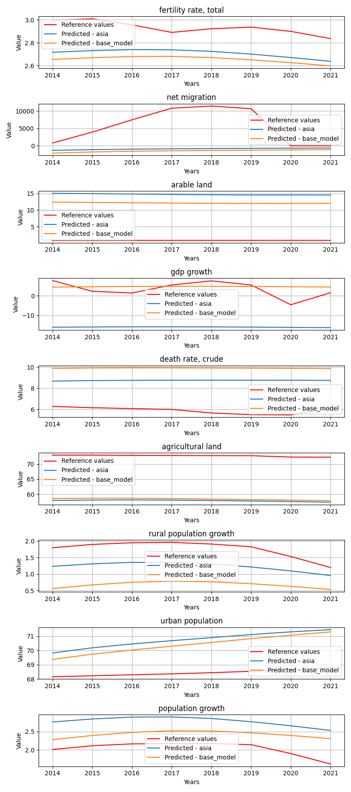
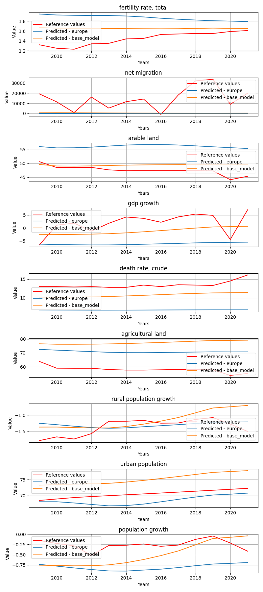
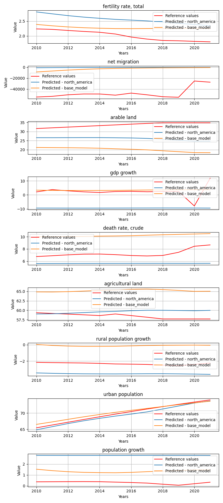
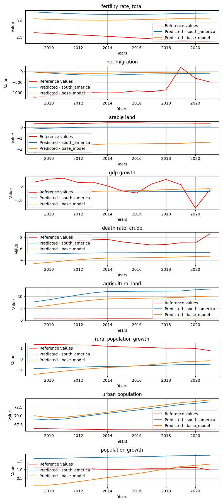
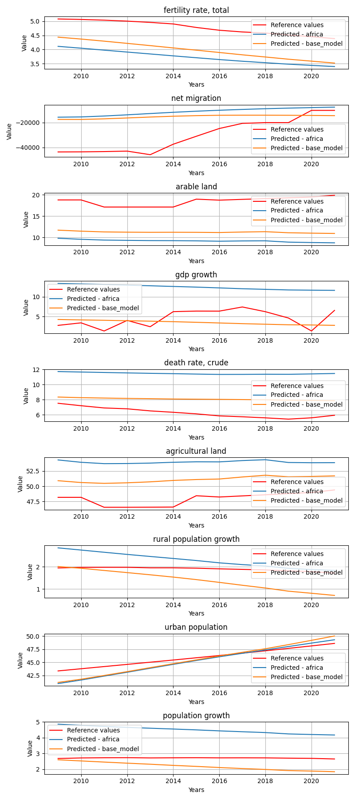
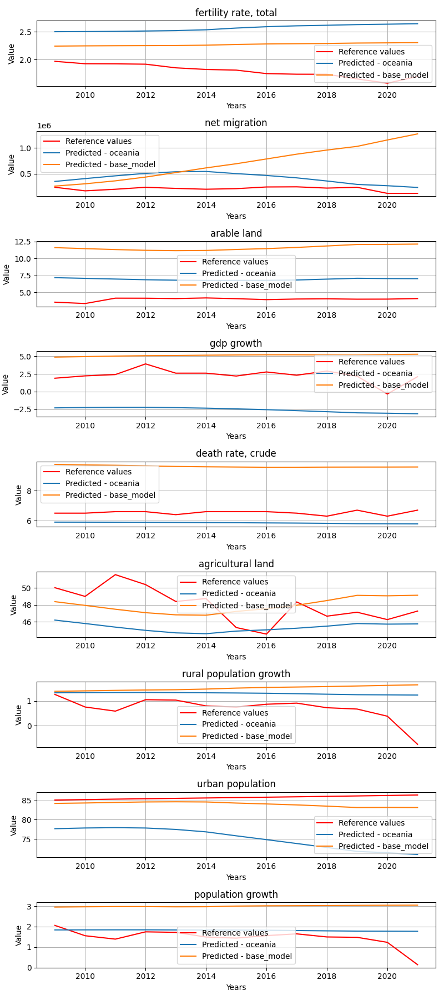

# StatesByGroup_geolocation

**Description:** States by the given state groups.

## asia model


## Model comparision prediction plot
In the next feagure you can see each model predictions compared to each other and the reference data.



## Per target metrics - model comparision
```
                target            mae           mse           rmse           r2               state       model   rank
139  death rate, crude       4.516144  2.080331e+01       4.561065  -163.075807          Bangladesh  base_model  389.0
62   population growth       0.480711  4.167429e-01       0.645556   -43.150573          Bangladesh        asia  151.0
59   agricultural land       2.173811  7.300733e+00       2.701987    -0.385513          Bangladesh        asia  195.0
55       net migration  270007.067474  1.013926e+11  318422.064167    -2.394833          Bangladesh        asia  515.0
136      net migration  261245.389457  9.487939e+10  308024.990477    -2.176757          Bangladesh  base_model  510.0
..                 ...            ...           ...            ...          ...                 ...         ...    ...
110        arable land       3.447535  1.248107e+01       3.532856   -11.032772  West Bank and Gaza  base_model  283.0
115   urban population       6.454537  4.174349e+01       6.460920  -188.183878  West Bank and Gaza  base_model  438.0
112  death rate, crude       6.911527  4.782124e+01       6.915290 -1161.339789  West Bank and Gaza  base_model  459.0
28       net migration   18046.192193  3.553718e+08   18851.306755    -9.588660  West Bank and Gaza        asia  518.0
29         arable land       5.863722  3.485631e+01       5.903923   -32.604338  West Bank and Gaza        asia  386.0

[162 rows x 8 columns]
```


## Overall metrics - model comparision
```
             mae           mse          rmse             r2                 state       model  rank
6   30006.373735  1.126585e+10  35385.987552    -110.265374            Bangladesh        asia  55.0
15  29031.238716  1.054216e+10  34229.106377     -62.247855            Bangladesh  base_model  48.0
17  16355.547369  3.095728e+09  18548.589444    -105.558792                 China  base_model  45.0
8   19420.656755  4.087112e+09  21314.826006     -69.773842                 China        asia  46.0
16   1437.842671  2.805732e+07   1769.041972     -33.885357             Indonesia  base_model  22.0
7    1695.081405  3.967270e+07   2104.900003     -47.230567             Indonesia        asia  30.0
1     902.931080  8.995983e+06   1009.484031    -158.393049              Maldives        asia  26.0
10    901.859036  8.998128e+06   1008.406691    -189.851790              Maldives  base_model  27.0
2     731.204596  7.184434e+06    899.612104 -926563.187756              Mongolia        asia  27.0
11    794.332368  8.059563e+06    950.480746 -612249.001594              Mongolia  base_model  29.0
4   65418.482807  7.647613e+10  92186.773022  -16296.888347  Syrian Arab Republic        asia  70.0
13  65416.748646  7.647613e+10  92185.450343   -3143.731432  Syrian Arab Republic  base_model  64.0
9     294.474453  9.258736e+05    324.752596    -102.612836          Turkmenistan  base_model   8.0
0     581.457637  3.453192e+06    626.311217   -2031.783298          Turkmenistan        asia  18.0
5    4550.897705  2.031044e+08   4756.055580  -14938.649616            Uzbekistan        asia  51.0
14   3536.434965  1.295653e+08   3797.363648   -5936.103827            Uzbekistan  base_model  47.0
3    2010.386916  3.948581e+07   2100.026725    -138.543454    West Bank and Gaza        asia  36.0
12   1788.931121  3.181156e+07   1884.397926    -169.498688    West Bank and Gaza  base_model  35.0
```


## europe model


## Model comparision prediction plot
In the next feagure you can see each model predictions compared to each other and the reference data.



## Per target metrics - model comparision
```
                    target        mae         mse       rmse           r2                   state       model   rank
41       agricultural land   5.005542   25.496325   5.049389  -180.062161  Bosnia and Herzegovina      europe  369.0
43        urban population  11.651261  135.927069  11.658776  -319.254231  Bosnia and Herzegovina      europe  475.0
39              gdp growth  11.378644  139.008628  11.790192   -13.830512  Bosnia and Herzegovina      europe  429.0
36   fertility rate, total   0.569136    0.324097   0.569295  -973.563870  Bosnia and Herzegovina      europe  215.0
113      agricultural land   7.100011   50.513779   7.107305  -357.723628  Bosnia and Herzegovina  base_model  408.0
..                     ...        ...         ...        ...          ...                     ...         ...    ...
128            arable land   0.515567    0.312286   0.558826   -63.255659             Switzerland  base_model  181.0
130      death rate, crude   1.097260    1.270030   1.126956   -18.027937             Switzerland  base_model  220.0
134      population growth   0.808146    1.041837   1.020704   -28.307481             Switzerland  base_model  219.0
58       death rate, crude   1.554131    2.473570   1.572759   -36.059685             Switzerland      europe  276.0
133       urban population   8.058591   65.596125   8.099143 -4712.190746             Switzerland  base_model  467.0

[144 rows x 8 columns]
```


## Overall metrics - model comparision
```
            mae           mse         rmse            r2                   state       model  rank
12   371.424050  1.539924e+06   418.091208   -392.413914  Bosnia and Herzegovina  base_model  16.0
4   1956.638927  3.439084e+07  1958.932914   -176.706560  Bosnia and Herzegovina      europe  32.0
13  3079.330802  9.863908e+07  3313.809856   -415.098874                  France  base_model  45.0
5   4128.772720  2.469522e+08  5241.729904   -281.375517                  France      europe  47.0
10  1599.605768  3.340042e+07  1930.334770    -13.514300                 Hungary  base_model  25.0
2   1647.152354  3.486397e+07  1972.713360    -18.767011                 Hungary      europe  31.0
1    506.835222  2.985572e+06   578.230146  -2422.978986                 Iceland      europe  29.0
9   1201.406019  2.196489e+07  1563.813200  -1534.649031                 Iceland  base_model  34.0
0    446.478625  1.801722e+06   452.488859   -487.726026                  Latvia      europe  22.0
8    601.879342  3.219422e+06   602.945799   -480.198872                  Latvia  base_model  27.0
3    133.269506  1.552861e+05   134.261999   -144.393630         North Macedonia      europe   9.0
11    92.648986  7.525599e+04    94.341879  -1361.496927         North Macedonia  base_model  15.0
15  2438.566782  7.177977e+07  2826.988433  -9569.853610                  Norway  base_model  48.0
7   3041.507878  9.954367e+07  3328.736893 -10995.636978                  Norway      europe  54.0
6   6522.479630  4.108297e+08  6759.538212   -317.300467             Switzerland      europe  54.0
14  4452.994325  2.853886e+08  5633.423621   -659.517897             Switzerland  base_model  56.0
```


## north_america model


## Model comparision prediction plot
In the next feagure you can see each model predictions compared to each other and the reference data.



## Per target metrics - model comparision
```
                     target          mae           mse          rmse           r2                state          model   rank
22        death rate, crude     2.697415  7.383384e+00      2.717238   -56.396133               Canada  north_america  181.0
65              arable land     1.370943  1.950882e+00      1.396740  -657.911531               Canada     base_model  159.0
67        death rate, crude     2.030824  4.211579e+00      2.052213   -31.739509               Canada     base_model  152.0
26        population growth     1.665583  2.828506e+00      1.681816   -52.423956               Canada  north_america  146.0
24  rural population growth     4.537378  2.070107e+01      4.549843  -159.749288               Canada  north_america  236.0
..                      ...          ...           ...           ...          ...                  ...            ...    ...
78  rural population growth     2.990014  1.010454e+01      3.178764   -53.484058  Trinidad and Tobago     base_model  197.0
74              arable land     4.033065  1.626806e+01      4.033369     0.000000  Trinidad and Tobago     base_model  161.5
31        death rate, crude     2.647216  7.463087e+00      2.731865   -12.402872  Trinidad and Tobago  north_america  164.0
28            net migration  7011.850574  1.422925e+08  11928.643716    -0.120062  Trinidad and Tobago  north_america  264.0
79         urban population    12.388776  1.607443e+02     12.678497 -1441.137193  Trinidad and Tobago     base_model  322.0

[90 rows x 8 columns]
```


## Overall metrics - model comparision
```
            mae           mse          rmse           r2                state          model  rank
2  16272.397973  2.981577e+09  18205.690173 -7793.016127               Canada  north_america  37.0
7  22160.049224  5.007421e+09  23590.571755 -3888.780676               Canada     base_model  39.0
5   1617.377430  2.659200e+07   1721.815932   -79.388116                 Cuba     base_model  16.0
0   1633.205450  2.719044e+07   1740.977117   -85.122872                 Cuba  north_america  21.0
9   4950.255987  2.289933e+08   5047.713360   -83.345350          El Salvador     base_model  23.0
4   5242.208619  2.573192e+08   5350.203048   -86.661827          El Salvador  north_america  28.0
6    550.982810  3.999327e+06    669.506136  -359.736759              Jamaica     base_model  10.0
1    883.391470  7.714330e+06    929.979017  -491.205699              Jamaica  north_america  16.0
8    762.166728  1.549702e+07   1316.840518  -288.607525  Trinidad and Tobago     base_model  14.0
3    784.344322  1.581033e+07   1330.841226  -255.607999  Trinidad and Tobago  north_america  16.0
```


## south_america model


## Model comparision prediction plot
In the next feagure you can see each model predictions compared to each other and the reference data.



## Per target metrics - model comparision
```
                     target          mae           mse         rmse             r2      state          model   rank
45    fertility rate, total     0.156468  3.109767e-02     0.176345      -0.095384  Argentina     base_model    4.0
20              arable land     8.332738  7.008453e+01     8.371650    -148.381186  Argentina  south_america  171.0
19            net migration  4421.152861  2.250961e+07  4744.429769      -0.295847  Argentina  south_america  161.0
46            net migration  4340.934194  2.194414e+07  4684.457155      -0.263293  Argentina     base_model  156.0
47              arable land     6.541283  4.340898e+01     6.588549     -91.523775  Argentina     base_model  156.0
52         urban population     6.189222  3.856430e+01     6.210016    -170.721999  Argentina     base_model  151.0
48               gdp growth     6.462260  5.692108e+01     7.544606      -0.743785  Argentina     base_model  135.0
25         urban population     3.769840  1.438134e+01     3.792274     -63.038330  Argentina  south_america  121.0
21               gdp growth     4.819161  4.219294e+01     6.495610      -0.292587  Argentina  south_america  112.0
49        death rate, crude     2.125128  4.895311e+00     2.212535     -23.428835  Argentina     base_model   94.0
53        population growth     1.679242  2.919586e+00     1.708680     -58.852412  Argentina     base_model   77.0
23        agricultural land    30.661666  9.447942e+02    30.737505    -592.232946  Argentina  south_america  193.0
18    fertility rate, total     0.177036  4.137768e-02     0.203415      -0.457487  Argentina  south_america   13.0
24  rural population growth     0.221099  1.176814e-01     0.343047      -0.448220  Argentina  south_america   15.0
51  rural population growth     0.542443  3.832603e-01     0.619080      -3.716511  Argentina     base_model   41.0
26        population growth     0.887148  8.355344e-01     0.914076     -16.128711  Argentina  south_america   60.0
50        agricultural land     1.239265  1.992993e+00     1.411734      -0.251393  Argentina     base_model   44.0
22        death rate, crude     1.012808  1.260108e+00     1.122545      -5.288255  Argentina  south_america   59.0
9     fertility rate, total     0.726228  5.339749e-01     0.730736     -65.187012   Suriname  south_america   68.0
41        agricultural land     7.996366  6.591854e+01     8.119023  -95034.168458   Suriname     base_model  182.0
37            net migration   811.961397  7.404094e+05   860.470442      -4.151982   Suriname     base_model  167.0
10            net migration   759.094807  6.514817e+05   807.144185      -3.533197   Suriname  south_america  161.0
43         urban population     5.563586  3.406325e+01     5.836373   -2521.049798   Suriname     base_model  157.0
16         urban population     5.042871  2.862013e+01     5.349779   -2118.040174   Suriname  south_america  145.0
39               gdp growth     6.113283  5.400425e+01     7.348759      -0.707839   Suriname     base_model  128.0
12               gdp growth     6.219478  5.117461e+01     7.153643      -0.618354   Suriname  south_america  127.0
44        population growth     0.477466  3.525145e-01     0.593729    -150.401430   Suriname     base_model   63.0
36    fertility rate, total     0.551061  3.134124e-01     0.559832     -37.847952   Suriname     base_model   53.0
14        agricultural land    10.813024  1.195157e+02    10.932323 -172305.499815   Suriname  south_america  192.0
17        population growth     0.662645  4.476395e-01     0.669059    -191.256651   Suriname  south_america   73.0
11              arable land     0.384707  1.501760e-01     0.387526    -252.131826   Suriname  south_america   61.0
13        death rate, crude     2.008579  4.267233e+00     2.065728     -17.003414   Suriname  south_america   85.0
15  rural population growth     1.787872  3.276129e+00     1.810008    -119.791304   Suriname  south_america   88.0
40        death rate, crude     3.030515  9.519466e+00     3.085363     -39.162532   Suriname     base_model  112.0
42  rural population growth     1.843397  3.696254e+00     1.922564    -135.281363   Suriname     base_model   92.0
38              arable land     2.042309  4.241028e+00     2.059376   -7147.538318   Suriname     base_model  110.0
7          urban population     5.370847  2.971851e+01     5.451469    -173.241059    Uruguay  south_america  141.0
32        agricultural land    17.561076  3.088908e+02    17.575288    -223.874194    Uruguay     base_model  186.0
34         urban population     9.483969  9.145237e+01     9.563073    -535.189616    Uruguay     base_model  183.0
3                gdp growth     5.328899  3.270927e+01     5.719202      -1.575862    Uruguay  south_america  114.0
1             net migration  4584.116081  2.583722e+07  5083.032772      -4.302872    Uruguay  south_america  180.0
28            net migration  4460.661396  2.425254e+07  4924.687124      -3.977630    Uruguay     base_model  175.0
29              arable land     3.860662  1.538960e+01     3.922958     -23.763606    Uruguay     base_model  119.0
35        population growth     2.829813  8.146552e+00     2.854217    -499.205617    Uruguay     base_model  119.0
6   rural population growth     2.076284  4.757200e+00     2.181101     -10.358594    Uruguay  south_america   86.0
30               gdp growth     4.742832  3.126918e+01     5.591885      -1.462455    Uruguay     base_model  108.0
31        death rate, crude     2.226359  5.397877e+00     2.323333      -9.389538    Uruguay     base_model   91.0
27    fertility rate, total     0.326270  1.384778e-01     0.372126      -2.059551    Uruguay     base_model   25.0
5         agricultural land     3.518438  1.397544e+01     3.738374      -9.174199    Uruguay  south_america  105.0
33  rural population growth     2.950266  9.324464e+00     3.053598     -21.263684    Uruguay     base_model  105.0
2               arable land     6.273702  3.973750e+01     6.303769     -62.942148    Uruguay  south_america  147.0
8         population growth     1.777374  3.170569e+00     1.780609    -193.675765    Uruguay  south_america   92.0
4         death rate, crude     2.943481  9.252585e+00     3.041806     -16.808867    Uruguay  south_america  100.0
0     fertility rate, total     0.451760  2.476530e-01     0.497647      -4.471684    Uruguay  south_america   37.0
```


## Overall metrics - model comparision
```
          mae           mse        rmse            r2      state          model  rank
5  485.096612  2.438254e+06  523.436522    -38.844154  Argentina     base_model  10.0
2  496.781595  2.501188e+06  532.934432    -91.840397  Argentina  south_america  15.0
1   87.415579  7.240997e+04   92.915887 -19452.562416   Suriname  south_america   9.0
4   93.286598  8.228683e+04   98.888385 -11674.478852   Suriname     base_model  11.0
3  500.515849  2.694779e+06  552.215956   -146.687321    Uruguay     base_model  19.0
0  512.428541  2.870817e+06  567.971861    -52.950117    Uruguay  south_america  20.0
```


## africa model


## Model comparision prediction plot
In the next feagure you can see each model predictions compared to each other and the reference data.



## Per target metrics - model comparision
```
                      target          mae           mse         rmse          r2     state       model   rank
79          urban population     5.699912  3.651419e+01     6.042697   -2.634788  Botswana      africa  451.0
172            net migration  2207.860144  6.454471e+06  2540.565051   -3.046205  Botswana  base_model  611.0
76         death rate, crude     2.877334  9.860275e+00     3.140108   -7.615144  Botswana      africa  389.0
73             net migration  1870.390113  4.878072e+06  2208.635711   -2.057985  Botswana      africa  593.0
175        death rate, crude     1.318885  2.745256e+00     1.656881   -1.398592  Botswana  base_model  245.0
..                       ...          ...           ...          ...         ...       ...         ...    ...
24   rural population growth     0.652212  5.281846e-01     0.726763  -13.839103      Togo      africa  202.0
125        population growth     0.412839  2.271401e-01     0.476592  -15.002627      Togo  base_model  162.0
121        death rate, crude     0.832524  9.197735e-01     0.959048   -0.794723      Togo  base_model  165.0
19             net migration  1228.910470  1.939464e+06  1392.646532  -14.083895      Togo      africa  641.0
26         population growth     1.275646  1.691072e+00     1.300412 -118.140584      Togo      africa  332.0

[198 rows x 8 columns]
```


## Overall metrics - model comparision
```
             mae           mse          rmse            r2          state       model  rank
8     210.893161  5.420294e+05    248.864829 -5.665085e+02       Botswana      africa  27.0
19    247.780185  7.171778e+05    285.016243 -1.127755e+03       Botswana  base_model  37.0
3    2245.165563  9.131696e+07   3188.158153 -2.476686e+02    Congo, Rep.      africa  53.0
14   2147.241189  8.837634e+07   3135.199863 -2.179377e+02    Congo, Rep.  base_model  49.0
10   6868.618524  8.273954e+08   9592.085908 -4.043135e+01  Cote d'Ivoire      africa  65.0
21   6758.681203  8.186874e+08   9540.619263 -1.364318e+01  Cote d'Ivoire  base_model  59.0
6     405.030108  1.688763e+06    438.532897 -1.648685e+30       Eswatini      africa  43.0
17    184.899987  4.175639e+05    220.705795 -4.711512e+30       Eswatini  base_model  32.0
15   5872.406755  4.090881e+08   6745.571376 -1.014051e+02          Kenya  base_model  61.0
4    5872.341009  4.091705e+08   6745.456746 -1.063531e+02          Kenya      africa  61.0
9    4999.973968  3.333901e+08   6089.824761 -8.385564e+01           Mali      africa  54.0
20   4972.338882  3.305503e+08   6062.182488 -1.779040e+01           Mali  base_model  48.0
16    415.650317  4.633948e+06    719.568937 -5.194287e+32     Mauritania  base_model  51.0
5     435.940976  4.305621e+06    695.106772 -1.666201e+32     Mauritania      africa  49.0
7     264.950760  6.984788e+05    286.720778 -7.224309e+02      Mauritius      africa  33.0
18    141.310431  2.108899e+05    160.324245 -7.685316e+02      Mauritius  base_model  21.0
12   1820.807683  4.071229e+07   2128.890229 -8.709275e+01        Senegal  base_model  40.0
1    2117.262284  5.180248e+07   2402.843945 -7.337353e+02        Senegal      africa  50.0
11  18886.604326  1.087350e+10  34762.318703 -9.727649e+02   South Africa  base_model  83.0
0   18794.997841  1.085913e+10  34740.324153 -7.472435e+02   South Africa      africa  78.0
13    163.404674  2.721507e+05    175.958988 -9.207493e+00           Togo  base_model  10.0
2     140.086998  2.155201e+05    158.407526 -3.288948e+01           Togo      africa   8.0
```


## oceania model


## Model comparision prediction plot
In the next feagure you can see each model predictions compared to each other and the reference data.



## Per target metrics - model comparision
```
                     target            mae           mse           rmse            r2        state       model   rank
43         urban population       1.719148  3.784872e+00       1.945475    -23.230069    Australia  base_model  107.0
10            net migration  207772.333950  5.065813e+10  225073.611033    -27.847522    Australia     oceania  192.0
16         urban population      10.503479  1.190558e+02      10.911268   -761.173568    Australia     oceania  187.0
38              arable land       7.603737  5.799825e+01       7.615658  -1064.883688    Australia  base_model  179.0
40        death rate, crude       3.080454  9.508909e+00       3.083652   -594.187258    Australia  base_model  141.0
12               gdp growth       4.856544  2.421522e+01       4.920896    -28.729626    Australia     oceania  139.0
11              arable land       2.959774  8.869257e+00       2.978130   -161.997969    Australia     oceania  128.0
39               gdp growth       2.833913  8.891064e+00       2.981789     -9.915781    Australia  base_model  111.0
14        agricultural land       2.699078  1.071917e+01       3.274014     -1.809426    Australia     oceania  103.0
44        population growth       1.545972  2.589422e+00       1.609168    -13.235477    Australia  base_model   91.0
41        agricultural land       2.113034  5.339957e+00       2.310835     -0.399569    Australia  base_model   86.0
9     fertility rate, total       0.764999  6.123955e-01       0.782557    -46.505469    Australia     oceania   83.0
13        death rate, crude       0.676436  4.750101e-01       0.689210    -28.732114    Australia     oceania   73.0
37            net migration  510674.328049  3.754979e+11  612778.815495   -212.829113    Australia  base_model  204.0
17        population growth       0.393483  2.975154e-01       0.545450     -0.635606    Australia     oceania   24.0
36    fertility rate, total       0.471323  2.401671e-01       0.490068    -17.630523    Australia  base_model   46.0
42  rural population growth       0.814607  9.392426e-01       0.969145     -3.317151    Australia  base_model   65.0
15  rural population growth       0.604477  5.611417e-01       0.749094     -1.579241    Australia     oceania   45.0
31        death rate, crude       1.869506  3.528247e+00       1.878363   -159.392136  New Zealand  base_model  112.0
28            net migration   21520.685620  9.457195e+08   30752.552957     -0.057223  New Zealand  base_model  156.0
33  rural population growth       0.556006  4.045829e-01       0.636068     -0.044481  New Zealand  base_model   26.0
27    fertility rate, total       0.345277  1.531687e-01       0.391368     -3.411902  New Zealand  base_model   27.0
3                gdp growth       5.270085  2.998959e+01       5.476275    -13.452417  New Zealand     oceania  135.0
2               arable land       2.882967  8.335807e+00       2.887180   -314.284815  New Zealand     oceania  130.0
6   rural population growth       0.458763  4.179692e-01       0.646505     -0.079040  New Zealand     oceania   30.0
5         agricultural land       3.572113  1.540996e+01       3.925552     -4.161962  New Zealand     oceania  118.0
32        agricultural land       3.103262  1.237885e+01       3.518360     -3.146616  New Zealand  base_model  112.0
29              arable land       5.889552  3.471909e+01       5.892291  -1312.178369  New Zealand  base_model  165.0
7          urban population       7.321359  5.766973e+01       7.594059  -1261.576615  New Zealand     oceania  177.0
8         population growth       0.624288  5.919443e-01       0.769379     -0.466563  New Zealand     oceania   45.0
4         death rate, crude       0.984175  9.920871e-01       0.996036    -44.099721  New Zealand     oceania   90.0
0     fertility rate, total       0.638863  4.516965e-01       0.672084    -12.010756  New Zealand     oceania   59.0
30               gdp growth       1.570686  4.491615e+00       2.119343     -1.164574  New Zealand  base_model   83.0
35        population growth       1.303528  2.084676e+00       1.443841     -4.164859  New Zealand  base_model   80.0
34         urban population       0.701656  6.983658e-01       0.835683    -14.289482  New Zealand  base_model   75.0
1             net migration   93614.860902  1.278919e+10  113089.287386    -13.297076  New Zealand     oceania  182.0
49        death rate, crude       0.152058  3.420648e-02       0.184950     -5.222913        Tonga  base_model   23.0
45    fertility rate, total       0.229327  5.353642e-02       0.231379     -2.013741        Tonga  base_model   21.0
25         urban population      12.311136  1.530652e+02      12.371952 -23156.541420        Tonga     oceania  194.0
47              arable land       9.452682  8.944701e+01       9.457643   -422.948140        Tonga  base_model  181.0
46            net migration   15617.847489  2.483830e+08   15760.171894   -733.080226        Tonga  base_model  198.0
20              arable land       8.720712  7.613462e+01       8.725515   -359.851988        Tonga     oceania  177.0
18    fertility rate, total       0.637511  4.173106e-01       0.645996    -22.491784        Tonga     oceania   61.0
21               gdp growth       5.379459  3.580095e+01       5.983390     -4.726385        Tonga     oceania  131.0
50        agricultural land       6.654204  4.494638e+01       6.704206   -212.030444        Tonga  base_model  164.0
23        agricultural land       6.624741  4.416317e+01       6.645537   -208.318262        Tonga     oceania  160.0
48               gdp growth       5.434358  3.854414e+01       6.208393     -5.165160        Tonga  base_model  135.0
51  rural population growth       0.591289  3.710692e-01       0.609155     -1.804015        Tonga  base_model   33.0
52         urban population      15.966144  2.606814e+02      16.145631 -39438.011693        Tonga  base_model  198.0
26        population growth       1.689631  2.991619e+00       1.729630    -18.620206        Tonga     oceania  100.0
22        death rate, crude       1.158081  1.344368e+00       1.159469   -243.570263        Tonga     oceania  100.0
24  rural population growth       1.216758  1.591500e+00       1.261547    -11.026299        Tonga     oceania   83.0
19            net migration    1374.153430  2.138232e+06    1462.269587     -5.319410        Tonga     oceania  168.0
53        population growth       0.170471  5.168200e-02       0.227337      0.661049        Tonga  base_model    7.0
```


## Overall metrics - model comparision
```
            mae           mse          rmse           r2        state       model  rank
1  23088.421358  5.628681e+09  25010.940183  -117.667838    Australia     oceania  16.0
4  56743.834471  4.172199e+10  68088.869032  -215.514292    Australia  base_model  22.0
3   2392.891677  1.050800e+08   3418.807586  -166.427738  New Zealand  base_model  11.0
0  10404.068168  1.421021e+09  12568.028273  -184.825440  New Zealand     oceania  15.0
2    156.876829  2.376164e+05    166.754736 -2670.051779        Tonga     oceania   8.0
5   1739.610891  2.759816e+07   1755.548954 -4535.512809        Tonga  base_model  12.0
```


